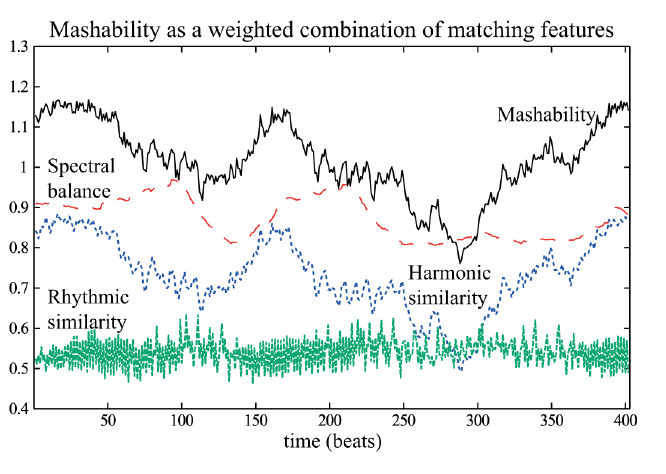
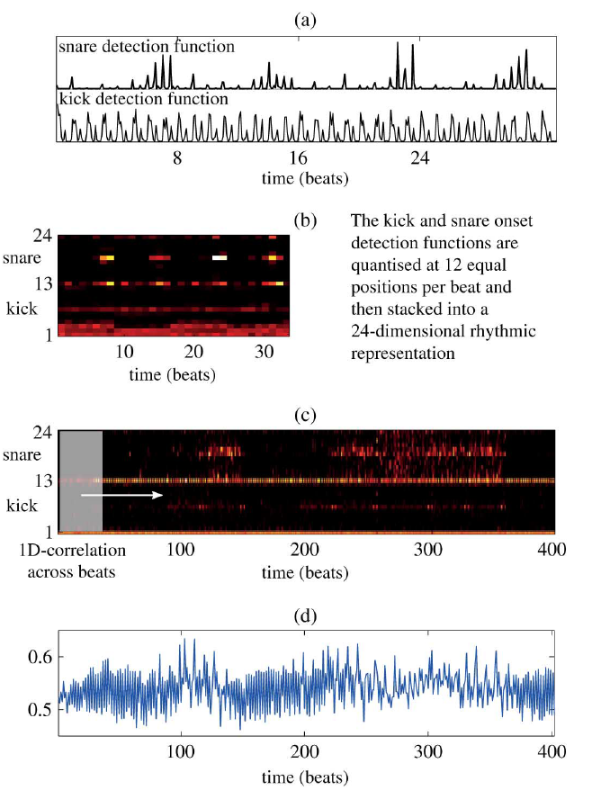

## One-line Summary

Davies et al. make multi-song mashups by segmenting an input into phrases, searching candidate recordings under allowable tempo and key transformations, and ranking each candidate window with an explicit harmonic-rhythmic-spectral score that remains adjustable in an interactive editor.

## 1. Document Information

- **Canonical citation:** Matthew E. P. Davies, Philippe Hamel, Kazuyoshi Yoshii, and Masataka Goto, “AutoMashUpper: Automatic Creation of Multi-Song Music Mashups,” *IEEE/ACM Transactions on Audio, Speech, and Language Processing*, 22(12), 1726–1737, December 2014.
- **DOI and publisher record:** `10.1109/TASLP.2014.2347135`; IEEE document `6876193`.
- **Publication history:** received 22 November 2013, revised 30 April 2014, accepted 28 July 2014, and published online 12 August 2014. [PDF p. 1 / article p. 1726]
- **Length:** 12 physical PDF pages with printed pagination 1726–1737, so `article page = PDF page + 1725`.
- **Affiliation:** all four authors were at the National Institute of Advanced Industrial Science and Technology (AIST), Tsukuba, Japan. [PDF p. 1 / article p. 1726]
- **Canonical integrity:** SHA-256 `37da41dbe01bbd015900dc68e170ba87ba2120d929446dee7fdb0153323d619b`. The canonical file is byte-for-byte identical to the supplied root PDF.
- **Rights boundary:** the PDF permits personal use and academic text/data mining but states that republication or redistribution requires IEEE permission. It is retained locally as research evidence and must not be pushed until repository visibility and redistribution rights are resolved. [PDF p. 1 / article p. 1726]
- **Primary category:** `retrieval-and-recombination`. AutoMashUpper selects, aligns, transforms, and mixes regions of existing recordings; it does not synthesize new notes or audio from a learned generative model.
- **Relationship to earlier work:** this journal article expands the authors’ 2013 ISMIR paper with a faster harmonic search, rhythmic and loudness-related compatibility terms, objective segmentation evaluation, and a listener study of Mashability. [PDF p. 2 / article p. 1727]

This digest separates three evidence levels:

1. **Reported:** claims and values stated in the paper.
2. **Verified:** formulas, graphs, and numerical values checked against rendered PDF pages.
3. **Repository interpretation:** implications for transparent and theory-grounded generative-music research that go beyond the authors’ direct claims.

## 2. Key Contributions

### Transform-aware compatibility rather than static similarity

The central idea is to score what two sections **could become after permitted edits**, not only how similar the unaltered recordings already are. For each input phrase, AutoMashUpper searches candidate time positions and key rotations, may reinterpret tempo at half or double metrical level, and computes the transformations needed to realize the best match. Candidate identity, source beat, score components, transposition, beat map, and gain adjustment are therefore reconstructable in principle from the specified algorithm. The paper does not show all of these internal quantities surfaced to the user or persistently logged. [PDF pp. 1–7 / article pp. 1726–1732]

This is the paper’s strongest conceptual contribution. It turns retrieval into a constrained counterfactual: “Would these sources fit if I applied this explicit transformation?” That principle remains useful for modern retrieval-augmented music systems because the selected source and proposed action can be reconstructed from the method, even though the prototype does not present a complete provenance log.

### Phrase-local multi-song construction

The input is segmented into short phrase-like regions, and each region is independently matched against a library. A single output can therefore draw consecutive sections from different source songs rather than applying one global companion track. The local search also finds *where* inside a globally compatible song the best passage occurs. [PDF pp. 1–3 / article pp. 1726–1728]

### A decomposed, user-adjustable Mashability score

Mashability combines three explicit local features:

- harmonic similarity between beat-synchronous chroma patches across time and key shifts;
- rhythmic similarity between quantized kick/snare onset patterns;
- complementary three-band spectral balance.

A separate tempo-range bonus rewards candidates close to the input’s tempo after metrical reinterpretation. The interface exposes the key range, tempo range, and all three feature weights. The default weighting gives harmony five times the weight assigned to either rhythm or spectral balance. [PDF pp. 3–7 / article pp. 1728–1732]

*Figure 6, PDF p. 6 / article p. 1731. The final score visibly follows the harmonic curve because the default harmonic weight is dominant.*

### Efficient harmonic search

The paper reformulates the nested search across chromatic rotations and beat offsets as two-dimensional convolution. In the authors’ timing demonstration, this changes execution from seconds to milliseconds over the tested patch and song lengths. The contribution matters because a 500-song collection, about 400 beats per song, and 12 key positions already create more than two million possible matches for one input phrase. [PDF p. 4 / article p. 1729]

### Mixed-initiative rather than fully autonomous authorship

The interface displays phrase boundaries and source-song assignments, ranks alternative candidates for each section, and permits users to adjust weights, change or delete selected sections, add material, jump between source regions, and rebalance the original and mashup audio. The authors explicitly frame the system as assistive: algorithmic analysis narrows the search, while the listener makes aesthetic choices. [PDF pp. 7, 10–11 / article pp. 1732, 1735–1736]

*Figure 7, PDF p. 7 / article p. 1732. The interface exposes source-section provenance, parameter weights, ranked alternatives, and local editing controls.*

### Evaluation at two intermediate boundaries

The paper evaluates phrase-boundary localization on the 100-song RWC Popular Music Database and tests whether the score’s ranking relates to enjoyment for 36 fixed-length phrase mashups rated by 15 listeners. This is more informative than presenting examples alone, but it deliberately stops one level below the final product: neither complete multi-song outputs nor the interactive workflow receive a user study. [PDF pp. 8–10 / article pp. 1733–1735]

### Relevance to the PhD programme

AutoMashUpper is a useful early template for transparent creative AI because every selection is produced by an explicit feature decomposition and specified edits. That makes the decision reconstructable in principle, although the paper does not show a complete trace surfaced or logged. Its weakness is equally instructive: formula visibility is not the same as a faithful musical explanation. Chroma, kick/snare correlation, and three-band balance do not explain chord function, cadence, voice leading, phrase role, melody clash, texture, register, or long-range form. A theory-grounded successor could keep the paper’s inspectable search-and-transform structure while replacing or augmenting these low-level terms with musically semantic constraints and listener-calibrated preferences.

## 3. Methodology and Architecture

### 3.1 Signal representations and assumptions

The analysis front end uses the NNLS Chroma Vamp plug-in through Sonic Annotator. For each recording it extracts global tuning, an 84-bin tuned semitone spectrogram spanning seven octaves, and a 12-dimensional chromagram. Stereo signals are downmixed to mono for analysis, but stereo audio is used when rendering the result. [PDF pp. 2–3 / article pp. 1727–1728]

The architecture assumes:

- approximately constant tempo;
- a fixed 4/4 time signature;
- phrase boundaries on downbeats;
- phrase durations that are complete numbers of bars, typically 2, 4, or 8;
- candidate full mixes that tolerate global time-stretching and pitch-shifting.

These assumptions make the approach well matched to regular popular music but exclude expressive tempo, changing or non-quadruple meter, and many classical-music forms. [PDF p. 2 / article p. 1727]

### 3.2 Beat and downbeat analysis

Harmonic/percussive separation supplies kick-emphasized and snare-emphasized onset-detection functions at 11.6 ms resolution. A simplified dynamic-programming tracker estimates beats from their sum under a roughly constant-tempo assumption. Downbeats combine beat-synchronous spectral change with the heuristic that kicks are more likely and snares less likely on downbeats. [PDF p. 2 / article p. 1727]

This stage matters downstream because the same beat grid controls segmentation, feature synchronization, candidate alignment, and final time stretching. The paper later identifies beat and tuning errors as especially harmful, whereas a one-beat phrase-boundary error can sometimes be absorbed because matching evaluates every candidate beat offset. [PDF p. 11 / article p. 1736]

### 3.3 Phrase segmentation

The beat-synchronous 84-bin semitone spectrogram is grouped into non-overlapping four-beat frames starting at downbeats, producing a 336-dimensional representation per bar. Pairwise cosine distance produces a self-similarity matrix:

\[
D(i,j)=1-\frac{X_{\Gamma,i}\cdot X_{\Gamma,j}}
{\lVert X_{\Gamma,i}\rVert\lVert X_{\Gamma,j}\rVert}.
\]

A 16-downbeat Gaussian checkerboard kernel slides along the matrix diagonal to generate a novelty curve, whose peaks are initial boundaries. The algorithm then iteratively considers moving every boundary backward one downbeat, leaving it in place, or moving it forward one downbeat. A global regularity score rewards durations of 2, 4, 8, and 16 downbeats and penalizes atypical values such as 7, 9, 15, and 17; iteration stops when no move improves the score. [PDF p. 3 / article p. 1728]

*Figure 1, PDF p. 3 / article p. 1728. Register-preserving semitone features become bar frames, a self-similarity matrix, and a downbeat-constrained novelty trace.*

The regularity prior is musically legible but not neutral. It biases the output toward common hypermetrical lengths and can move an acoustically supported boundary to satisfy that prior. This is a good example of an explicit theory-like constraint whose effect is auditable but whose validity depends on repertoire.

### 3.4 Tempo-octave normalization

AutoMashUpper may halve or double a candidate beat sequence and applies the same transformation to its beat-synchronous features. This handles metrical ambiguity: a 70 BPM song and a 140 BPM song can be layered without an unnecessary factor-of-two stretch, while a 130 BPM candidate can be adjusted toward 140 rather than slowed to 70. [PDF pp. 3–4 / article pp. 1728–1729]

The rule minimizes gross time-scale change but does not reason about perceived beat level, groove, or phrase-level tempo variation. It is an explicit, reversible transformation choice rather than a learned tempo representation.

### 3.5 Harmonic matching

For an input phrase chromagram and each candidate song, the system computes cosine similarity across candidate beat offsets and chromatic rotations. The fast implementation stacks the 12-pitch-class candidate chromagram to 24 rows, treats the input phrase as a two-dimensional filter, and uses MATLAB `conv2` to search time and transposition jointly. It retains, per beat offset, the maximum harmonic score and the inverse pitch shift required to render that match. [PDF pp. 4–5 / article pp. 1729–1730]

*Figure 3, PDF p. 5 / article p. 1730. The worked 32-beat example finds its best chroma patch under a +2-semitone rotation, implying a −2-semitone shift of the candidate when rendered.*

The UI image shows a default range of ±3 semitones, while the method and timing discussion permit a broader user-selected range and illustrate −6 through +6. The score uses pitch-class energy, not a chord-label or functional-harmony model; it can reward aligned chroma even when melody, bass motion, chord inversion, cadence, or vocal content conflicts.

### 3.6 Rhythmic matching

Every beat is divided into 12 equal positions. Kick and snare onset amplitudes sampled at those positions are stacked into a 24-dimensional vector per beat. Cosine similarity between the input rhythm patch and each candidate window is computed as a correlation over beat shifts. The intended distinction is finer than beat matching, especially between straight and swung patterns. [PDF p. 5 / article p. 1730]

*Figure 4, PDF p. 5 / article p. 1730. The rhythm representation is explicit and inspectable, but limited to kick/snare evidence quantized within each beat.*

This representation does not cover pitched rhythmic interaction, percussion other than kick/snare, syncopation at higher metrical levels, changing groove, or the rhythmic role of vocals and bass.

### 3.7 Spectral balance

Replay Gain supplies beat-synchronous perceptual loudness in three bands: low up to 220 Hz, mid from 220 to 1760 Hz, and high above 1760 Hz. The input and candidate band profiles are summed and averaged across the phrase; after normalization to unit sum, spectral compatibility is `1 − standard deviation`. A flatter combined three-band profile receives a larger score. [PDF pp. 5–6 / article pp. 1730–1731]

Equation (6) reuses `k` for the candidate-window position and the summation index, making the notation ambiguous even though the prose describes an average over the phrase’s beat dimension. More substantively, three bands cannot represent masking, timbral density, stereo placement, simultaneous bass-line conflict, or production-specific equalization.

### 3.8 Score, tempo bonus, and candidate selection

The local score for candidate `n` at beat `k` is:

\[
M_n(k)=w_HM_{H,n}(k)+w_RM_{R,n}(k)+w_LM_{L,n}(k).
\]

The informally selected defaults are `w_H = 1`, `w_R = 0.2`, and `w_L = 0.2`. A bonus `α = 0.2` is added when the relative tempo lies within a user range `η`, whose default is 0.3 (±30% in the interface). The result is not a probability and can exceed one. Each candidate is reduced to its maximum over beat positions; candidates are ranked by that maximum, and the maximizing beat and key shift are retained. [PDF pp. 6–7 / article pp. 1731–1732]

The weights and thresholds were chosen through informal testing, with no ablation or held-out calibration. Taking a maximum also gives longer candidate tracks more opportunities to achieve a high score. Independent maximization for every phrase ignores global source reuse, transition continuity, narrative arc, and long-range form.

### 3.9 Rendering and runtime

Rubber Band maps candidate beat times onto the input phrase’s beat anchors with dynamic time stretching. Its pitch factor combines the selected semitone shift with the ratio between candidate and input tuning estimates:

\[
f=\frac{t_n}{t_i}\,2^{q_{\max}(n)/12}.
\]

Pitch processing is bypassed when the semitone shift is zero and the two tuning estimates differ by less than 0.5%. Replay Gain then matches perceptual loudness, and the transformed candidate sections are concatenated into a mashup-accompaniment track mixed with the input. [PDF pp. 6–7 / article pp. 1731–1732]

The MATLAB prototype reportedly processes a four-minute input with 10–15 candidates in under 30 seconds. Hardware and a reproducible timing environment are not provided. [PDF p. 7 / article p. 1732]

### 3.10 Interface and operating examples

The interface shows the input waveform and phrase boundaries, a section-by-section source visualization, a candidate library, sorted alternatives, key/tempo/weight controls, playback balance, and add/change/delete operations. Four suggested modes illustrate the search space: [PDF pp. 7–8 / article pp. 1732–1733]

1. **Album/artist mode:** draw all source material from one album or performer.
2. **Style mode:** restrict sources to a genre, such as combining J-pop and Drum and Bass.
3. **Forced mode:** supply only one candidate, including deliberately distant pairings such as electronic dance music and a 1960s jazz ballad.
4. **Musician mode:** use an isolated instrumental performance rather than the conventional a cappella vocal; the authors report experimenting with solo slap bass.

These are design examples, not experimentally compared conditions.

## 4. Key Results and Benchmarks

### 4.1 Phrase-boundary localization

The objective study uses all 100 songs in RWC-MDB-P-2001, with beat, downbeat, and structural-boundary annotations. Structural boundaries are treated as phrase boundaries, labels are ignored, and F-measure is calculated for tolerance windows from 0 to ±3 seconds in 0.05-second increments. Comparators are the three unique best-performing systems from the 2012 MIREX structural-segmentation task; the authors download their outputs rather than rerun them. [PDF p. 8 / article p. 1733]

Four internal variants isolate front-end choices:

- **RDB:** detected beats with a random initial downbeat;
- **VAMP:** QM-VAMP beat and bar tracking;
- **GTA:** ground-truth beat and downbeat annotations;
- **CHR:** a folded chromagram rather than the seven-octave semitone representation.

*Figure 8, PDF p. 8 / article p. 1733. AutoMashUpper favors very precise boundary placement; its comparative advantage does not persist at wider tolerances.*

Reported and visually verified findings: [PDF pp. 8–9 / article pp. 1733–1734]

- AutoMashUpper reaches `F = 0.35` at the very narrow ±0.05-second tolerance and is well above the MIREX comparators there.
- Estimated downbeats are much better than randomized downbeats at narrow tolerances.
- Ground-truth beats/downbeats only marginally improve the narrow-window result, suggesting the proposed beat/downbeat front end is adequate for this dataset.
- The seven-octave semitone representation beats the folded chromagram, implying that octave/register evidence assists localization.
- Once tolerance exceeds roughly one second, the MIREX systems begin to outperform AutoMashUpper; SMGA2 is best at three seconds.
- Median detected segment duration is 10.3 seconds for AutoMashUpper, versus 15.6 seconds for SMGA2 and 14.3 seconds in the annotations.

The defensible conclusion is **precise localization of relatively short boundaries under this regular-pop dataset**, not generally superior structural segmentation.

### 4.2 Listener-study design

The listening study randomly selects 12 automatically bounded, 32-beat excerpts from a 90-song collection. Each is matched against the remaining collection with the default score, and three versions are rendered: the highest-scoring candidate, the candidate nearest the mean score, and the lowest-scoring candidate. This yields 36 stimuli. [PDF p. 9 / article p. 1734]

Fifteen unpaid participants complete a training phase and then rate every mashup from 0–10 for enjoyment/success relative to the un-mashed input. The original and mashup can be replayed; order is independently randomized. Musical training is not required, although participants must understand what a mashup is. [PDF p. 9 / article p. 1734]

The paper fixes excerpts at 32 beats because absolute Mashability depends on phrase length: short windows are more likely than long windows to find a high chroma match. The study therefore tests within-length ranking of isolated sections rather than entire multi-song outputs. [PDF p. 9 / article p. 1734]

### 4.3 Enjoyment by rank

*Figure 9, PDF p. 9 / article p. 1734. The highest-ranked result leads for 11 of 12 excerpts, but the middle and lowest conditions are often close.*

- Highest-ranked mean: **6.7/10**.
- Middle-ranked mean: **4.7/10**.
- Lowest-ranked mean: **4.3/10**.
- Highest versus middle: paired test, **`p < .005`**.
- Middle versus lowest: **`p = .65`**, not significant.
- Highest is above both alternatives for 11 of 12 excerpts; Excerpt 2 is the exception. [PDF pp. 9–10 / article pp. 1734–1735]

No test statistic, degrees of freedom, confidence interval, effect size, or correction procedure is reported. The pattern supports selecting a favorable extreme more clearly than it supports a fully ordered scalar model: the score separates top from middle, but not middle from bottom.

### 4.4 Mashability–enjoyment relationship

*Figure 10, PDF p. 10 / article p. 1735. Overall correlation is moderate and weakens for manually classified vocal-overlap excerpts.*

- All 36 stimulus means: **Pearson `r = .49`, `p < .005`**.
- No-vocal-overlap subset: **`r = .66`**.
- Vocal-overlap subset: **`r = .35`**. [PDF p. 10 / article p. 1735]

Subset sizes and subset p-values are not stated. Manual post-hoc classification also makes the subgroup result exploratory. Several overlapping-vocal examples nevertheless score highly, so the authors reject a blanket “no overlapping vocals” rule and instead suggest that listener preference may differ.

The paper’s own interpretation is appropriately limited: high Mashability is evidence for an acceptable candidate, not a guarantee of the listener’s favorite result. Low-scoring candidates can still be enjoyable. One highly ranked example receives only 3.6 because vocals overlap and candidate chord changes occur away from downbeats. Participants also mention incompatible bass parts and dislike of altering a familiar source. [PDF pp. 9–10 / article pp. 1734–1735]

### 4.5 What was not benchmarked

- complete automatic multi-song mashups;
- interactive usability, learning, agency, or creative benefit;
- harmonic-only versus full-score ablations;
- random retrieval or contemporary retrieval baselines;
- transformation artifact severity as a function of key/tempo change;
- transition quality or whole-song coherence;
- runtime on specified hardware;
- generalization beyond regular 4/4 popular music.

## 5. Limitations and Future Work

### Explicit limitations and failure modes

- Beat errors are particularly damaging because all sources must remain synchronized. Tuning errors affect both chroma analysis and final pitch correction. [PDF p. 11 / article p. 1736]
- Wide key ranges enlarge the search but can make full-mix vocals unnatural, especially upward-shifted female voices and downward-shifted male voices. Instrumental material is more tolerant. [PDF p. 11 / article p. 1736]
- Vocal overlap and incompatible bass parts are not adequately represented by the score. A simple vocal-exclusion rule would also remove combinations that some listeners enjoy. [PDF pp. 9–11 / article pp. 1734–1736]
- Constant tempo and fixed meter exclude many realistic songs. The authors propose extending both assumptions. [PDF p. 11 / article p. 1736]
- The interaction design is central to the authors’ position but is not evaluated; a future user study is proposed. [PDF p. 10 / article p. 1735]
- Vocal detection, richer vocal-interaction features, and source separation are proposed as future extensions. [PDF p. 11 / article p. 1736]

### Evaluation and reproducibility limits

- Annotated structural boundaries are used as proxies for phrases even though the constructs are not identical.
- RWC Pop is acknowledged to be relatively unchallenging and closely matches the method’s assumptions.
- The listener study has only 15 participants and reports no demographics, musicianship distribution, hearing screening, power analysis, confidence intervals, effect sizes, or participant/item mixed-effects model.
- The 90-song collection, song identities, genre composition, and licensing are not described sufficiently for replication.
- There is no listening-test ablation of rhythm, spectrum, tempo bonus, or manually chosen weights.
- The vocal-overlap grouping is post-hoc and manually assigned.
- Choosing score extremes contributes to the observed all-condition correlation; it does not measure fine calibration among similarly high-scoring alternatives.
- No source code, hardware configuration, seeds, or reproducibility bundle is provided. An author-hosted paper and project page exist, but no official code release was located.

### Model limitations

- Independent phrase optimization has no global arrangement objective, source-diversity constraint, transition model, or long-range form.
- Maximum-over-offset selection can favor longer candidate songs because they provide more chances for a high accidental match.
- Chroma cannot represent chord function, inversion, cadence, melody collision, voice leading, or the expressive role of dissonance.
- Kick/snare similarity is too narrow for many grooves, meters, and instrumental textures.
- Three-band flatness is not a mixing model and cannot diagnose masking, simultaneous bass motion, density, or spatial conflict.
- The system applies global pitch/time processing to complete mixes; it cannot protect vocals or drums selectively without source separation.
- Default score weights are informal design choices, not learned preferences or calibrated probabilities.
- The prose says the normalized spectral-flatness score approaches zero for uneven profiles, but with only three non-negative components summing to one, `1 − std` does not literally span the full 0–1 range under ordinary standard-deviation conventions.

### Research opportunities for explainable music AI

1. Replace the single score with a typed constraint ledger: chord function, cadence compatibility, voice-leading cost, phrase role, meter, register, texture, vocal activity, and production conflict.
2. Report rejected alternatives and score margins, not only the winner, and calibrate uncertainty against human intervention.
3. Make transformation cost explicit so compatibility gains can be weighed against audible pitch/time artifacts.
4. Add global planning across phrase choices, transitions, source reuse, energy contour, and form.
5. Learn listener-specific preferences while retaining explicit features as controls and audit evidence.
6. Evaluate explanations causally: change one stated reason, hold irrelevant state fixed, and test whether the recommendation changes as predicted.
7. Test whether musicians use the trace to diagnose and repair failures faster or more accurately without over-trusting the system.
8. Use song-, artist-, and repertoire-disjoint evaluation and analyze participant and musical item as crossed random effects.

## 6. Related Work

The paper extends the authors’ 2013 ISMIR paper, “AutoMashUpper: An Automatic Multi-Song Mashup System.” The earlier version establishes phrase-level harmonic search and interaction; this journal version adds efficient two-dimensional convolution, rhythmic matching, spectral balance, and the two evaluations. [PDF p. 2 / article p. 1727]

Its closest cited systems include harmonic-mixing tools that globally compare keys and tempo, Beat-Sync-Mash-Coder for synchronized real-time mashups, and interactive remix interfaces. AutoMashUpper differs by searching local regions, explicitly considering the transformations needed to make them compatible, and allowing several source songs to occupy different input phrases. [PDF pp. 1–2 / article pp. 1726–1727]

Within this repository, [[retrieval-and-recombination/wu-2026-an-automated-pop-song-mashup]] treats the AutoMashUpper/Mashability lineage as a foundational handcrafted baseline. Wu’s later work adds listener-trained ranking, vocal-conditioned section retrieval and rearrangement, and learned mix restoration. That later evidence supports the historical value of Davies et al.’s decomposition while showing that a fixed low-level score leaves substantial perceptual structure unexplained.

Use these synthesis routes:

- [[overviews/automated-music-mashup-systems]] — historical and methodological comparison of explicit Mashability with later learned retrieval, rearrangement, and restoration.
- [[concepts/auditable-creative-editing-pipelines]] — distinction between a reconstructable formula/edit path and a validated faithful explanation.
- [[questions/when-do-interpretable-music-editing-traces-become-faithful-explanations]] — tests required before an explicit score decomposition should be trusted as a musical reason.

## 7. Glossary

- **Beat-synchronous feature:** An audio descriptor summarized between successive detected beats so recordings at different tempi can be compared on a musical-time grid.
- **Chroma:** A 12-dimensional representation that folds pitch energy into pitch classes while discarding octave.
- **Downbeat:** The first beat of a metrical bar; AutoMashUpper constrains candidate phrase boundaries to downbeats.
- **Gaussian checkerboard kernel:** A novelty detector slid along a self-similarity matrix diagonal to emphasize transitions between internally similar regions.
- **Harmonic matching:** Cosine comparison of chroma patches across candidate beat positions and chromatic rotations.
- **Mashability:** The paper’s weighted compatibility score combining harmonic similarity, rhythmic similarity, spectral balance, and a tempo-range bonus.
- **Mixed-initiative system:** A workflow in which computation proposes and transforms candidates while a person changes parameters, selects alternatives, and edits the result.
- **Phrase-local retrieval:** Selecting a different candidate recording region independently for each phrase of an input.
- **Replay Gain:** A perceptual loudness method used here both for coarse band-energy features and final level matching.
- **Rubber Band:** The open-source time-stretching and pitch-shifting library used to realize beat and key alignment.
- **Self-similarity matrix:** Pairwise distances between temporal feature frames, used to reveal repeated sections and boundaries.
- **Spectral balance:** A three-band score favoring a flatter combined low/mid/high loudness profile.
- **Tempo-octave relation:** A metrical ambiguity in which tempi such as 70 and 140 BPM can describe related beat levels.
- **Transform-domain search:** Retrieval that evaluates compatibility under explicit hypothetical edits and returns the edits required for the chosen match.
- **Workflow auditability:** The ability to reconstruct the source, score components, alternatives, and transformations behind an output; this is weaker than a causally faithful musical explanation.
