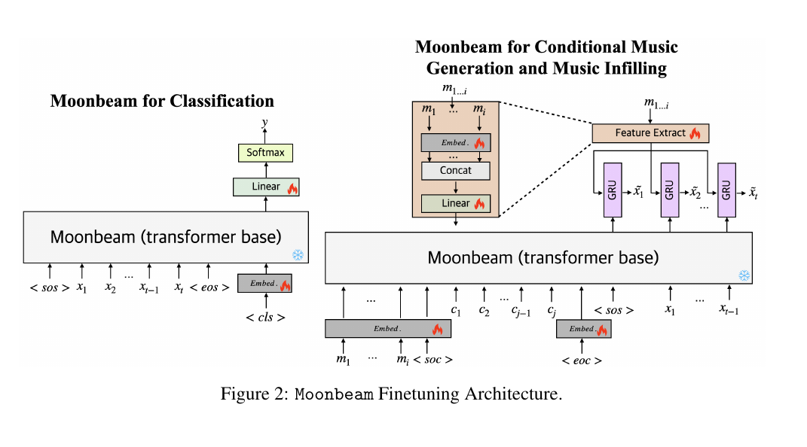
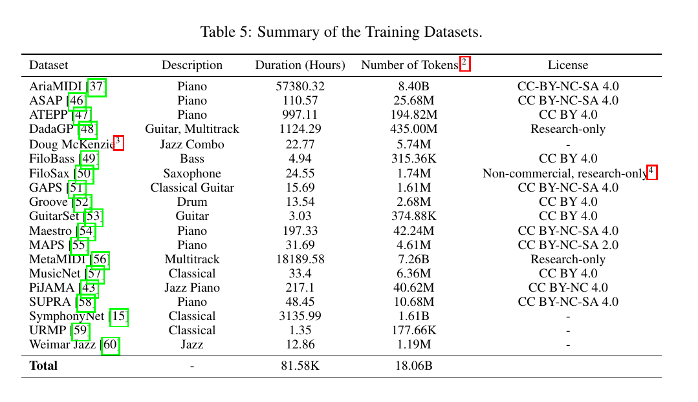
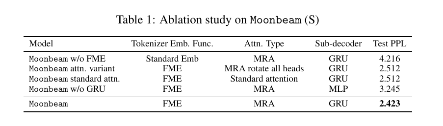
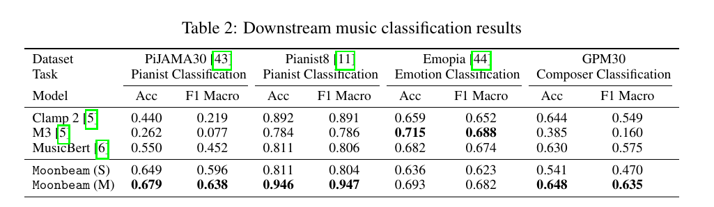
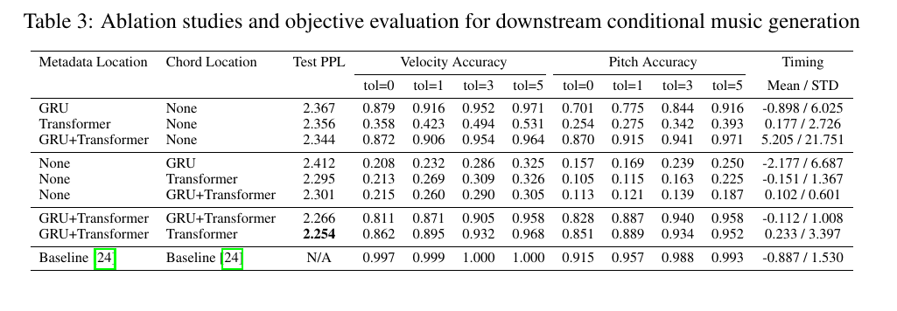
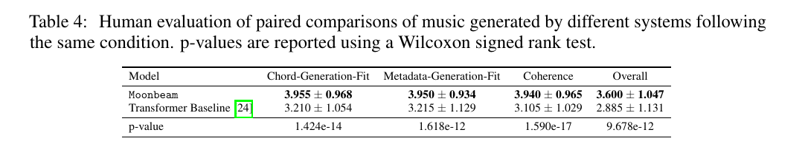
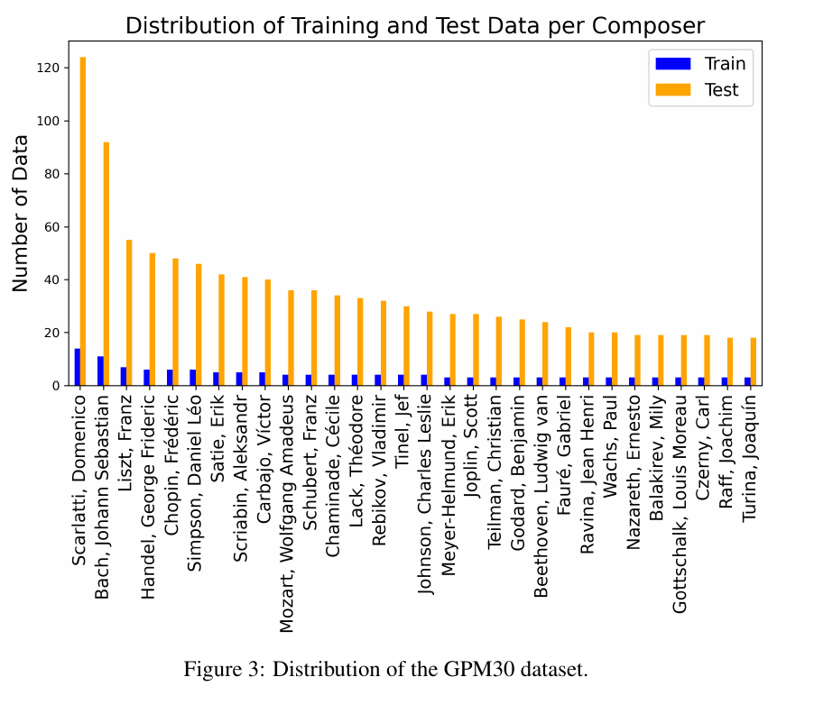

## One-line Summary

Moonbeam is a 309M/839M-parameter autoregressive MIDI foundation-model family that combines semantically factorized event tokens, continuous music-attribute embeddings, fixed multidimensional relative rotations, and a sequential attribute decoder; it improves most reported classification comparisons and expert-rated generation outcomes, while providing architectural audit points rather than faithful musical explanations or guarantees of music-theory compliance.

## 1. Document Information

- **Document:** arXiv preprint `2505.15559v1` in `cs.SD`, with `cs.AI` and `eess.AS` also recorded in the embedded metadata. The visible manuscript is dated 21 May 2025 and says “Preprint. Under review.” [PDF p. 1]
- **Authors:** Zixun Guo and Simon Dixon, Centre for Digital Music, Queen Mary University of London. [PDF p. 1]
- **DOI:** `10.48550/arXiv.2505.15559`. The arXiv identifier is printed on the first page, and the DOI is present in the PDF Info dictionary. The XMP identifier is the version-specific arXiv URL for `2505.15559v1`.
- **Length and denominator:** 20 physical PDF pages were read out of 20. Pages 1–9 contain the main paper, pages 10–13 contain references and the beginning of Appendix A, and pages 13–20 contain appendices. There were no empty or failed pages.
- **Extraction and verification:** Poppler `pdftotext -layout` was used over PDF pp. 1–20. Every table (Tables 1–8), every figure (Figures 1–5), and the signs and relative-direction terms in Equations 1–8 were checked against 150-DPI rendered pages. The eight retained evidence crops were rendered reproducibly at 180 DPI and visually checked. Text extraction preserved the important negative signs in Table 3 and the `m - n`, `a_q - a_k`, and `b_q - b_k` directions in the relative-attention equations. [PDF pp. 5, 8–9, 14–20]
- **Canonical integrity:** SHA-256 `88d90533b1da810eba59dd0009d4e702e5ec7ba0a4ea7d86326389e488d93592`. The canonical file in `papers/` is a byte-for-byte copy of the supplied root PDF; the supplied file was not moved or modified.
- **Source and rights:** The PDF identifies arXiv as publisher/source and embeds a CC BY-SA 4.0 rights URL. The paper links a GitHub repository for code, pretrained weights, and samples, but these artifacts were not opened or independently executed for this digest. [PDF p. 1 and embedded link annotations]
- **Primary category:** `generation-and-planning`. The principal contribution is a pretrained generative architecture and its adaptation to generation/infilling; tokenization, data provenance, classification, and domain-knowledge inductive biases are important secondary contributions.

This digest distinguishes **reported evidence** from **repository interpretation**. “Reported” means stated or tabulated in the paper. “Repository interpretation” is used for implications for explainable, transparent, or theory-grounded music generation that the authors did not themselves validate.

## 2. Key Contributions

### A general-purpose MIDI event representation

Moonbeam represents each input event as the compound tuple `(absolute onset, duration, octave, pitch class, instrument, velocity)`. It applies Fundamental Music Embedding (FME), a fixed continuous sinusoidal construction followed by a learned projection, to all attributes except instrument; instrument and non-music tokens use learned lookup embeddings. The six attribute embeddings are concatenated. The design is intended to cover score and performance MIDI, polyphony, and single- or multi-instrument files without a bar/beat tracker or a growing lookup table for every absolute time. [PDF pp. 3–4]

### Explicit multidimensional relative information

Multidimensional Relative Attention (MRA) extends the RoPE idea by assigning attention-head groups to musically named coordinates. Five intrinsic coordinates are onset, duration, octave, pitch class, and velocity. A sixth group corresponds to the categorical instrument field but is rotated by onset, the time at which that instrument event occurs. Each group is rotated using its assigned scalar before query-key comparison, so the attention score carries the corresponding attribute difference without an additional learned relative-position table. [PDF pp. 5, 16–17]

*Figure 1, PDF p. 3. The diagram makes the event fields and MRA head grouping explicit and shows the GRU attribute decoder above the transformer.*

### A large, heterogeneous MIDI pretraining run

Moonbeam Medium has 839M parameters and is pretrained on 19 listed datasets totaling 81.58K hours and 18.06B attribute tokens. The corpus spans piano, guitar, bass, saxophone, drums, jazz combinations, classical ensembles, and multitrack MIDI. Moonbeam Small has 309M parameters and is trained only on LakhMIDI. Both use two A100 GPUs, with reported wall-clock times of 54 hours for Small and about 15 days for Medium. [PDF pp. 2, 7, 14–15]

### Two parameter-efficient downstream adaptation patterns

For classification, a `<cls>` token and linear head replace the GRU decoder while LoRA adapts selected attention projections. For conditional generation, non-temporal metadata and a time-bearing control sequence are prepended, and metadata also conditions the GRU. Because musical events and control events use absolute onset inputs, the generated token can attend to controls both before and after its current musical time—what the paper calls full anticipatory capability. [PDF pp. 6–7, 17–18]

*Figure 2, PDF p. 6. Flame symbols denote trainable modules and snowflakes denote frozen modules; the right-hand architecture provides metadata to both the transformer-side condition embedding and the GRU-side feature path.*

### A useful but bounded transparency contribution

The model exposes semantically named event fields, fixed mappings from attributes to attention-head groups, explicit metadata/chord conditioning routes, and a dataset-by-dataset license table. These are strong architectural and provenance audit points. The paper does not, however, show that an attention head faithfully explains a generated note, that the model follows harmony/counterpoint rules, or that users understand model decisions better. Its contribution to explainability is therefore structural transparency and inductive-bias specification, not explanation faithfulness. [PDF pp. 3–6, 14–17]

## 3. Methodology and Architecture

### 3.1 Input-output event asymmetry

The input event is

`x_t = (o_t, d_t, oct_t, p_t, i_t, v_t)`,

where onset `o_t` is absolute. The model predicts the next event as

`x_tilde_t = (Delta o_t, d_t, oct_t, p_t, i_t, v_t)`,

where the first predicted sub-event is a delta onset/time shift. Thus, “absolute-onset representation” describes the context presented to the transformer, not every output category. The authors motivate this asymmetry by arguing that a transformer should not have to sum a long history of time-shift tokens to recover current time. Absolute control and music onsets also give MRA a direct relative-time coordinate during conditional generation. [PDF pp. 3–4, 6]

FME is used for onset, duration, octave, pitch class, and velocity. It encodes scalar values continuously and is claimed to support interpolation or extrapolation to inputs unseen during pretraining, such as long durations, pitch bends, or microtonal values. Instrument has a standard embedding because it is categorical. Non-music tokens such as sequence boundaries and classification tokens also use standard embeddings. [PDF p. 4]

The generative output remains categorical. Pretraining therefore quantizes time to 10 ms. Maximum time shifts and note durations are 10,240 ms for Small and 40,960 ms for Medium; files exceeding those limits are discarded. The dictionaries contain 1,024 or 4,097 shift values, the same counts for duration, 11 octaves, 12 pitch classes, 129 instrument tokens, 128 velocities, and per-attribute start/end tokens. The paper notes that input-side limits can be relaxed in a downstream classification task that does not use the categorical GRU output, but it does not demonstrate unconstrained extrapolative generation. [PDF pp. 15–16]

### 3.2 Multidimensional Relative Attention

For ordinary RoPE, the rendered equations give the query-key term as

`Re[(Q_m exp(i m theta))(K_n exp(i n theta))*] = Re[Q_m K_n* exp(i (m - n) theta)]`.

The sign and direction are `m - n`, not `m + n`. MRA partitions the heads into groups and substitutes a music-coordinate value for the single token index. In Moonbeam the six group coordinates are: [PDF p. 5]

1. onset;
2. duration;
3. octave;
4. pitch class;
5. onset again for the instrument-associated group;
6. velocity.

The Appendix F two-dimensional derivation confirms that the first head group carries `a_q - a_k` and the second carries `b_q - b_k`; Appendix G's all-head variant multiplies both relative phase terms. [PDF pp. 16–17]

MRA has no additional trainable relative-position parameters, but it is not parameter-free in the broader architectural sense: ordinary query/key/value projections remain trainable, and FME contains a learned projection. Moreover, the rotation makes attention logits a function of relative attribute differences; absolute attribute information reaches the network primarily through the input embeddings. The paper's phrase “both absolute and relative” therefore refers to their combination, not to relative rotations alone. [PDF pp. 4–5]

### 3.3 Transformer and sequential attribute decoder

The backbone follows a LLaMA-style causal decoder with RMSNorm, SwiGLU feed-forward blocks, grouped query/key-value heads, and MRA rotations. Table 6 reports 12 query heads and 6 key/value heads in both scales. Small uses 9 attention layers, hidden size 1,536, and a two-layer GRU; Medium uses 15 attention layers, hidden size 1,920, and a four-layer GRU. [PDF pp. 3, 5, 15]

At each event step, the transformer emits one latent vector. That vector initializes a GRU which predicts the six next-event fields in sequence, allowing a later field to depend on earlier sampled fields—for example, instrument can depend on pitch. Training applies cross-entropy to each categorical sub-event. This avoids assuming conditional independence among pitch, instrument, velocity, and the other fields, while keeping the within-event decoder only six steps long. [PDF p. 6]

### 3.4 Pretraining corpus and optimization

Moonbeam Medium's 19 listed sources sum to 81.58K hours and 18.06B tokens. AriaMIDI contributes 57,380.32 hours/8.40B tokens and MetaMIDI contributes 18,189.58 hours/7.26B tokens; together they dominate the corpus. SymphonyNet contributes another 3,135.99 hours/1.61B tokens. “Token” in Table 5 means one of the six attributes composing an event, so the number is not directly comparable to a one-token-per-event representation. [PDF p. 14]

*Table 5, PDF p. 14. The table is both scale evidence and provenance evidence: licenses range from CC BY to non-commercial/research-only, while four rows show no license value.*

Training concatenates samples to a fixed sequence length of 1,024 and uses a block-diagonal causal mask so separate pieces cannot attend to one another. The optimizer is Adam with initial learning rate `3e-4` and epoch decay factor `0.85`; training lasts no more than nine epochs. Mixed precision and Distributed Data Parallel run on two A100s: 40 GB cards for Small and 80 GB cards for Medium. Small takes 54 hours; Medium takes about 15 days. Batch size, exact number of updates, random seeds, and per-stage energy use are not reported. [PDF p. 7]

The main ablation uses a randomly selected 5% Lakh test set for Small. Appendix A separately says the authors created a private human-performance MIDI test set rather than withholding examples from the Table 5 datasets, to reduce overlap between pretraining train and test. The paper does not fully explain which reported results use that private test set. [PDF pp. 7, 13]

### 3.5 Classification finetuning

The classification architecture appends `<cls>`, removes the GRU, and trains a linear classifier. LoRA rank is 8 with dropout 0.05. The `<cls>` embedding and classifier remain fully trainable. LoRA targets `q,k,v,o` for PiJAMA30, Pianist8, and GPM30, but only `q,k` for Emopia. Sliding-window lengths are 1,200, 900, 130, and 1,200 events respectively, with three boundary/classification tokens added. Training windows overlap by 25%. Learning rates are dataset-specific. [PDF pp. 6, 17]

The four evaluated datasets cover pianist identification (PiJAMA30 and Pianist8), emotion classification (Emopia), and composer classification (GPM30). The main text says comparisons are made at piece level; inputs exceeding a model's limit are split into non-overlapping windows and their logits averaged. Appendix H.1 also describes direct clip-wise classification for inputs that fit, and Appendix H.2 gives a separate 15-second preliminary experiment against a CRNN. [PDF pp. 7, 17–18]

GPM30 is constructed by retaining GPM pieces shorter than 4,096 events, selecting the 30 composers with the most remaining pieces, and randomly assigning 90% of each composer's pieces to training and 10% to test, producing 1,205 pieces. No work-level deduplication, edition grouping, or seed is reported. [PDF p. 18]

### 3.6 Conditional generation and claimed infilling capability

The conditional task uses CoMMU. Each target passage `x` has a chordal accompaniment/control sequence `c`, converted from chord symbols, and 12 non-temporal metadata controls `m`, including pitch range, velocity range, number of measures, and track role. Conditions are delimited with `<soc>` and `<eoc>`. Chord events use the same event format as music events and enter the frozen transformer base; metadata uses an added embedding/linear path and also reaches the GRU through a feature extractor. [PDF pp. 6–7]

An ablation places metadata and chords at the transformer, GRU, both, or neither. The selected architecture provides metadata to both transformer and GRU but chord controls only to the transformer. All passages are tempo-normalized to 120 BPM, although BPM remains a metadata field. Samples are padded to length 848 so the end token is always present in the same training example. LoRA again uses rank 8 and dropout 0.05. The paper does not identify whether Small or Medium is the starting checkpoint for this generation experiment, nor does it report the complete optimization schedule. [PDF pp. 9, 18]

Although the architecture can attend to future control events and is described as supporting music infilling, the reported experiment uses chord accompaniment plus metadata as controls. It does not present a dedicated masked-span or missing-note infilling benchmark. Anticipatory access is therefore demonstrated architecturally, not as a measured infilling result. [PDF pp. 6–9]

### 3.7 Evaluation design

For classification, accuracy and macro-F1 are reported. No confidence intervals, repeated-run variance, or significance tests accompany Table 2. [PDF pp. 7, 9]

For conditional generation, objective metrics measure whether notes fall in requested pitch and velocity bins, with tolerances of 0, 1, 3, and 5 bins, plus the mean and standard deviation of generated-minus-control end-time differences. Greedy decoding is used for the ablations to reduce sampling noise. These metrics deliberately do not measure musicality or chord correctness. [PDF pp. 7–8]

The final comparison uses Moonbeam top-p sampling with `p = 0.6` and temperature `0.7`, selected by manual inspection. The baseline uses the configuration recommended by the CoMMU paper rather than a jointly tuned decoding rule. Twenty music experts each rate ten randomly sampled output pairs under the same conditions. Fifty-five percent report more than 11 years of musical training and 90% more than four years. Four five-point questions cover chord fit, metadata fit, coherent development, and enjoyment. Volumes are normalized, and a two-question screening task is shown in Appendix I. Institutional ethics approval is reported, but the approval number, recruitment source, compensation, exclusions, and analysis unit are not. [PDF pp. 8, 19–20]

### 3.8 Relevance to explainable and theory-grounded generative music

The strongest explainability-relevant feature is the **a priori semantic decomposition**: each head group is assigned to a named music coordinate, and each generated event is decomposed into readable attributes. This is more inspectable than an undifferentiated token-index RoPE. The architecture also distinguishes non-temporal metadata from timed control events. [PDF pp. 3–6]

However, the paper never visualizes or intervenes on individual MRA head groups, measures whether a group actually uses its assigned relation, or gives a note-level decision trace. It does not evaluate transposition, tempo-scaling, duration-scaling, or velocity-shift equivariance. Its “domain knowledge” is relational geometry over event attributes, not explicit harmony, voice-leading, counterpoint, cadence, or form rules. The results support useful inductive bias and control, not faithful explanation or verified theory adherence. This distinction is a repository interpretation grounded in what the experiments do and do not test. [PDF pp. 5, 7–9]

## 4. Key Results and Benchmarks

### 4.1 Pretraining ablations

Moonbeam Small obtains test perplexity 2.423. Replacing MRA with standard attention gives 2.512; rotating all heads by the sum of attributes also gives 2.512. Replacing the GRU with a two-layer MLP gives 3.245. The nominal “without FME” model gives 4.216, but onset still uses FME because a full onset lookup would be too large; this is not a complete removal of FME. The authors approximately parameter-match the ablations. [PDF pp. 7–8]

*Table 1, PDF p. 8. The full model is best on the one reported test split, but no repeated runs or uncertainty estimates establish whether the 2.423-versus-2.512 gap is stable.*

### 4.2 Music classification

Moonbeam Medium leads both accuracy and macro-F1 on three of four datasets: [PDF p. 9]

- **PiJAMA30:** 0.679 accuracy / 0.638 macro-F1, versus the best non-Moonbeam baseline's 0.550 / 0.452.
- **Pianist8:** 0.946 / 0.947, versus CLaMP 2's 0.892 / 0.891.
- **GPM30:** 0.648 / 0.635. CLaMP 2 is close in accuracy at 0.644, while MusicBERT has the next-best F1 at 0.575.
- **Emopia:** M3 is best at 0.715 / 0.688; Moonbeam Medium reaches 0.693 / 0.682.

Moonbeam Small is strongest on PiJAMA30 among every listed system except Medium (0.649 / 0.596), but it is weaker than several baselines on Emopia and GPM30. Medium differs from Small in both parameter count and pretraining data, so Table 2 does not isolate scale from corpus breadth. [PDF pp. 9, 15]

*Table 2, PDF p. 9. Bold values were checked against the rendered page; Moonbeam does not lead Emopia.*

### 4.3 Conditional-generation control

The selected Moonbeam conditioning layout—metadata at GRU and transformer, chords at transformer—has the best ablation perplexity, 2.254. Its exact-bin velocity accuracy is 0.862 and pitch accuracy 0.851; at ±5 bins these become 0.968 and 0.952. End-time error is reported as `0.233 / 3.397` mean/standard deviation. [PDF p. 9]

The REMI-like transformer baseline is objectively stronger on all corresponding controls: exact velocity 0.997, exact pitch 0.915, ±5-bin velocity 1.000, ±5-bin pitch 0.993, and timing `-0.887 / 1.530`. The paper calls Moonbeam's objective deficit “slight,” but the exact-bin velocity gap is 0.135 and its timing standard deviation is more than twice the baseline's. [PDF p. 9]

*Table 3, PDF p. 9. Negative signs in the timing column were verified on the rendered page; lower absolute mean and smaller standard deviation are desirable there, while higher accuracy is desirable in the control columns.*

### 4.4 Expert listening results

Moonbeam receives higher reported ratings on all four questions: chord fit `3.955 ± 0.968` versus `3.210 ± 1.054`; metadata fit `3.950 ± 0.934` versus `3.215 ± 1.129`; coherence `3.940 ± 0.965` versus `3.105 ± 1.029`; and enjoyment `3.600 ± 1.047` versus `2.885 ± 1.131`. Reported Wilcoxon signed-rank p-values range from `1.590e-17` to `9.678e-12`. The table does not label whether the `±` statistic is a standard deviation or another dispersion measure. [PDF pp. 8–9]

*Table 4, PDF p. 9. The result supports preference under this interface and decoding setup; it does not by itself establish better rule compliance, general musical quality, or performance on infilling.*

### 4.5 Internal visual discrepancy in GPM30

The text says 90% of each composer's data is training and 10% is test, which is consistent with the large bars being training. Figure 3's legend instead labels the small blue bars “Train” and the large orange bars “Test.” The legend or the plotted color assignment therefore appears reversed. The classification values cannot resolve which code-side split labels were used. [PDF p. 18]

*Figure 3, PDF p. 18. This crop is retained because the direction of the visual encoding conflicts with the prose split description.*

## 5. Limitations and Future Work

### Evidence and experimental design

- The paper is an arXiv v1 preprint marked under review. No peer-review outcome is present. [PDF p. 1]
- Table 1 reports one perplexity value per ablation, without seeds, uncertainty, or downstream ablations. The 2.423-versus-2.512 MRA improvement is not decomposed by onset, duration, octave, pitch class, or velocity, and the “without FME” condition retains onset FME. [PDF pp. 7–8]
- Classification results lack repeated-run variance and significance tests. Dataset-specific LoRA targets and learning rates differ, but tuning procedures and selection budgets are not described. [PDF pp. 9, 17]
- PiJAMA appears in the pretraining corpus and PiJAMA30 is a downstream benchmark. The paper does not document exclusion or deduplication of downstream test pieces from pretraining, so leakage risk cannot be assessed. [PDF pp. 7, 14]
- GPM30 uses random within-composer piece splits without a published seed or documented duplicate/edition grouping, and Figure 3 reverses the apparent train/test colors relative to the prose. [PDF p. 18]
- The generation checkpoint scale, full finetuning schedule, and baseline parameter/training-budget comparability are not reported. Different decoding configurations were used for Moonbeam and the baseline. [PDF pp. 8, 18]
- Twenty participants provide ten paired judgments each, but the paper does not say whether the Wilcoxon analysis uses 200 item ratings, 20 participant aggregates, or another unit. If repeated ratings are treated as independent, the very small p-values would overstate effective sample size. No effect size, confidence interval, multiple-test adjustment, participant-level model, or order/randomization detail is given. [PDF pp. 8–9, 19–20]
- There is no dedicated infilling benchmark despite the claimed capability. Objective generation metrics cover only pitch range, velocity range, and end time; chord fit and musicality rely on one listening study. [PDF pp. 6–9]

### Data and representation

- The authors acknowledge that the corpus is mainly Western and therefore likely biased. [PDF p. 14]
- “Freely available” does not mean unrestricted: DadaGP and MetaMIDI are marked research-only, FiloSax non-commercial/research-only, many datasets use non-commercial Creative Commons terms, and Doug McKenzie, SymphonyNet, URMP, and Weimar Jazz show `-` in the license column. The authors also acknowledge ambiguity from web scraping and transcription. [PDF p. 14]
- Dataset versions, hashes, deduplication, transcription-error filtering, and train-mixture weights are absent. Three sources dominate hours/tokens, so nominal dataset diversity does not imply balanced representation. [PDF pp. 14–15]
- Only note-level MIDI is retained. Metadata, system messages, continuous controllers, modulation, volume, sustain, and other performance signals are excluded. Expressiveness therefore means onset/duration/velocity and instrument events, not the full MIDI performance channel. [PDF p. 14]
- Categorical next-event decoding still imposes 10-ms quantization and finite time-shift/duration dictionaries during pretraining. FME's claimed extrapolation and interpolation are not directly benchmarked. [PDF pp. 4, 15–16]
- A 1,024-event context may be short for long-range form, and the paper reports no structural-coherence metric over complete pieces. [PDF pp. 7–9]

### Explainability and theory grounding

- Semantically assigned MRA head groups are an architectural prior, not a validated explanation. There is no causal head intervention, feature attribution, counterfactual test, attention-faithfulness study, or user evaluation of explanation utility.
- Relative onset, duration, octave, pitch class, and velocity are low-level musical attributes, not explicit rules of harmony, voice leading, counterpoint, cadence, phrase structure, or form. Chord sequences are external controls, not verified constraints.
- The whole-MRA ablation does not establish the claimed dimension-wise mechanism, and no transformation suite tests invariance/equivariance under transposition, tempo scaling, dynamics scaling, or expressive timing changes.
- Data-source disclosure improves auditability, but the incomplete/heterogeneous licenses and missing deduplication/version details prevent full training-data provenance reconstruction.

Useful future work would therefore include dimension-specific and causal MRA ablations; controlled musical-transformation tests; explicit theory-rule probes and violation reports; released train/test manifests with deduplication; work-disjoint downstream splits; a dedicated infilling benchmark; equal-budget decoding comparisons; and participant-aware statistical models with effect sizes and confidence intervals.

## 6. Related Work

- **Relative attention for music:** Music Transformer uses generic relative attention, while RIPO adds relative token index, pitch, and onset. Moonbeam's MRA differs by assigning fixed head groups to five event-attribute axes and applying RoPE-like rotations without a learned relative table. [PDF pp. 2–5]
- **Music-domain embeddings:** FME and the earlier RIPO Transformer provide the immediate basis for the continuous scalar embeddings used here. Moonbeam extends the earlier monophonic/single-instrument setting to polyphonic, expressive, multi-instrument MIDI. [PDF pp. 4–5]
- **Symbolic foundation models:** MusicBERT and CLaMP/CLaMP 2 are bidirectional encoders used as understanding baselines; MIDI-GPT and Anticipatory Music Transformer are autoregressive; MuPT uses ABC text. Moonbeam positions itself as an autoregressive MIDI model that retains expressive timing and multi-instrument events. [PDF pp. 1–3]
- **Compound event tokenization:** MIDI-like, REMI/REMI+, PopMAG, Compound Word Transformer, Multitrack Music Transformer, and BPE approaches trade semantic factorization, temporal grid assumptions, sequence length, and extensibility. Moonbeam keeps a compound event but sequentially decodes its six fields. [PDF pp. 2–4, 6]
- **Conditional generation and infilling:** CoMMU supplies the chord/metadata task and baseline; MusIAC and Anticipatory Music Transformer motivate controllable infilling and future-aware conditioning. Moonbeam avoids a separate encoder by representing timed controls in the same absolute-onset event space. [PDF pp. 6–8]
- **Repository relation:** At extraction time, the repository contains no directly comparable MIDI foundation-model or multidimensional-relative-attention paper page. The existing mashup-system papers address source-preserving recombination rather than foundation-model pretraining, so they are not linked as direct relatives.

## 7. Glossary

- **Absolute onset (`o`):** Event time measured directly from the beginning of the sequence, used on the transformer input side.
- **Anticipatory capability:** Ability to condition a generated event on control events located later in musical time, enabled here by prepending the entire control sequence and comparing absolute onset coordinates.
- **Compound event:** One sequence step containing several musically meaningful fields rather than one field per transformer step.
- **FME (Fundamental Music Embedding):** Continuous sinusoidal embedding of a scalar music attribute followed by a learned projection, designed to preserve relative relationships and accept unseen scalar inputs.
- **GPM30:** A 30-composer, 1,205-piece subset constructed from GiantMIDI-Piano for composer classification.
- **GRU sub-decoder:** Recurrent decoder which predicts the six fields of the next compound event sequentially from one transformer state.
- **MRA (Multidimensional Relative Attention):** RoPE-like query/key rotations in which different attention-head groups use different event-attribute coordinates.
- **Macro-F1:** Unweighted mean of per-class F1 scores, reducing dominance by large classes.
- **LoRA:** Low-rank parameter updates used to adapt selected attention projections while freezing most pretrained weights.
- **Perplexity:** Exponentiated predictive cross-entropy; lower is better, but it is not a direct measure of musicality or controllability.
- **REMI:** Beat/bar-oriented symbolic-music event representation used by the generation baseline in a REMI-like form.
- **Time shift (`Delta o`):** Difference from one event onset to the next, predicted by the GRU even though transformer inputs use absolute onset.
