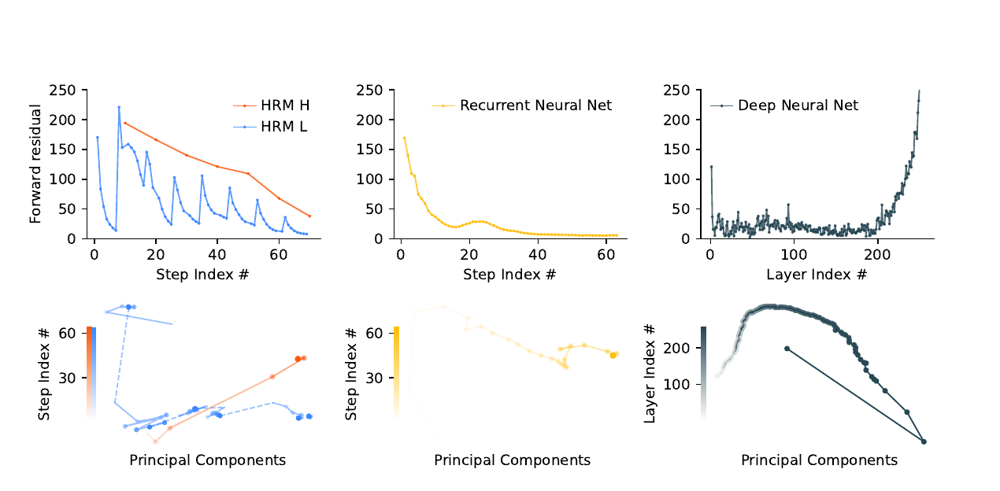

## One-line Summary

Wang et al. replace token-visible chain-of-thought with a small recurrent sequence model whose slow high-level state periodically redirects a fast low-level computation, using detached deep supervision and adaptive halting to obtain strong grid-reasoning results while offering only preliminary—not yet faithful—views of its latent solution process.

## 1. Document Information

- **Exact title:** *Hierarchical Reasoning Model*.
- **Authors:** Guan Wang, Jin Li, Yuhao Sun, Xing Chen, Changling Liu, Yue Wu, Meng Lu, Sen Song, and Yasin Abbasi Yadkori. Guan Wang, Meng Lu, Sen Song, and Yasin Abbasi Yadkori are marked as corresponding authors. Authors other than Sen Song are affiliated with Sapient Intelligence, Singapore; Sen Song is affiliated with Tsinghua University. [PDF p. 1]
- **Version and date:** the PDF identifies itself as `arXiv:2506.21734v3 [cs.AI]`, dated 4 August 2025. [PDF p. 1]
- **DOI handling:** the PDF prints the arXiv identifier but no journal DOI. Frontmatter uses the corresponding arXiv DOI, `10.48550/arXiv.2506.21734`; it is an identifier normalization from the printed arXiv record, not a DOI line printed in the article.
- **Document length:** 24 physical PDF pages, numbered 1–24 without a front-matter offset. Pages 1–18 contain the paper; pages 19–24 contain 101 references.
- **Extraction denominator and method:** all **24/24 pages** were read from a `pdftotext -layout` extraction that retained page boundaries. Pages carrying equations, benchmark plots, architecture diagrams, decoded trajectories, or participation-ratio results were additionally rendered at 180 DPI with Poppler and checked visually. Seven figure-only crops were produced with the repository's normalized-coordinate crop manifest and visually inspected. No local LaTeX source was available.
- **Canonical integrity:** SHA-256 `81b05b03ebd92748b1bc0e59d4b6e0d8271e1e56b84d1d589a03430db79b6e25`. The canonical `papers/` copy is byte-for-byte identical to the supplied root PDF; the root file remains in place.
- **Rights boundary:** the PDF itself does not display a redistribution license. ArXiv provenance alone is not evidence of a particular artifact license, so the canonical PDF should remain local until repository visibility and redistribution policy are resolved.
- **Code statement:** the PDF prints `github.com/sapientinc/HRM` as the code location. It was not accessed because this ingestion is restricted to local paper evidence. [PDF p. 1]
- **Primary category:** `generation-and-planning`. The core contribution is a recurrent latent-computation architecture with a slow planning state, fast detailed state, and adaptive inference depth. The paper does not provide an explanation method, a music system, or explicit domain constraints.

This digest separates three evidence levels:

1. **Reported:** claims and values stated in the paper.
2. **Visually verified:** formula signs, diagram directions, plot directions, and numeric labels checked against rendered pages.
3. **Repository interpretation:** implications for transparent, theory-grounded generative music; these are not claims made or evaluated by the authors.

## 2. Key Contributions

### Coupled recurrence at two timescales

HRM contains a high-level recurrent module (`H`) intended to evolve slowly and organize abstract strategy, and a low-level recurrent module (`L`) intended to perform faster local computation. One forward pass contains `N` high-level cycles with `T` low-level steps per cycle. The high-level state remains fixed during a low-level cycle, then updates at the boundary and supplies a new context for the next low-level phase. Both modules are implemented with encoder-only Transformer blocks rather than conventional gated RNN cells. [PDF pp. 3–5, 9–10]

*Figure 1, PDF p. 1. The biological drawing is an inspiration analogy; the operative model is the coupled high/low recurrence in the center.*

### “Hierarchical convergence” as usable recurrent depth

The authors argue that an ordinary recurrent model approaches a single fixed point too quickly, making later steps inert. HRM instead lets `L` approach a local equilibrium under one fixed `H` context, updates `H`, and thereby launches `L` toward another equilibrium. Figure 3 shows repeated `L` residual spikes after high-level updates while the high-level residual declines more slowly. The paper calls this nested pattern hierarchical convergence and attributes HRM's depth scaling to it. The figure does not define the residual mathematically, identify the plotted evaluation set, or provide variability across runs. [PDF pp. 3, 5]

### Constant-memory approximate gradients

Rather than backpropagate through every recurrent step, the implementation runs all but the final low- and high-level updates under `no_grad`, then differentiates only through the last local update of each module. The authors motivate this as the first-term approximation to the Neumann-series inverse in deep-equilibrium implicit differentiation. They claim `O(1)` activation memory with respect to recurrent timesteps, versus `O(T)` for backpropagation through time. This is a memory-complexity argument; the paper does not report measured training memory, throughput, or an exact-gradient ablation. [PDF pp. 5–7]

### Detached deep supervision and learned halting

Training may execute several full HRM forward passes, called **segments**. Each segment receives the previous segment's hidden state, produces an output and loss, performs an optimizer update, then detaches the state before the next segment. A Q-head predicts `halt` and `continue` values from the final high-level state. Correctness supplies a binary halt reward; continuing yields no immediate reward. Random minimum-segment exploration sometimes forces longer runs. [PDF pp. 7–9]

On Sudoku-Extreme-Full, Figure 5 shows that adaptive computation time (ACT) holds mean segments near roughly 1.5–1.7 as the allowed maximum rises from 2 to 8, while fixed-compute models use 2, 4, and 8 segments. ACT's accuracy is visibly much lower when the maximum is only 2, but the difference closes by maximum 8. Increasing the inference limit beyond its training value improves Sudoku accuracy in the plotted runs. [PDF pp. 8–9]

### Strong reported results from approximately one thousand examples

The 27M-parameter HRM is trained from random initialization without language-model pretraining or token-level chain-of-thought labels. Figure 1 reports `40.3%` on ARC-AGI-1, `5.0%` on ARC-AGI-2, `55.0%` on Sudoku-Extreme, and `74.5%` on Maze-Hard. The first two use 960 and 1,120 training examples respectively; the latter two use 1,000. [PDF pp. 1, 3, 10–12]

The headline needs a precise scope. “Nearly perfect” Sudoku accuracy is demonstrated in separate scaling analyses trained on **Sudoku-Extreme-Full**, which contains 3,831,994 training examples, not in the 1,000-example Figure 1 experiment. The small-sample Sudoku score is 55.0%, and the small-sample Maze score is 74.5%. [PDF pp. 1, 3, 9, 11]

### Preliminary latent-process inspection

At each internal timestep, the authors apply a provisional high-level update and decode it with the output head. Selected Maze examples seem to expand and prune candidate paths; selected Sudoku states contain violations and later corrections; selected ARC states change incrementally. These images show that intermediate states are decodable and evolve non-monotonically. They do **not** establish that the decoded grids are the causal computation, that the verbal labels “depth-first search,” “backtracking,” or “hill climbing” are faithful, or that the examples are representative. The paper explicitly leaves a definitive algorithmic account outside scope. [PDF pp. 12–13]

### Emergent dimensionality separation

After training on Sudoku-Extreme-Full, the participation ratio of hidden-state trajectories is reported as `89.95` for the high-level module and `30.22` for the low-level module over 100 Sudoku trajectories. In an untrained control, the values are `40.75` and `42.09`. The authors compare the trained high/low ratio of about `2.98` with a reported mouse-cortex ratio of about `2.25`, while explicitly acknowledging that the evidence is correlational and causal necessity is untested. [PDF pp. 13–16]

### Relevance to explainable, theory-grounded generative music

The architecture suggests a useful **design hypothesis** for symbolic music: a slow state could hold form, phrase, harmonic trajectory, or orchestration plans while a fast state realizes notes and repairs local voice-leading conflicts; ACT could spend more computation around difficult transitions or constraint conflicts. None of that is demonstrated here. HRM operates on padded discrete grids, uses no music representation, encodes no theory rule, exposes no constraint provenance, and does not evaluate human understanding or creative control.

For transparent music generation, Figure 7 is more cautionary than explanatory. A decodable intermediate score is not automatically the reason for a note. A music adaptation would need intervention tests, explicit state-to-rule mappings, logged constraint evaluations, counterfactual edits, uncertainty, and listener or expert studies showing that the trace improves prediction, diagnosis, or repair.

## 3. Methodology and Architecture

### 3.1 Sequence-to-sequence setup

Inputs and outputs are discrete token sequences. Two-dimensional task grids are flattened and padded to a benchmark's maximum sequence length. An input network maps tokens to working vectors; a token output head maps high-level hidden states to distributions. For small-sample experiments the authors substitute `stablemax` for softmax. Initial high- and low-level states are sampled from a truncated normal distribution with standard deviation 1 and truncation 2, then kept fixed throughout training. [PDF pp. 9, 11]

The model is direct-prediction rather than autoregressive chain-of-thought: internal recurrence supplies computational depth, and the final output is decoded from the high-level state. “Single forward pass” in the abstract refers to one `NT` recurrence block; ACT can run multiple such segments before halting. [PDF pp. 1, 4, 7–8]

### 3.2 Formal recurrent dynamics

The input projection is

\[
\tilde{x}=f_I(x;\theta_I).
\]

For timestep `i`, the printed recurrence is

\[
z_L^i=f_L(z_L^{i-1},z_H^{i-1},\tilde{x};\theta_L),
\]

and

\[
z_H^i=
\begin{cases}
f_H(z_H^{i-1},z_L^{i-1};\theta_H), & i\equiv 0\pmod T,\\
z_H^{i-1}, & \text{otherwise}.
\end{cases}
\]

After `N` cycles, `\hat y=f_O(z_H^{NT};\theta_O)`. [PDF p. 4; signs and indices visually verified]

There is an internal index discrepancy. The prose says `H` consumes the low-level module's **final state** at the end of the current cycle, and Figure 4 pseudocode updates `zL` before passing that updated value to `H_net`. The formal equation instead gives `z_L^{i-1}` to `H`. The implementation-intent description and pseudocode agree with each other, but the paper does not reconcile them. [PDF pp. 4, 6]

The pseudocode uses illustrative defaults `N=2, T=2`; the paper does not state that these are the benchmark settings. Actual per-task values for `N`, `T`, module depth, hidden dimension, attention heads, batch size, learning rate, training steps, ACT exploration probability, or maximum segments are not tabulated in the PDF. [PDF pp. 4, 6, 9–12]

### 3.3 Hierarchical convergence

Within one high-level cycle, `H` is fixed while `L` repeatedly updates. The authors describe `L` as approaching a local fixed point conditioned on the current high-level state. The next high-level update changes that condition, restarting the low-level trajectory toward a different fixed point. This creates a sequence of stable subcomputations rather than one rapid global convergence. [PDF pp. 4–5]

Figure 3 qualitatively supports this story: `L` has a sawtooth residual with repeated spikes, `H` declines across a slower trajectory, an ordinary recurrent model quickly settles near zero, and a deep feed-forward network's residual rises sharply near its last layers. The paper does not define the baseline architectures or measurement protocol next to the figure, so it is evidence of one observed trajectory rather than a complete mechanism isolation. [PDF p. 5]

### 3.4 One-step implicit-gradient approximation

For an idealized low-level fixed point,

\[
z_L^\star=f_L(z_L^\star,z_H^{k-1},\tilde{x};\theta_L),
\qquad
z_H^k=f_H(z_H^{k-1},z_L^\star;\theta_H).
\]

Writing the high-level fixed point as `z_H^\star=F(z_H^\star;\tilde{x},\theta)`, implicit differentiation gives

\[
\frac{\partial z_H^\star}{\partial\theta}
=
\left(I-J_F\rvert_{z_H^\star}\right)^{-1}
\frac{\partial F}{\partial\theta}\Big\rvert_{z_H^\star}.
\]

The Neumann expansion `(I-J_F)^{-1}=I+J_F+J_F^2+...` is truncated to its identity term. The resulting approximation differentiates only the most recent `H` update, the most recent `L` update, and the input embedding. Earlier recurrent states are constants. [PDF pp. 6–7; inverse, minus sign, and approximation visually verified]

The notation on PDF p. 6 defines `\theta=(\theta_I,\theta_L)` while immediately deriving a gradient with respect to `\theta_H`; this appears to omit `\theta_H` from that tuple. No exact implicit-gradient, truncated-BPTT, or full-BPTT comparison quantifies bias or performance tradeoffs. [PDF pp. 6–7]

### 3.5 Deep supervision

Let segment `m` start from detached state `z^{m-1}`. HRM produces `(z^m,\hat y^m)`, a supervised output loss is computed, and an optimizer step occurs. The new state is detached before segment `m+1`, blocking inter-segment gradients. This provides frequent output supervision while retaining constant recurrent-history memory. [PDF p. 7]

This is not intermediate reasoning-label supervision: every segment is trained against the final target. It is also not one frozen computation followed by one optimizer step; the printed procedure and pseudocode show optimizer updates inside the segment loop. That distinction matters when interpreting later states during training. [PDF pp. 7, 6]

### 3.6 Adaptive computation time

The Q-head applies a sigmoid to the final high-level state and predicts values for `halt` and `continue`. With probability `epsilon`, the minimum allowed segment count is sampled uniformly from 2 through `M_max`; otherwise it is 1. The system halts at the limit or once halt value exceeds continue value after the minimum. [PDF pp. 7–8]

The halt target is exact-sequence correctness:

\[
\hat G^m_{halt}=\mathbf 1\{\hat y^m=y\}.
\]

The continue target bootstraps from the next segment's Q values. The printed piecewise condition uses `m >= N_max`, although the surrounding definition and every plot use `M_max`; `N_max` is otherwise undefined. [PDF p. 8; subscript visually verified]

Each segment loss combines output loss and binary cross-entropy for the Q-head. The ACT experiment indicates compute savings at sufficiently permissive limits, but the paper gives no latency, FLOP, or energy measurement and no distribution of selected segment counts by item difficulty. [PDF pp. 8–9]

### 3.7 Transformer-module and optimization details

`H` and `L` use identical encoder-only Transformer architectures and dimensions. Their multiple inputs are merged by element-wise addition. Blocks incorporate rotary position encoding, gated linear units, RMSNorm, no linear-layer biases, Post-Norm, and truncated LeCun-normal initialization. The authors identify gating as a possible future alternative to simple addition. [PDF pp. 9–10]

The printed token loss is

\[
\mathrm{LOSS}(\hat y,y)=\frac{1}{l'}\sum_{i=1}^{l'}\log p(y_i).
\]

This formula has **no leading minus sign** on the rendered page even though the paper says the loss is minimized and Figure 4 calls `softmax_cross_entropy`. As printed, minimizing positive mean log probability would move in the wrong direction; the intended objective is almost certainly negative log-likelihood, but that correction is an inference, not a silently repaired transcription. [PDF pp. 6, 9]

The ACT stability paragraph says the model satisfies a cited stability condition through RMSNorm and the **AdamW optimizer**, while the following architectural-details paragraph says **all parameters are optimized with Adam-atan2**, a scale-invariant Adam variant, using a constant learning rate with linear warm-up. The relationship between AdamW and Adam-atan2 is not specified. [PDF pp. 9–10]

### 3.8 ARC-AGI protocol

ARC tasks contain a few demonstration input-output pairs and one or more test inputs. The paper uses all labeled pairs from the official training set plus the demonstration pairs and unlabeled test inputs from the evaluation set. Examples are augmented with translations, rotations, flips, and color permutations. Each example receives a learnable special token identifying its puzzle. [PDF pp. 10, 12]

At evaluation, the method creates and solves **1,000 augmented variants per test input**, reverses each augmentation, and submits the two modal predictions as ARC's two allowed attempts. This is a task-adaptive, heavily ensembled protocol. The CoT comparison values are taken from the official leaderboard, not rerun under a matched compute and augmentation pipeline. [PDF p. 12]

### 3.9 Sudoku-Extreme

The authors compile `1,149,158` easier puzzles from Kaggle, 17-clue, and unbiased samples, plus `3,104,157` challenging puzzles from Magictour 1465, Forum-Hard, and Forum-Extreme. A strict 90/10 split is designed to prevent the test puzzles from being equivalent transformations of training puzzles. `Sudoku-Extreme` down-samples this corpus to 1,000 training examples for the headline experiment; `Sudoku-Extreme-Full` uses `3,831,994` training examples for scaling and convergence analyses. [PDF p. 11]

Exact-match accuracy requires the entire 9×9 solution to be correct. The authors measure difficulty with the number of backtracks required by the `tdoku` solver. Sudoku-Extreme averages 22 backtracks, versus 0.45 for Sudoku-Bench according to the paper. Augmentation applies band and digit permutations. [PDF pp. 10–12]

### 3.10 Maze-Hard

Maze-Hard consists of 30×30 grids generated using an earlier procedure, filtered to retain shortest-path lengths above 110. A prediction is correct only if it is a valid **and optimal** path. Training and test sets each contain 1,000 examples; no data augmentation is used. [PDF p. 11]

### 3.11 Baselines and evaluation

“Direct pred” uses the same small-sample setup as HRM but swaps in an 8-layer Transformer described as identical in size. ARC CoT scores come from the official leaderboard. Sudoku and Maze scores are obtained through model APIs, but the PDF does not give prompts, sampling parameters, exact model snapshots, number of attempts, or response-parsing rules. [PDF p. 12]

The scaling studies compare Transformer width at fixed eight layers, Transformer depth at fixed hidden size 512, a recurrent Transformer, and HRM. Figures provide curves but no confidence intervals, seed counts, or numeric result table. [PDF pp. 2–3]

### 3.12 Intermediate decoding and participation ratio

To inspect an internal timestep `i`, the authors do not directly decode `z_H^i`; they first compute a provisional high-level update `\bar z^i=f_H(z_H^i,z_L^i;\theta_H)` and decode `f_O(\bar z^i;\theta_O)`. This probe therefore shows what the next high-level update would predict from the current state pair. [PDF pp. 12–13]

Effective dimensionality is measured as

\[
\mathrm{PR}=\frac{(\sum_i\lambda_i)^2}{\sum_i\lambda_i^2},
\]

where the eigenvalues come from the covariance of hidden-state trajectories. A trained and an untrained HRM are fed the same Sudoku task inputs. The trained high-level PR increases as more trajectories are included, while the low-level PR stays near 30; untrained modules remain close to one another near 41–42. [PDF pp. 14–15; squared numerator and denominator visually verified]

There is a panel-reference reversal in the prose: the Figure 8 caption correctly identifies panel `(c)` as scaling with number of trajectories and `(d)` as the fixed 100-trajectory bars, while PDF p. 15 cites `(c)` for the fixed values and `(d)` for scaling. [PDF pp. 14–15]

## 4. Key Results and Benchmarks

### Headline small-sample comparison

The exact labels visible in Figure 1 are: [PDF p. 1]

| Model | ARC-AGI-1 | ARC-AGI-2 | Sudoku-Extreme | Maze-Hard |
|---|---:|---:|---:|---:|
| DeepSeek R1 | 15.8 | 1.3 | 0.0 | 0.0 |
| Direct prediction | 21.0 | 0.0 | 0.0 | 0.0 |
| Claude 3.7 8K | 21.2 | 0.9 | 0.0 | 0.0 |
| o3-mini-high | 34.5 | 3.0 | 0.0 | 0.0 |
| HRM | **40.3** | **5.0** | **55.0** | **74.5** |

The figure labels the training-example counts as 960 for ARC-AGI-1, 1,120 for ARC-AGI-2, and 1,000 each for Sudoku and Maze. HRM and Direct prediction are small-sample models trained from scratch; the other systems are pretrained CoT models. The result establishes strong performance under the paper's protocols, but it is not a controlled architecture-only comparison against the API/leaderboard systems. [PDF pp. 1, 12]

### Depth versus width

On Sudoku-Extreme-Full, widening an 8-layer Transformer from 27M to 872M parameters leaves accuracy near the high teens. Increasing depth at fixed 512 hidden units raises the plotted Transformer accuracy from roughly the high teens to the mid-60s. In the computed-depth comparison, the ordinary Transformer saturates near the mid-60s, the recurrent Transformer peaks around 80%, and HRM rises from about 92% at 128 computed layers to nearly 100% at 512. These are visual readings from unlabeled points, not tabulated values. [PDF pp. 2–3]

This experiment uses millions of training puzzles. It supports the claim that effective depth matters on this Sudoku distribution, not the broader claim that width is generally useless or that every fixed-depth Transformer is intrinsically unable to reason. No equal-training-compute, equal-FLOP, or multiple-seed analysis is reported. [PDF pp. 2–3, 11]

### Adaptive compute

Figure 5(a) shows ACT using about 1.5–1.7 mean segments even as `M_max` increases from 2 to 8, whereas fixed runs use exactly 2, 4, and 8. Figure 5(b) shows a substantial accuracy deficit at limit 2 (about 83% ACT versus 92.5% fixed), a smaller gap at 4 (about 96% versus 97.5%), and convergence near 99% at 8. [PDF p. 9]

Figure 5(c) shows monotonic gains when inference `M_max` exceeds training `M_max` for models trained with limits 2, 4, and 8. The largest relative gain occurs for the model trained with 2. Curves approach the dashed 100% line by inference limit 16. No corresponding latency or compute-normalized comparison is given. [PDF pp. 8–9]

### Intermediate state evolution

Figure 7 contains one Maze sequence, one Sudoku sequence, and two ARC task sequences. The Maze trace visibly generates multiple blue route candidates before retaining a final path. Sudoku outputs contain many red violations early and later revise cells; grey marks changes between steps. ARC outputs accumulate and remove shapes across timesteps. [PDF pp. 12–13]

The authors describe the examples as resembling search/backtracking for Sudoku and hill climbing for ARC, using qualified wording such as “appears” and “resembles.” No probe accuracy, intervention, counterfactual, state-ablation, automated algorithm classifier, or representative sample is provided. The valid conclusion is that solution-like intermediates can be decoded, not that the network's causal algorithm has been identified. [PDF pp. 12–13]

### Dimensionality hierarchy

For 100 trained-network Sudoku trajectories, `PR_H = 89.95` and `PR_L = 30.22`; for the untrained control, `PR_H = 40.75` and `PR_L = 42.09`. The high-level PR in the trained network rises with the number of analyzed trajectories, while the low-level PR grows little after the first few tens. [PDF pp. 14–15]

The adapted mouse-cortex comparison reports Spearman `rho = 0.79`, `P = 0.0003` between cortical hierarchy position and PR. The paper then compares HRM's high/low PR ratio (`~2.98`) with a mouse ratio (`~2.25`). This is an analogy across different systems and measurements. It does not show functional equivalence, and the authors explicitly call their evidence correlational. [PDF pp. 14–16]

### What is and is not established

The evidence supports these bounded claims:

- nested recurrence plus the proposed training procedure can learn these padded-grid tasks from limited labeled examples;
- more recurrent compute improves the tested full-data Sudoku models;
- ACT can save average segments at sufficiently generous limits;
- selected intermediate states decode to structured, revisable outputs;
- trained high- and low-level state trajectories differ in participation ratio.

The paper does not establish universal reasoning, practical Turing completeness at finite resources, faithful latent explanations, causality of the dimensionality hierarchy, generalization to language or music, or an efficiency advantage under matched wall-clock/FLOP budgets.

## 5. Limitations and Future Work

### Reproducibility details are incomplete in the PDF

The PDF omits benchmark-specific module depth, hidden size, heads, `N`, `T`, `M_max`, `epsilon`, learning rate, batch size, weight decay, number of updates or epochs, hardware, wall-clock time, random seeds, and variance. It links code, but the local paper record cannot depend on an external repository that was not part of this ingestion. [PDF pp. 1, 4, 6, 9–12]

### Headline and analysis regimes blur together

The abstract and introduction pair “only 1,000 examples” with “nearly perfect” Sudoku/pathfinding language, while Figure 1 reports 55.0% Sudoku and 74.5% Maze in the 1,000-example regime. Near-perfect Sudoku appears in analyses trained on 3,831,994 examples. Any citation should keep those regimes separate. [PDF pp. 1, 3, 9, 11]

### Baseline comparability is weak

ARC uses 1,000 augmented predictions and voting; leaderboard systems may use different compute. Sudoku and Maze API baselines lack prompt and decoding details. The internal Direct prediction baseline is closer to an architecture comparison, but only one shallow configuration is reported in Figure 1. Scaling plots lack uncertainty and compute matching. [PDF pp. 1–3, 12]

### Exact-gradient and component ablations are absent

There is no comparison against full BPTT, exact implicit differentiation, longer Neumann truncation, low-only recurrence, high-only recurrence, shared versus separate weights, fixed versus learned initial states, or alternative H/L merge operations. Figure 5 isolates ACT only on full-data Sudoku; no ACT result is shown for the headline small-sample tasks. [PDF pp. 5–10]

### Several printed specifications conflict

- Formal `H` recurrence uses `z_L^{i-1}`, while prose and pseudocode use the just-updated cycle-final `z_L`. [PDF pp. 4, 6]
- The fixed-point parameter tuple omits `theta_H` immediately before differentiating with respect to it. [PDF p. 6]
- ACT defines `M_max` but the continue-target equation tests `N_max`. [PDF p. 8]
- The sequence-loss equation lacks a negative sign despite minimization and cross-entropy pseudocode. [PDF pp. 6, 9]
- ACT stability cites AdamW, whereas the architecture section names Adam-atan2 as the optimizer for all parameters. [PDF pp. 9–10]
- Figure 8 panels `(c)` and `(d)` are reversed in the body description relative to the figure and caption. [PDF pp. 14–15]

These discrepancies should be resolved from code or author clarification before a faithful reimplementation.

### Interpretability remains descriptive

The decoded intermediates are generated by an extra provisional high-level update and shown for selected examples. They are not tested for causal mediation, completeness, stability, or human usefulness. A faithful account would need interventions on states or modules, causal tracing, prediction of output changes from trace edits, comparisons against alternative latent decompositions, and coverage across the test distribution. [PDF pp. 12–13]

### Biological correspondence is limited

The paper correctly notes that H/L modules do not map directly to theta/gamma frequencies and that PR evidence is correlational. Nevertheless, cross-frequency coupling, local credit assignment, System 1/System 2, cortical hierarchy, and dimensionality ratios are used as mutually reinforcing narratives without a causal biological model. Similar PR ratios do not establish homologous computations. [PDF pp. 1, 4, 6–9, 13–16]

### Generalization scope is narrow

All experiments use exact-output discrete grids with strong structural augmentation. ARC includes task-specific learned tokens and evaluation-task demonstrations. Sudoku and Maze have fixed sizes and synthetic or curated generators. There is no out-of-size generalization, noisy input, natural language, continuous control, open-ended generation, or compositional transfer across the three benchmark families. [PDF pp. 10–12]

### Music adaptation requires additional machinery

For symbolic classical generation, HRM would need a representation that preserves simultaneity, meter, parts, duration, and long-range form; explicit theory constraints with named scope and exceptions; long-context memory beyond the paper's full-attention setup; and an output process suitable for multiple valid continuations rather than one exact target grid. It would also need evaluation of musicality, stylistic validity, controllability, trace faithfulness, and explanation utility. The present results do not justify importing the brain analogy or small-sample claim into music without those tests.

### Author-stated directions

The authors mention gated H/L merging, incorporating hierarchical memory, more comprehensive investigation of solution strategies, and causal tests of high-level dimensionality as future work. They also discuss linear attention as a possible long-context complement. [PDF pp. 9, 13, 16–18]

## 6. Related Work

### Recurrent neural algorithm learners

The paper positions HRM after Neural Turing Machines, Differentiable Neural Computers, Neural GPUs, Recurrent Relational Networks, Universal Transformers, looped Transformers, continuous latent reasoning, and Transformer/neural-algorithm-reasoner hybrids. Its differentiator is the coupled high/low recurrence plus a one-step gradient approximation intended to avoid both premature convergence and full BPTT. [PDF pp. 16, 24]

### Equilibrium and local-credit methods

The gradient argument draws on deep equilibrium models, implicit differentiation, one-step gradients, equilibrium propagation, and biologically motivated local learning. HRM uses a practical first-term approximation rather than solving the exact equilibrium Jacobian system. [PDF pp. 5–7, 21]

### Adaptive computation

ACT and PonderNet are direct precedents for learned halting. HRM changes the control target by using correctness-conditioned Q-learning over detached deep-supervision segments. The paper argues its Post-Norm/weight-decay setup stabilizes Q-learning without target networks or replay, but provides no stability curve or ablation. [PDF pp. 7–9, 16]

### Hierarchical timescales and brain-inspired models

Clockwork RNNs and hierarchical sequential models use modules at different temporal rates for memory. Spaun and the Tolman-Eichenbaum Machine are cited as brain-inspired cognitive architectures. HRM adopts hierarchy and temporal separation as architectural inspiration while using ordinary dense Transformer blocks and supervised gradient optimization. [PDF pp. 16–17, 24]

### Relationship to the current repository

No existing paper page in the repository is methodologically close enough to justify a direct Related Papers wikilink at ingestion time. The current indexed papers concern source-preserving music mashups, not latent recurrent planning. A future synthesis anchor should compare latent hierarchical planning, adaptive compute, and the difference between decodable state trajectories and faithful explanations.

For the PhD programme, the most defensible reuse is a hypothesis: separate slow form-level planning from fast note-level realization, then make both layers auditable through explicit musical constraints and intervention-tested traces. HRM strengthens the feasibility of latent hierarchical compute, but it narrows rather than strengthens any interpretability claim: the paper's own trace evidence is observational and preliminary.

## 7. Glossary

- **Adaptive computation time (ACT):** A learned policy that chooses how many detached HRM segments to execute before returning an answer.
- **ARC-AGI:** A benchmark of few-demonstration grid transformations intended to test induction and abstraction; this paper augments and votes over 1,000 variants per test input.
- **Backpropagation through time (BPTT):** Exact gradient computation through an unrolled recurrence, with activation memory growing with the number of stored timesteps.
- **Deep supervision:** Applying the final target loss after successive internal segments rather than supervising a hand-authored reasoning trace.
- **Direct prediction:** In this paper, an 8-layer Transformer trained from scratch on input-output pairs without chain-of-thought labels.
- **Exact-match accuracy:** A prediction counts only if the entire target grid or puzzle solution is correct.
- **Forward residual:** The plotted magnitude of change across steps or layers in Figure 3; the paper does not provide a formal definition.
- **High-level module (`H`):** The slower recurrent state, updated once after each low-level cycle and used as the final decoding source.
- **Hierarchical convergence:** Repeated low-level approach to local equilibria under successive high-level contexts.
- **Inference-time scaling:** Improving accuracy by permitting more recurrent segments at inference than were allowed during training.
- **Latent reasoning:** Performing multi-step computation in hidden states rather than externalizing each step as language tokens.
- **Low-level module (`L`):** The faster recurrent state, updated multiple times while the high-level state is fixed.
- **Neumann-series approximation:** Replacing the inverse fixed-point Jacobian term with the first identity term to obtain a one-step gradient.
- **Participation ratio (PR):** `(sum eigenvalues)^2 / sum squared eigenvalues`, used as an effective-dimensionality measure for hidden-state trajectories.
- **Segment:** One complete `N × T` HRM forward pass between deep-supervision boundaries; ACT can request several segments.
- **Stablemax:** A softmax alternative used by the authors in small-sample experiments to improve numerical/generalization behavior.
- **Task-specific token:** A learnable token identifying the ARC puzzle to which an augmented example belongs.
- **Theory-grounded trace:** In the repository's usage, a record tying model decisions to explicit musical rules, evidence, exceptions, and interventions; HRM does not supply such a trace.
