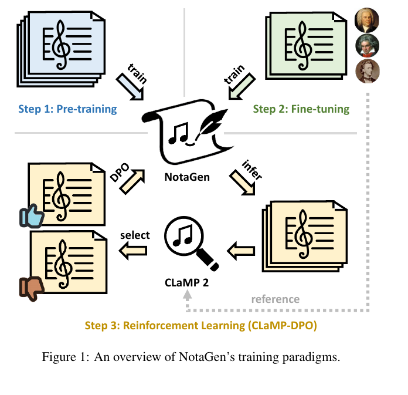
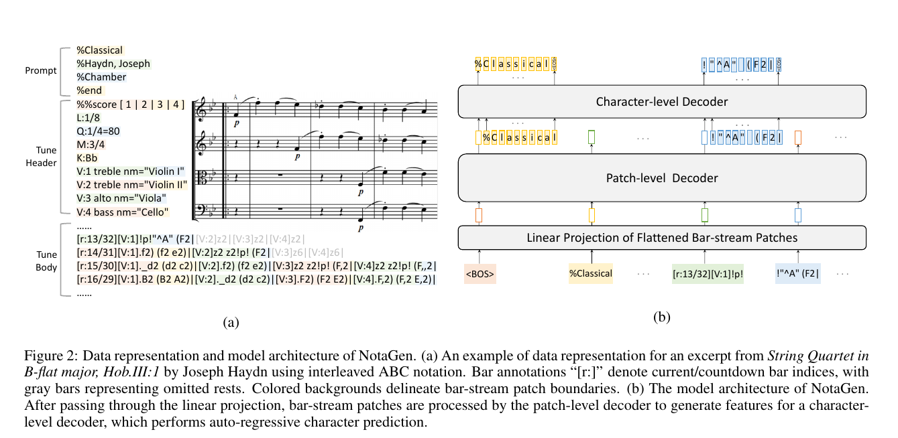
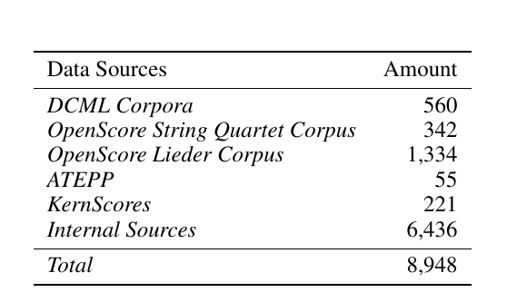
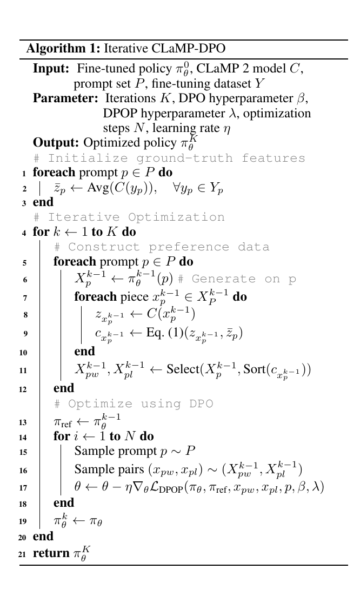
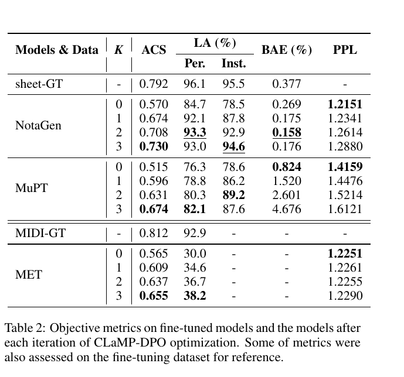
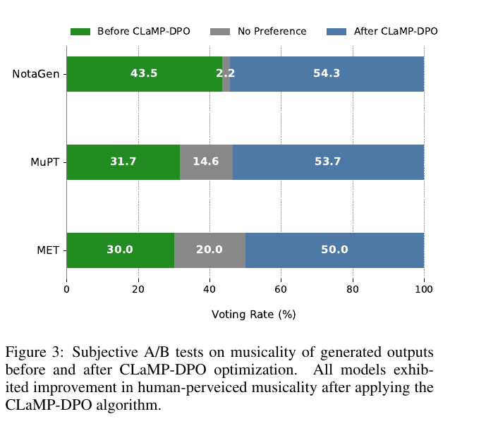
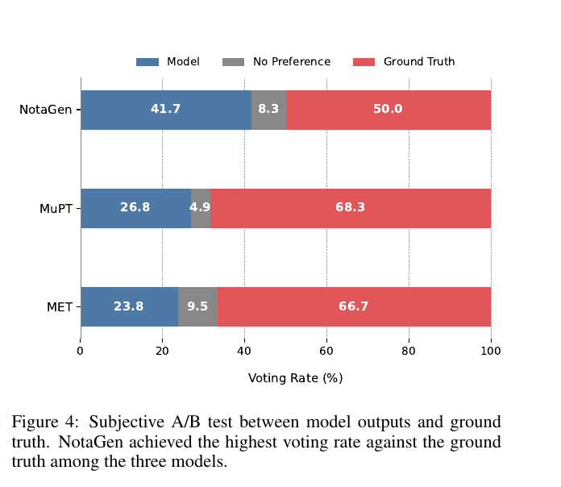

## One-line Summary

Wang et al. train a 516M-parameter hierarchical ABC-notation generator through large-scale pre-training, classical-music fine-tuning, and iterative CLaMP-2-guided preference optimization; the pipeline improves its own latent similarity and prompt-label proxies and receives more post-training A/B votes, but it does not expose music-theory reasons, independently validate its AI evaluator, or statistically establish the claimed musicality gains.

## 1. Document Information

- **Exact title:** *NotaGen: Advancing Musicality in Symbolic Music Generation with Large Language Model Training Paradigms*.
- **Authors:** Yashan Wang, Shangda Wu, Jianhuai Hu, Xingjian Du, Yueqi Peng, Yongxin Huang, Shuai Fan, Xiaobing Li, Feng Yu, and Maosong Sun. Wang, Wu, and Hu are marked as equal contributors; Sun is the corresponding author. [PDF p. 1]
- **Source record:** arXiv `2502.18008v5`, subject class `cs.SD`, dated 21 March 2025 in the PDF margin. The PDF does not print a publisher DOI or final venue; the frontmatter therefore records the standard arXiv resolver DOI `10.48550/arXiv.2502.18008`. [PDF p. 1]
- **Affiliations:** Central Conservatory of Music, University of Rochester, Beijing Flowingtech Ltd., an independent researcher, Beihang University, and Tsinghua University. [PDF p. 1]
- **Length and denominator:** 12 physical PDF pages: seven pages of main paper, two pages of references, and three appendix pages. This digest checked **12/12 pages**. The paper does not print conventional page numbers, so citations use physical PDF pages only.
- **Extraction method:** the complete PDF was extracted twice with Poppler/MiKTeX `pdftotext` (UTF-8 layout-preserving and reading-order modes). The layout extraction contained 12 page separators and non-empty text on all 12 pages. All pages were also rendered at 150 DPI for page-level checking; seven claim-bearing figures, tables, and the algorithm were reproducibly cropped at 180 DPI and visually inspected. Equation signs, top/bottom preference directions, Table 1 counts, every Table 2 value, and Figures 3–4 bar directions were checked against the rendered pages.
- **Canonical integrity:** SHA-256 `b10f17fd4e0a5914f50a491b5c7a473d8cf6c755691521e8573197f4e6bf1431`. The canonical `papers/` copy is byte-for-byte identical to the supplied root PDF; the root file was not moved or modified.
- **Availability boundary:** the PDF gives a public demonstration URL, but it does not contain a code-release, checkpoint-release, training-data manifest, or explicit redistribution statement. No external site was consulted.
- **Primary category:** `generation-and-planning`. The main contribution is a generative architecture and an LLM-style pre-train–fine-tune–preference-optimize recipe. The work has secondary relevance to representation, controllability, and human evaluation, but it neither enforces explicit music-theory constraints nor claims a faithful explanation method.

This digest distinguishes three evidence levels:

1. **Reported:** statements, values, and interpretations made by the authors.
2. **Verified:** formulas, table entries, and graphical directions checked against rendered PDF pages.
3. **Repository interpretation:** implications for explainable, transparent, and theory-grounded generative-music research that are not direct claims by the authors.

## 2. Key Contributions

### A complete LLM-inspired training sequence for classical sheet music

NotaGen applies three stages to one symbolic-music generator: pre-training on 1.6M ABC sheets, supervised fine-tuning on 8,948 curated classical sheets, and iterative preference optimization with an AI evaluator. The authors frame the combination, rather than any one stage alone, as the paper's central contribution. [PDF pp. 1–5]

*Figure 1, PDF p. 1. The diagram makes the direction of the final loop explicit: CLaMP 2 compares generated candidates with prompt-conditioned reference music, selects preferred and rejected generations, and supplies those pairs to DPO-style optimization.*

### A structured long-form ABC representation

The model uses interleaved ABC notation, placing the voices of each bar on one line and marking them with `[V:]`. Full-rest bars are removed, reducing sequence length to 80.7% on average. Each body line receives `[r:current/countdown]` bar indices. During training, a random body segment is paired with the header; at inference, generation begins from the first bar and, if the context fills before the countdown reaches the end, continues from the header plus the latter half of the generated body. [PDF pp. 2–3]

This is more than formatting. Interleaving makes simultaneous voices locally co-present, the bar countdown supplies an explicit plan horizon, and stream continuation supports pieces longer than one model context. The paper does not separately ablate any of these three choices.

### Hierarchical character generation over bar-stream patches

Fixed-length bar-stream patches, padded when necessary, are flattened from one-hot characters and linearly projected. A patch-level GPT-2 decoder models dependencies between patches; its hidden states condition a character-level GPT-2 decoder that autoregressively generates the next patch. NotaGen has 20 patch-level layers, six character-level layers, hidden size 1,280, context length 1,024, and 516M parameters. [PDF pp. 3, 5]

*Figure 2, PDF p. 3. The left side links the prompt, score header, interleaved voices, countdown labels, and patch boundaries; the right side shows the patch-to-character decoding hierarchy.*

### CLaMP-DPO: preference optimization without new human labels

For each prompt, CLaMP 2 embeds generated pieces and the prompt's fine-tuning references. Cosine similarity to the mean reference embedding becomes the CLaMP 2 Score. The top 10% of generated scores form the chosen set and the bottom 10% form the rejected set; DPO-Positive then optimizes these pairs while penalizing a fall in chosen-output probability relative to the frozen reference policy. The procedure is repeated three times, with fresh generations and a new reference policy at each iteration. [PDF pp. 4–6]

The method avoids collecting a new preference label for every generated pair, but it does not avoid a preference assumption: similarity to the average CLaMP 2 representation of authentic pieces is treated as the desired direction. This is a latent learned proxy, not an explicit statement of harmony, counterpoint, form, or notation rules.

### Cross-architecture post-training test

The same procedure is applied to NotaGen, MuPT, and the MIDI Event Transformer (MET), spanning ABC and MIDI, character and BPE/event tokenization, and different hierarchical decoders. Average CLaMP 2 Score rises monotonically for all three, prompt-label accuracy generally rises, and post-optimization outputs receive more subjective votes than pre-optimization outputs. This supports transfer of the optimization recipe across the three tested systems, not universality across symbolic-music models. [PDF pp. 5–7]

### Human comparison against fine-tuning references

Ninety-two participants from music colleges took part in A/B tests. NotaGen earns 41.7% of votes against its human-authored reference set, versus 26.8% for MuPT and 23.8% for MET in their respective comparisons. NotaGen is therefore the strongest of the three models under this protocol, but human ground truth still receives 50.0% against NotaGen, 68.3% against MuPT, and 66.7% against MET. [PDF pp. 6–7]

### Relevance to explainable and theory-grounded generation

The work is useful as a boundary case. Its training pipeline is **procedurally inspectable**: one can identify the prompt, reference set, embedding score, chosen/rejected quantiles, frozen policy, and optimization iteration. Its musical reason is **not interpretable**: the dimensions of CLaMP 2's embedding and the basis of a candidate's score are not decomposed into theory concepts or validated as faithful explanations. A theory-grounded successor could preserve NotaGen's scalable preference stage while combining the latent critic with explicit voice-leading, harmonic-function, cadence, meter, range, notation-validity, and long-form constraints whose contributions are separately logged and tested.

## 3. Methodology and Architecture

### 3.1 Interleaved ABC notation

An ABC sheet contains a tune header—tempo, meter, key, instrumentation, and related metadata—and a tune body. NotaGen adopts the interleaved variant used by CLaMP 2 and MuPT: different voices in one bar are merged onto one line and marked with `[V:]`, preserving local temporal alignment across voices. Full-rest bars containing only `z` or `x` are removed. The authors report that this leaves 80.7% of the original length on average. [PDF pp. 2–3]

The representation retains standard notation information unavailable in note-only token streams, but the paper does not quantify ABC parse success, engraving errors other than duration mismatch, tie/slur validity, enharmonic spelling, dynamic consistency, or whether omitted rest bars can always be restored without ambiguity.

### 3.2 Bar countdown and stream continuation

Every tune-body line is prefixed with `[r:]`, encoding both current and remaining bar counts. Random body segments are used during training, attached to the tune header. At inference, bar labels force generation to start at the beginning. If the work does not finish inside the current context, the model forms a new input from the header and second half of the existing body and continues until the final countdown bar. [PDF pp. 2–3]

This provides a simple explicit length plan, but not a plan for exposition, recapitulation, cadence placement, thematic return, or orchestral trajectory. No experiment isolates whether countdown conditioning improves long-range form.

### 3.3 Bar-stream patch hierarchy

Bar-stream patching divides header lines and bars into fixed-length character patches. Every patch is flattened from character one-hot vectors and mapped through a linear projection. The patch decoder models the sequence of patch embeddings; the character decoder receives its final hidden features and predicts the next patch one character at a time. [PDF p. 3]

The architecture's reported configuration is:

- patch-level GPT-2 decoder: 20 layers;
- character-level GPT-2 decoder: six layers;
- hidden size: 1,280;
- context length: 1,024;
- total parameters: 516M. [PDF p. 5]

The paper does not state the character vocabulary, patch width, dropout, fine-tuning batch size, number of fine-tuning epochs, decoding temperature/top-k/top-p, or generation stopping/error-recovery details in the main PDF.

### 3.4 Pre-training

The pre-training corpus contains 1.6M internally curated ABC sheets spanning genres and instrumentations. Music-related text such as tempo and expression markings is retained; lyrics and background text are removed. Every sheet is transposed into 15 keys for augmentation, including F-sharp, G-flat, C-sharp, and C-flat; one transposition is randomly selected for each piece in each epoch. [PDF p. 3]

Training uses AdamW, learning rate `1e-4`, 1,000 warm-up steps, eight NVIDIA H800 GPUs, and batch size four per GPU. The PDF does not report epochs, total update steps, wall time, energy, duplicate control, train/validation split, corpus licensing, composer overlap with later evaluation, or memorization tests. [PDF p. 5]

### 3.5 Classical fine-tuning corpus and conditioning

The supervised corpus contains 8,948 sheets with at most 16 staves. Every work is labeled by one of three periods, one of 152 composer names, and one of six instrumentation groups: Keyboard, Chamber, Orchestral, Art Song, Choral, and Vocal-Orchestral. The prompt is the concatenated `period-composer-instrumentation` triple. Fine-tuning augmentation is limited to the six nearest transpositions, with farther choices among them sampled less frequently, to balance reuse with plausible instrument ranges. [PDF pp. 3–4]

*Table 1, PDF p. 4. Verified source counts: DCML 560; OpenScore String Quartet 342; OpenScore Lieder 1,334; ATEPP 55; KernScores 221; internal sources 6,436; total 8,948.*

Internal sources account for 6,436/8,948, about 71.9% of the fine-tuning collection. The public source names and aggregate counts are given, but the work-level manifest, deduplication policy, license map, internal-source provenance, and held-out split are absent. The appendix visualizes label embeddings with t-SNE and lists the prompt combinations used for reinforcement learning; it does not report exact period/composer/instrumentation counts. [PDF pp. 11–12]

### 3.6 CLaMP 2 score

For prompt `p`, let `Y_p` be the prompt's fine-tuning references and `X_p` the generated set. CLaMP 2 maps each piece to a semantic embedding; reference embeddings are averaged to `\bar z_p`. The generated piece score is the cosine similarity

\[
c_{x_p}=\frac{z_{x_p}\cdot \bar z_p}
{\lVert z_{x_p}\rVert\lVert \bar z_p\rVert}.
\]

The signs and normalization in Equation (1) were checked on the rendered fourth PDF page. The optimization seeks a larger mean score over generated pieces. [PDF p. 4]

This objective encourages proximity to a prompt-conditioned corpus centroid. It can reward period, instrumentation, global style, and complexity features captured by CLaMP 2, but the paper does not establish which feature caused an individual score, whether score changes correspond to rule correction, or whether maximizing centroid similarity preserves stylistic diversity.

### 3.7 DPO-Positive objective

For a chosen generation `x_{pw}` and rejected generation `x_{pl}`, ordinary DPO raises the chosen response's relative log-probability over the rejected response, both normalized by a frozen reference policy. The authors report that standard DPO nevertheless allowed absolute chosen probability to fall, so they use DPO-Positive (DPOP). In the verified Equation (3), the DPO logit contains two subtractions:

\[
\beta\log\frac{\pi_\theta(x_{pw}\mid p)}{\pi_{ref}(x_{pw}\mid p)}
-\beta\log\frac{\pi_\theta(x_{pl}\mid p)}{\pi_{ref}(x_{pl}\mid p)}
-\beta\lambda\max\!\left(0,
\log\frac{\pi_{ref}(x_{pw}\mid p)}{\pi_\theta(x_{pw}\mid p)}\right).
\]

The complete loss is the negative expected log-sigmoid of that expression. The final penalty activates when chosen probability under the updated model falls below its reference-policy probability. [PDF p. 4]

### 3.8 Iterative preference construction

For each iteration, the current model generates about 100 pieces for every eligible prompt. Candidates are sorted by CLaMP 2 Score: the top 10% are chosen and bottom 10% rejected. The method description says syntax checks and ground-truth-plagiarism exclusions *can* further refine the sets; the experimental section explicitly confirms only that sheets failing to group staves for the same instrument were removed from the chosen set. Random chosen/rejected pairings become DPOP data. At the next iteration, the previous policy becomes the new frozen reference and fresh candidates are generated. [PDF pp. 4–6]

*Algorithm 1, PDF p. 5. The rendered algorithm verifies the generation → CLaMP embedding → score sorting → chosen/rejected selection → DPOP update sequence and the moving reference policy.*

Only prompts with more than ten fine-tuning examples are eligible. NotaGen and MuPT use 112 prompts covering 86.4% of sheet-GT; MET uses 29 prompts covering 90.5% of MIDI-GT. Settings are `K = 3` iterations, roughly 100 generations per prompt per iteration, `β = 0.1`, `λ = 10`, and `N = 10,000` optimization steps. Learning rates are `1e-6` for NotaGen and MET and `1e-7` for MuPT. [PDF pp. 5–6]

### 3.9 Baselines and modality differences

MuPT-v1-8192-550M uses synchronized/interleaved multi-track ABC with BPE, a 16-layer decoder, hidden size 1,024, context 8,192, and a reported 505M parameters; its pre-training corpus contains 33.6B tokens. MET uses hierarchical event-level and token-level Llama decoders, with 12 and three layers respectively, hidden size 1,024, context 4,096, and 234M parameters. It is pre-trained on Los Angeles MIDI, Monster MIDI, and SymphonyNet data. [PDF p. 5]

NotaGen and MuPT receive the full 8,948-sheet fine-tuning set. Conversion limitations restrict MET to 3,104 keyboard works converted to MIDI, with only `period-composer` prompts. Its appendix encoding represents event type followed by up to seven parameters, padded to length eight, with 3,406 base tokens plus period and composer IDs. Time is split into inter-event beat difference and one-of-16 within-beat subdivision. [PDF pp. 5, 10]

The experiment tests whether the post-training recipe transfers, but it is not a controlled architecture comparison: models differ in pre-training corpora, modality, tokenization, parameter count, context, and for MET even fine-tuning subset and prompt fields.

### 3.10 Objective and subjective evaluation protocol

Four objective measures are used: [PDF p. 6]

- **ACS:** mean CLaMP 2 Score; this is also the optimization target.
- **LA:** period and instrumentation label accuracy from linear classifiers trained on features from M3, a symbolic-music encoder associated with the CLaMP 2 work.
- **BAE:** proportion of sheet bars with duration misalignment.
- **PPL:** model perplexity.

For subjective evaluation, two pieces generated under the same prompt are rendered as videos: Sibelius for sheets and MIDIVisualizer for MIDI. Participants choose the more musically appealing piece or “no preference.” Instructions mention melodic appeal, harmonic fluency, orchestral balance, counterpoint correctness, structural coherence, and notation formatting for sheets. Ninety-two music-college participants take part, with at least 35 valid responses per test group. For model-versus-ground-truth tests involving MET, both sides are converted to MIDI to reduce format bias. [PDF pp. 6–7]

The PDF does not specify the number of unique stimulus pairs per group, prompt sampling, seeds, participant assignment/repeated-measures structure, randomization, blinding, listening environment, exclusions, compensation, demographic breakdown, inter-rater reliability, power calculation, confidence intervals, effect sizes, or hypothesis tests.

### 3.11 Transparency and explanation boundary

NotaGen has an auditable *workflow* but not an interpretable *musical rationale*. A training audit could record the prompt, references, generated candidates, CLaMP scores, quantile selection, policy versions, and DPOP losses. None of those records explains why a passage has good voice leading, why a cadence fits its formal role, or why the model changed a particular note. CLaMP 2 is a learned embedding whose scalar cosine score is neither decomposed nor subjected here to causal faithfulness tests. The human test assesses output preference, not explanation usefulness.

## 4. Key Results and Benchmarks

### 4.1 Objective trajectories

*Table 2, PDF p. 6. Every numeric entry below was checked against this rendered table.*

| Model/data | K | ACS | LA period | LA instrumentation | BAE | PPL |
|---|---:|---:|---:|---:|---:|---:|
| sheet-GT | — | 0.792 | 96.1 | 95.5 | 0.377 | — |
| NotaGen | 0 | 0.570 | 84.7 | 78.5 | 0.269 | 1.2151 |
| NotaGen | 1 | 0.674 | 92.1 | 87.8 | 0.175 | 1.2341 |
| NotaGen | 2 | 0.708 | 93.3 | 92.9 | 0.158 | 1.2614 |
| NotaGen | 3 | 0.730 | 93.0 | 94.6 | 0.176 | 1.2880 |
| MuPT | 0 | 0.515 | 76.3 | 78.6 | 0.824 | 1.4159 |
| MuPT | 1 | 0.596 | 78.8 | 86.2 | 1.520 | 1.4476 |
| MuPT | 2 | 0.631 | 80.3 | 89.2 | 2.601 | 1.5214 |
| MuPT | 3 | 0.674 | 82.1 | 87.6 | 4.676 | 1.6121 |
| MIDI-GT | — | 0.812 | 92.9 | — | — | — |
| MET | 0 | 0.565 | 30.0 | — | — | 1.2251 |
| MET | 1 | 0.609 | 34.6 | — | — | 1.2261 |
| MET | 2 | 0.637 | 36.7 | — | — | 1.2255 |
| MET | 3 | 0.655 | 38.2 | — | — | 1.2290 |

ACS increases monotonically for all three systems, as expected for the metric used to build preference pairs. NotaGen gains `+0.160`, MuPT `+0.159`, and MET `+0.090` from `K = 0` to `K = 3`. The increments diminish with iteration.

Prompt-label accuracy also generally rises, but not monotonically in every column: NotaGen period accuracy peaks at 93.3% at `K = 2` before falling to 93.0%; MuPT instrumentation peaks at 89.2% before falling to 87.6%. NotaGen instrumentation rises from 78.5% to 94.6%, while MET period remains far below MIDI-GT at 38.2% versus 92.9%.

NotaGen's BAE improves from 0.269% to 0.158% at `K = 2`, then rises slightly to 0.176%. MuPT's BAE degrades sharply from 0.824% to 4.676%. The authors attribute the contrast to character tokenization preserving durations while BPE may fuse duration and pitch. This is a plausible hypothesis, not an ablation.

Perplexity rises for NotaGen and MuPT as ACS rises; MET PPL stays nearly flat. This supports the limited claim that held-distribution next-token likelihood does not track the paper's preferred post-training direction. It does not establish that perplexity is generally unsuitable for all symbolic-music evaluation.

### 4.2 Before-versus-after A/B preferences

*Figure 3, PDF p. 6. All blue “after” bars are longer than the green “before” bars; the figure provides percentages but no intervals or significance markers.*

- **NotaGen:** before 43.5%, no preference 2.2%, after 54.3%.
- **MuPT:** before 31.7%, no preference 14.6%, after 53.7%.
- **MET:** before 30.0%, no preference 20.0%, after 50.0%.

Post-training wins each descriptive comparison. The net “after minus before” margins are 10.8, 22.0, and 20.0 percentage points. Because response counts, pairing structure, and uncertainty are not supplied, these are observed vote shares rather than established population effects.

### 4.3 Model-versus-human-reference comparisons

*Figure 4, PDF p. 7. The direction is unambiguous: NotaGen is closest to its human references, but ground truth wins all three comparisons.*

- **NotaGen:** model 41.7%, no preference 8.3%, ground truth 50.0%.
- **MuPT:** model 26.8%, no preference 4.9%, ground truth 68.3%.
- **MET:** model 23.8%, no preference 9.5%, ground truth 66.7%.

The paper's body correctly says human compositions consistently outperform all generated outputs and that NotaGen has the highest model vote share. The abstract and contribution bullet say NotaGen “significantly outperforms baseline models in subjective A/B tests against human compositions,” but the PDF reports no statistical test. The human reference set is also constructed from the fine-tuning dataset rather than identified as an unseen work-disjoint test set. The defensible conclusion is narrower: under three separate descriptive A/B comparisons against training-corpus references, NotaGen performs closer to those references than MuPT or MET; it does not beat the human reference, establish held-out composition generalization, or demonstrate statistical significance. [PDF p. 7]

### 4.4 What the evidence supports

The combined results support these bounded claims:

1. CLaMP-selected DPOP raises CLaMP similarity across three tested model/encoding families.
2. It usually improves coarse prompt-label agreement, although some measures peak before iteration three.
3. It can damage notation-duration validity for BPE-based MuPT even while preference proxies rise.
4. The post-trained outputs receive more A/B votes than their own pre-trained/fine-tuned counterparts in the reported sample.
5. NotaGen receives the largest model-side vote share against human references among the three tested systems.

The results do **not** establish a statistically significant improvement, a causal contribution for each architectural choice, independent evaluator validity, theory compliance, generalization beyond the sampled prompts and corpora, freedom from memorization, or superiority to human composition.

## 5. Limitations and Future Work

### Limitations acknowledged by the authors

- A separate classical post-training stage between pre-training and fine-tuning improves NotaGen convergence and ACS but has weaker effects on MuPT and MET, so it is not retained as a general recipe. [PDF p. 7]
- CLaMP 2 Score is unreliable for corrupted or syntactically defective generations; it presupposes a model already capable of reasonable composition. [PDF p. 7]
- Orchestral generation remains weaker than solo piano and string-quartet generation even after full-rest-bar removal. [PDF p. 7]
- Future work proposes applying the framework to jazz, pop, ethnic music, and emerging music-generation architectures. [PDF p. 7]

### Evidence and reproducibility limits

- **Mostly internal data:** the 1.6M pre-training corpus is internal, and 6,436 of 8,948 fine-tuning sheets are internal. No work-level provenance, license, deduplication, or train/test-leakage audit is supplied.
- **No independent reward validation:** ACS is both the preference-construction signal and the headline objective measure. LA uses another learned encoder from the same CLaMP 2 line. Improvements can therefore reflect evaluator alignment rather than broader musical quality.
- **Coarse conditioning:** period, composer, and instrumentation labels do not encode movement type, meter, form, harmonic plan, texture, difficulty, voice-leading constraints, or intended expressive arc.
- **Weak notation coverage:** BAE checks only bar duration. It cannot establish correct spelling, ties, tuplets, dynamics, instrument ranges, playable voicing, engraving, or recovery of omitted rest bars.
- **Incomplete subjective protocol:** vote shares lack sample counts per item, intervals, effects, significance tests, reliability, and power. The single preference choice does not reveal which of the instructed criteria drove a judgment.
- **Training-corpus reference comparison:** the human-authored comparison pieces are taken from the fine-tuning dataset, and no work-disjoint held-out reference protocol is stated. The result therefore cannot establish generalization to unseen human compositions.
- **Unequal baselines:** pre-training data, modality, architecture, context, parameter count, fine-tuning set, and prompts differ. The comparison cannot assign NotaGen's advantage specifically to bar-stream patching, characters, data quantity, or model size.
- **Unclear filtering:** syntax and plagiarism filters are described as options, but only same-instrument stave-grouping exclusion is explicitly confirmed for the experiment.
- **Long-form claims are not directly tested:** countdown streaming is described, but no form-aware metric, full-piece structural analysis, or listener study by composition length is reported.
- **No explicit release statement:** the paper names a demo but does not document code, checkpoints, fixed evaluation stimuli, or data manifests in the PDF.

### Explainability and theory-grounding limits

CLaMP-DPO is not a theory-constrained generator. CLaMP 2 compresses musical evidence into a latent embedding; cosine similarity gives no local note-level or rule-level rationale. A high score does not certify cadence treatment, tonal function, counterpoint species, resolution of tendency tones, voice independence, motivic development, orchestration, or notational correctness. Nor does the paper test whether changes to the claimed reason cause predicted changes in model behavior.

For transparent generative-music research, a stronger extension would:

1. record reference identities, model versions, raw evaluator scores, quantile decisions, and rule-specific signals for every training pair;
2. combine the learned aesthetic proxy with explicit, separately weighted harmony, voice-leading, range, meter, form, and notation constraints;
3. test evaluator faithfulness with counterfactual score edits and controlled musical perturbations;
4. measure diversity and memorization while optimizing similarity to prompt centroids;
5. use blind musician studies that separate musical quality, stylistic fit, correctness, explanation usefulness, and repair performance;
6. report corpus provenance and composer/work-disjoint splits so style control is distinguishable from recall;
7. ablate interleaving, rest removal, countdown labels, patch hierarchy, supervised fine-tuning, DPOP, and each feedback component.

## 6. Related Work

The paper positions NotaGen among text-like sheet generators. Tunesformer supplies the bar-patching lineage; MuPT supplies synchronized/interleaved multitrack ABC and a large pre-trained baseline; Score Transformer and Measure by Measure represent alternative score encodings and hierarchical designs. MelodyT5, MelodyGLM, MuseBERT, and LakhNES motivate pre-training for symbolic generation. [PDF pp. 2–3]

Its reinforcement-learning lineage includes RL Tuner, RL-Duet, RL-Chord, and a transformer fine-tuning system whose rewards are hand-designed from music theory or style-specific objectives. The authors contrast those with MusicRL's costly human feedback and propose CLaMP 2 as reusable AI feedback. DPO and DPO-Positive provide the optimization mechanism. [PDF pp. 2, 4]

The direct baselines are MuPT and MET. CLaMP 2 is not only cited background: it defines the reference embedding, preference ranking, and ACS evaluation. This dependence should be explicit in future comparisons because the post-training procedure and main objective metric share the same evaluator. [PDF pp. 4–6]

No currently ingested paper page in this repository is sufficiently close for a defensible paper-to-paper wikilink. The appropriate synthesis connection is a new overview of LLM-style training for symbolic music and a concept page on AI feedback or learned-evaluator preference optimization; root-level integration should add reciprocal links after choosing the shared anchor.

## 7. Glossary

- **ABC notation:** A text-based music notation encoding containing a metadata/header section and symbolic score body.
- **Interleaved ABC:** A variant that places all voices for one bar into one sequence line, distinguished by `[V:]` markers.
- **Bar-stream patching:** Fixed-length character patches constructed across header lines and interleaved bars, used as the higher-level model units.
- **Countdown annotation (`[r:]`):** A label containing current and remaining bar indices, used to condition length and continuation.
- **NotaGen:** The paper's 516M-parameter hierarchical patch-level/character-level ABC generator.
- **CLaMP 2:** A multimodal learned retrieval model that embeds ABC and MIDI and supplies the latent semantic features used for AI feedback.
- **CLaMP 2 Score / ACS:** Cosine similarity between a generated embedding and the mean reference embedding for its prompt; ACS is its average over outputs.
- **DPO:** Direct Preference Optimization, which trains a policy from chosen/rejected pairs relative to a frozen reference policy.
- **DPOP:** DPO-Positive, adding a penalty when the chosen output's absolute probability falls below the reference model's probability.
- **CLaMP-DPO:** The paper's iterative process for generating candidates, ranking them by CLaMP 2, selecting top/bottom quantiles, and optimizing with DPOP.
- **Label Accuracy (LA):** Linear-classifier agreement between generated music and requested period/instrumentation labels.
- **Bar Alignment Error (BAE):** Percentage of bars whose encoded durations do not align.
- **MuPT:** A pre-trained BPE-based multitrack ABC model used as a sheet-music baseline.
- **MET:** MIDI Event Transformer, a hierarchical event/token decoder used as a MIDI baseline.
- **Procedural auditability:** Ability to reconstruct the stages and scalar decisions of a pipeline; it is weaker than a faithful musical explanation.
