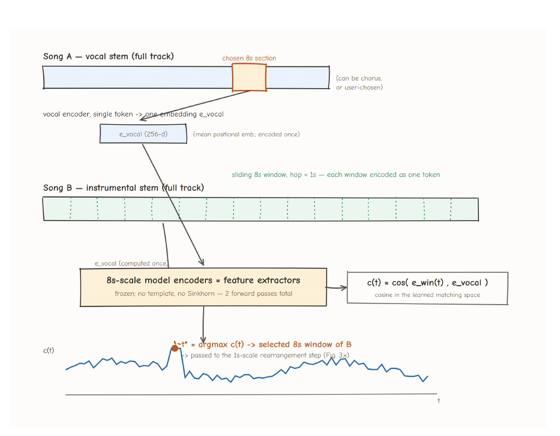

## One-line Summary

Wu decomposes source-preserving pop-song mashup creation into downbeat-level temporal alignment, vocal-conditioned accompaniment selection and rearrangement, and reference-steered mix restoration, exposing inspectable intermediate states while evaluating listener preference as a graded ranking rather than a binary label.

## 1. Document Information

- **Document:** Final Ph.D. thesis in Computer Science and Engineering, The Hong Kong University of Science and Technology, August 2026.
- **Author:** Xinyang Wu.
- **Supervisor:** Andrew Brian Horner.
- **Completion evidence:** The signature page states that the examined thesis is complete, satisfactory, and revised as required; it is dated 27 August 2026. [PDF p. 3 / thesis p. iii]
- **Length:** 109 physical PDF pages. Front matter occupies PDF pp. 1–16; Arabic thesis page 1 begins on physical PDF p. 17, so body citations follow `PDF page = printed page + 16`. The list of publications is PDF p. 98 / thesis p. 82, followed by the bibliography.
- **Canonical integrity:** SHA-256 `771daaeeec623de9af1b10dab64816119b8553b5a7d90b7688938ce692723501`. The file in `papers/` is an exact byte-for-byte copy of the supplied PDF.
- **DOI:** No DOI for the dissertation is stated in the PDF. Four publications listed by the author have DOIs; a fifth is marked “to appear.” [PDF p. 98 / thesis p. 82]
- **Rights boundary:** The authorization page permits HKUST to lend and reproduce the thesis for scholarly research. It does not clearly grant third-party public Git redistribution, so the repository PDF must not be pushed until the publication policy is decided. [PDF p. 2 / thesis p. ii]
- **Primary category:** `retrieval-and-recombination`. The system edits, selects, aligns, rearranges, and restores stems from existing recordings. Its secondary contributions concern interaction and evaluation, transparent workflow design, theory-informed constraints, and learned generation/restoration.

This digest distinguishes three evidence levels:

1. **Reported:** statements, methods, and numbers present in the dissertation.
2. **Verified:** values checked against the rendered PDF, especially tables and figures.
3. **Repository interpretation:** implications for explainable and transparent music AI that go beyond the author’s direct evidence.

## 2. Key Contributions

### A modular, provenance-aware pipeline

The thesis rejects a single end-to-end mashup generator in favor of three independently testable stages: temporal alignment, musical compatibility, and mix engineering. Table 1.1 distinguishes adopted components such as HT Demucs, Beat This!, and OpenL3 from proposed DSP methods, proposed learned models, and evaluation components. The system therefore exposes both the origin and the role of each module. [PDF pp. 22–25 / thesis pp. 6–9]

*Figure-only evidence from Figure 1.1, PDF p. 23 / thesis p. 7. Shading separates thesis contributions from adopted components.*

### Downbeat-level temporal alignment

The alignment stage separates four stems, extracts a representative kick/snare pattern, key-matches the complementary song through a Camelot-wheel rule, globally normalizes tempo, and locally warps every detected downbeat to an exact grid. The intended advantage over uniform stretching is that small tempo-estimation errors cannot accumulate into later phrase misalignment. [PDF pp. 26–34 / thesis pp. 10–18]

### Graded, context-dependent preference ranking

Two stem-swapping studies create 360 rated mashups across four strategies. Instead of treating listener judgments as independent scalar ratings or binary compatibility labels, the thesis converts within-context preferences into Bradley–Terry comparisons and learns a transitive candidate utility conditioned on the base vocal. [PDF pp. 34–42 / thesis pp. 18–26]

### Vocal-conditioned accompaniment rearrangement

A family of asymmetric dual-encoder Transformers learns to undo random accompaniment permutations relative to an ordered vocal template. Cosine similarities become a doubly stochastic Sinkhorn assignment. Models trained at 1-, 4-, and 8-second scales are reused hierarchically: coarse encoders scan for a compatible accompaniment section, while the fine model reorders segments within the selected material. [PDF pp. 44–68 / thesis pp. 28–52]

### Reference-steered mix restoration

The final system treats mix integration as restoration of a foreign instrumental beneath an untouched vocal. A 46M-parameter U-Net learns a deterministic rectified flow from broken to clean instrumental magnitude, reuses the input phase, and accepts a 31-band vocal-relative tone-and-level target. The target can be dropped for an unconditional fallback or supplied from a reference production. [PDF pp. 69–90 / thesis pp. 53–74]

### Transparent editing as the thesis position

The dissertation’s transparency claim is architectural: downbeat grids, warp maps, compatibility curves, assignment matrices, rankings, tonal-balance curves, and restored spectra provide intervention points. This supports local repair rather than whole-output resampling. It is strong workflow auditability, but it is not yet evidence of mechanistic explanation, semantic musical reasoning, or improved human understanding. [PDF pp. 22–24, 95–97 / thesis pp. 6–8, 79–81]

## 3. Methodology and Architecture

### 3.1 Stage 1: temporal alignment and stem swapping

#### Source separation and role assignment

HT Demucs separates each song into vocals, drums, bass, and “other.” The **base** song supplies the vocal identity; the **complementary** song supplies material to swap or rearrange. This directionality matters throughout the pipeline because compatibility is judged relative to the retained vocal. [PDF pp. 24–26 / thesis pp. 8–10]

#### Main beat pattern extraction

The proposed drum analysis follows this sequence: [PDF pp. 27–30 / thesis pp. 11–14]

1. Low-pass the drum stem at approximately 2 kHz and downsample it; the new sampling rate is not reported.
2. Compute magnitude-spectrogram spectral flux using half-wave rectification and peak-pick onsets. A 50 ms minimum interval is an example, but the threshold multiplier and complete parameters are not stated.
3. Extract a centered 0.1-second mel-spectrogram vector around every onset and cluster the vectors with K-means, `K = 2`.
4. Label the lower mean spectral-centroid cluster “kick” and the higher cluster “snare.”
5. Find the modal kick-to-snare delay within a 0.1-second tolerance, retain kick events followed by snares at that delay, and cross-correlate adjacent onset sequences.
6. Select the most correlated pair as the main rhythmic pattern and alignment anchor.

*Figure 2.1, PDF p. 27 / thesis p. 11. The diagram makes the kick/snare rule inspectable, but no annotated phrase-boundary evaluation is reported.*

The method assumes a kick/snare-dominant rhythmic texture. It does not cover drumless material and may be brittle for unusual percussion, compound or changing meter, rubato, and patterns whose percussion boundary is not a harmonic or vocal phrase boundary.

#### Harmonic mixing and local beat warping

The complementary song is shifted to the base key or its perfect fifth, choosing the target with the smaller semitone displacement. The implementation requires ground-truth key metadata because the thesis considers automatic estimation insufficiently reliable. This is an explicit theory rule, but it does not ensure chord-progression or melodic compatibility. [PDF p. 30 / thesis p. 14]

Global tempo estimates can drift when bars are counted toward a later section. The 120-versus-121 BPM example is approximately 495.9 ms after 30 four-beat bars, substantively about half a second although described as more than 500 ms. [PDF p. 31 / thesis p. 15]

Warp anchors come from the kick/snare analysis or Beat This! as a fallback. Outlier intervals differing by more than 10% from the median are removed, metrical level is normalized, and Rubber Band’s timemap mode with the R3/fine engine continuously maps source downbeats to an exact target grid. Smoothing is enabled and transient detection disabled. The worked 44.1 kHz map moves frames `89,081 → 88,200`, `177,281 → 176,400`, and `265,482 → 264,600`, while preserving segment endpoints. [PDF pp. 32–34 / thesis pp. 16–18]

The chapter does not directly evaluate alignment error, compare global-only and local-warp conditions, or run a perceptual artifact test. “Downbeat-accurate” and “artifact-free” are therefore design claims rather than demonstrated outcomes in this thesis.

### 3.2 Listening studies and learning to rank

#### Drum-swapping study

Ten unnamed pop, hip-hop, and dance-pop songs spanning 98–174 BPM form all 90 ordered base/complementary pairs. Twenty listeners hear the original and nine drum-swapped candidates for each base and can select any preferred candidates. The prose says each excerpt is eight bars. [PDF pp. 34–36 / thesis pp. 18–20]

#### Four-strategy study

The same ten songs yield 360 candidates: 90 each for drums, drums plus bass, “other,” and base-vocal-plus-complementary-accompaniment swapping. Four web tests were conducted at different times over a year with 108 unique, musically experienced college students aged 18–30. Strategy is therefore confounded with session and possibly participant cohort. The thesis does not report per-strategy sample sizes, playback controls, exclusion rules, hearing screening, counterbalancing, or participant-level modeling. [PDF pp. 36–38 / thesis pp. 20–22]

#### Pairwise utility model

Each stem is resampled to 16 kHz mono. Frozen OpenL3 produces a 512-dimensional embedding per second, averaged through time. A session-block mapping places the feature in one of four nonzero blocks. Candidate utility for accompaniment `A` and vocal context `B` is linear in the candidate feature and candidate-context elementwise interaction. Within-context rating differences create Bradley–Terry comparisons. [PDF pp. 38–40 / thesis pp. 22–24]

*Figure 2.5, PDF p. 38 / thesis p. 22. The 360 rated candidates create 1,335 non-tied pairs; filtering to rating gaps of at least two leaves 1,096 comparisons.*

Leave-one-context-out evaluation holds out each of 40 strategy/base contexts, trains on the other 39, and ranks the held context’s nine candidates. This is context-held-out but not song-disjoint: the same ten songs recur elsewhere in training. [PDF p. 40 / thesis p. 24]

### 3.3 Stage 2: adaptive instrumental rearrangement

#### Representation and asymmetric encoders

At the finest scale, an eight-second, four-bar passage normalized to 120 BPM is divided into eight one-second half-bars. Every segment uses a coarse mel representation: 32 kHz sampling, `n_fft = 4000`, hop 4000, 128 mel bands, nine frames, and 1,152 flattened values. Standard mel is tested as a higher-resolution alternative with 8,064 features. [PDF pp. 44–48 / thesis pp. 28–32]

Separate two-layer, four-head Transformer encoders project vocal and instrumental inputs to 256 dimensions. Only the vocal encoder receives learned positional embeddings. The vocal is an ordered template; the shuffled instrumental side remains position-invariant. L2-normalized embeddings form a cosine-similarity matrix, divided by a learned temperature and normalized for 20 Sinkhorn iterations into a doubly stochastic assignment. Row maxima supply confidence, while rowwise argmax supplies the reported hard ordering. [PDF pp. 48–51 / thesis pp. 32–35]

*Figure 3.2, PDF p. 49 / thesis p. 33. The architecture exposes a score and assignment trace. Rowwise argmax is not guaranteed to select unique columns unless the matrix is already close to a permutation; a linear-assignment projection would guarantee that property.*

#### Self-supervision and multi-scale reuse

Training starts from aligned same-song vocal/instrumental sequences, randomly permutes the eight accompaniment segments, predicts the inverse permutation, softly reconstructs the ordered features with the assignment matrix, and minimizes squared reconstruction error. This creates supervision without human compatibility labels. [PDF pp. 51–54 / thesis pp. 35–38]

The same architecture is trained at 1-, 4-, and 8-second token scales. The 8-second encoders scan overlapping accompaniment windows at one-second hops using cosine similarity. The selected window then passes to the 1-second Sinkhorn model for fine rearrangement. [PDF pp. 54, 57–63 / thesis pp. 38, 41–47]

*Figures 3.4–3.5, PDF p. 59 / thesis p. 43. In the illustrated pair, the selected eight-second window begins at 145 s with cosine 0.302. It is one case study, not a dataset-level validation.*

The chapter distinguishes coarse section compatibility from fine rearrangeability. Their weak correlation in one representative pair (`ρ = 0.18`) is evidence that “compatibility” is not one scalar property. Assignment sharpness also differentiates an illustrated compatible window (mean row confidence 0.97) from an incompatible one (0.49), but this score is not calibrated against listener preference. [PDF pp. 61–63 / thesis pp. 45–47]

### 3.4 Stage 3: vocal-conditioned rectified-flow restoration

#### Per-stem pilot

The pilot corrupts each of four MUSDB18 stems independently with 30–50 time/frequency gain manipulations. Separate complex-STFT Attention-UNets and a final mastering model run a 100-step source-reinjected diffusion process. This establishes that an input-anchored diffusion formulation can beat two baselines in a deliberately severe synthetic setting, while also revealing that per-stem correction lacks a relational vocal reference. [PDF pp. 72–77 / thesis pp. 56–61]

#### Scaled training task

The final system trains on approximately 100,000 internally held professional songs separated into vocal/instrumental pairs. It draws random eight-second mono windows at 44.1 kHz. An online corruption applies 2–4 log-frequency Gaussian EQ bells with gains sampled from −10 to +10 dB, centers from 80 Hz to 9 kHz, random widths, and a global level shift from −6 to +6 dB. The positive, time-invariant gain changes magnitude but preserves phase. [PDF pp. 77–80 / thesis pp. 61–64]

The model therefore predicts only instrumental magnitude, reconstructs with the exact broken-instrumental phase, adds the untouched vocal, and applies the inverse STFT. This structurally prevents phase error for the corruption family used in training; it does not cover clipping, codec loss, heavy compression, reverberation, or other destructive or spatial mismatches. [PDF p. 80 / thesis p. 64]

#### Semantic condition and deterministic flow

Four `2048 × 352` planes enter a 46M-parameter convolutional U-Net: the current bridge state, clean vocal magnitude, a 31-band target tonal-balance map, and a binary map-present indicator. The 31 bands span 40 Hz–16 kHz over two four-second chunks and are expressed relative to vocal level, so the target carries both tone and instrumental-to-vocal level while suppressing note-level content. The map and indicator are jointly dropped for 30% of training cases. [PDF pp. 80–83 / thesis pp. 64–67]

*Figure 4.6, PDF p. 81 / thesis p. 65. The curve is an intelligible production target, although it is not a music-theory explanation.*

Training samples a point on the straight path from broken to clean magnitude. The target velocity is exactly `m_clean - m_broken`, optimized with L1 loss and no Gaussian noise. At inference, an eight-step Euler solver begins at the broken magnitude. Classifier-free guidance compares a dropped-condition velocity with a supplied-condition velocity; the reported default is `w = 2`, requiring 16 U-Net evaluations. [PDF pp. 83–85 / thesis pp. 67–69]

Training uses AdamW, learning rate `1e-4`, weight decay 0.01, cosine scheduling with 1,000 warm-up steps, batch size 36, and approximately 90,000 updates. Corruptions, windows, and condition dropout are resampled each step. The chapter does not state corpus licensing, genre balance, artist-disjoint splitting, the exact separator, or the treatment of separator leakage. [PDF pp. 84–85 / thesis pp. 68–69]

### 3.5 Proposed full-length and mixed-initiative extension

Chapter 5 proposes, but does not implement, an agent that analyzes structure, beats, chords, energy, key, and tempo; plans section pairings and transitions; calls rearrangement, content-editing, mixing, and spatial tools; and uses learned evaluators to retry weak sections. A mixed-initiative version would expose section plans, transitions, and stem choices while accepting high-level constraints over energy, transition character, and source prominence. [PDF pp. 91–97 / thesis pp. 75–81]

This is a research agenda rather than a demonstrated system. Confidence-triggered editing, tool contracts, LLM planning, long-form coherence, spatial output, and interactive explanation utility remain unevaluated.

## 4. Key Results and Benchmarks

### 4.1 Stem swapping and temporal alignment

- In the 20-listener drum-swap study, the thesis reports a 27% preferred-over-original rate and says 89 of 90 candidates received at least one selection. The 27% denominator is not defined; it most plausibly refers to the 1,800 listener–candidate yes/no opportunities. [PDF p. 35 / thesis p. 19]
- Pop bases with hip-hop drums receive the highest mean selection count, 6.83 of 20, followed by pop/dance-pop at 6.11. Hip-hop bases with pop drums score lowest at 4.08. No confidence intervals or inferential tests are supplied. [PDF p. 36 / thesis p. 20]
- The four strategy sessions show mean cross-strategy ranking correlation 0.18, but strategy, session time, and participant cohort are confounded. [PDF p. 37 / thesis p. 21]
- No reported benchmark measures downbeat accuracy, cumulative drift after warping, audio artifacts, or global-only versus locally warped alignment.

### 4.2 Learning-to-rank results

| Model | Pairwise accuracy | Mean per-context Spearman `ρ` |
|---|---:|---:|
| Pointwise regression | 0.784 | 0.676 |
| Pairwise win-count | 0.810 | 0.735 |
| Pairwise utility, full | 0.807 | **0.738** |
| Full minus session-aware blocks | 0.792 | 0.705 |

*Verified from Table 2.3, PDF p. 40 / thesis p. 24. Other ablations lie within the reported fold-to-fold noise.*

The utility ranker beats the Mashability heuristic for all four swapping strategies: mean `ρ = 0.738` versus `−0.047`, with per-strategy ranker values 0.798 vocal, 0.799 other, 0.639 drum, and 0.717 bass. This rejects that short-stem implementation as a ranking proxy in this setup; it does not reject explicit harmonic knowledge in general. [PDF p. 41 / thesis p. 25]

*Figure 2.6, PDF p. 42 / thesis p. 26: AUC 0.89 overall, 0.93 on gap-filtered pairs, and 0.64 on excluded adjacent pairs; all 40 context correlations are positive, with minimum 0.27 and mean 0.74. Calibration is shown visually without ECE, Brier score, bin counts, or uncertainty bands.*

### 4.3 Rearrangement results

| Scale | Context | Parameters | Train/validation examples | Train accuracy | Validation accuracy |
|---|---:|---:|---:|---:|---:|
| 1 s | 8 s | 3.75M | 260k / 29k | 98.12% | **89.24%** [89.1, 89.4] |
| 4 s | 32 s | 5.32M | 158.9k / 8.5k | 99.37% | **93.94%** [93.8, 94.1] |
| 8 s | 64 s | 7.42M | 71.3k / 3.8k | 98.82% | **91.91%** [91.6, 92.2] |

*Verified from Table 3.3, PDF p. 54 / thesis p. 38. The random baseline is 12.5%.*

These are held-out **same-song unshuffling** results, not cross-song mashup-quality estimates. The text calls the train/validation gaps 4–6 points, while the table yields 8.88, 5.43, and 6.91 percentage points. The Wilson intervals treat placement decisions as binomial even though positions within an eight-token sequence are correlated.

The vocal ablation drops the coarse model from 89.24% normally to 28.88% when zeroed and 16.09% under random-noise vocals. Shuffled vocal content retains 87.88%, which the thesis interprets as content matching rather than a simple position shortcut. However, it does not directly ablate the “critical” positional asymmetry, and the exact target transformation for shuffled-vocal evaluation is insufficiently specified. [PDF pp. 55–56 / thesis pp. 39–40]

The cross-song listening study uses ten training-unseen songs and 30 musically experienced participants aged 19–25: [PDF pp. 63–65 / thesis pp. 47–49]

| Criterion | Mashability | Rearrangement | Original |
|---|---:|---:|---:|
| Rhythm | 2.67 | **3.51** | 4.06 |
| Harmony | 2.74 | **3.31** | 3.89 |
| Creativity | 2.73 | **3.24** | 3.62 |
| Overall | 2.63 | **3.38** | 3.93 |

*Figure 3.8, PDF p. 65 / thesis p. 49. The thesis says the proposed system “significantly” outperforms the baseline, but Chapter 3 reports no statistical test, p-value, interval, effect size, or error bars. The design also lacks a same-section-without-reordering condition, so the causal contribution of permutation is not isolated.*

### 4.4 Mix restoration results

The per-stem pilot improves mean SDR from 1.14 dB for the broken mix to 9.32 dB, compared with 0.36 dB for FxNorm-Automix and 3.53 dB for Wave-U-Net. Its best/mean/worst values are 12.89/9.32/6.99 dB. [PDF p. 76 / thesis p. 60]

The final evaluation contains 10 internal-validation clips and 149 MUSDB18-HQ songs under clean, EQ ±4/8/12 dB, and volume-only conditions. The most compact SI-SDR view is: [PDF pp. 86–87 / thesis pp. 70–71]

| Condition | Broken input | Dropped condition `w=0` | Full condition `w=2` |
|---|---:|---:|---:|
| Clean | ∞ | 24.28 ± 4.13 | **28.63 ± 2.70** |
| EQ ±4 dB | 15.77 ± 4.93 | 17.22 ± 4.01 | **23.71 ± 3.38** |
| EQ ±8 dB | 12.70 ± 5.19 | 14.75 ± 3.86 | **21.77 ± 4.09** |
| EQ ±12 dB | 10.64 ± 5.45 | 12.58 ± 4.81 | **20.28 ± 4.82** |
| Volume only | 14.32 ± 3.56 | 17.09 ± 3.36 | **22.55 ± 2.57** |

*Figure 4.8, PDF p. 87 / thesis p. 71. The steered model gains 7.94–9.64 dB over broken inputs across the four corrupted conditions. `w=2` also beats `w=4` on every reported metric and condition.*

On clean input, the `w=2` model reports 0.50 mel-MAE, 0.19 dB tonal-balance error, 0.13 LUFS error, and 28.63 dB SI-SDR. For volume-only corruption, LUFS error falls from 2.90 to 0.23 dB. These are objective synthetic-restoration metrics; Chapter 4 includes no perceptual listening study. [PDF pp. 86–88 / thesis pp. 70–72]

The conditioning ablation is especially informative: [PDF pp. 88–89 / thesis pp. 72–73]

| Conditioning | SI-SDR | Balance error | LUFS error | Clean SI-SDR |
|---|---:|---:|---:|---:|
| Full tone + level | **22.08 ± 4.01** | **0.37 ± 0.33** | **0.32 ± 0.56** | 28.63 |
| Dropped | 15.41 ± 4.47 | 1.88 ± 0.98 | 1.64 ± 1.16 | 24.28 |
| Tone only, level stripped | 8.41 ± 5.27 | 8.35 ± 3.83 | 8.51 ± 3.89 | 8.79 |
| Level only, tone stripped | 2.90 ± 3.13 | 5.31 ± 1.88 | 3.54 ± 1.94 | 2.72 |

Full conditioning adds 6.67 dB pooled SI-SDR over condition dropping. The inference-only partial conditions are worse than no condition because the model follows their malformed target semantics. This is evidence that the control is causally load-bearing, while also showing that separate tone and level controls must be represented during training rather than improvised later.

*Figure 4.9, PDF p. 88 / thesis p. 72. This is qualitative evidence for one EQ ±12 dB, −5 dB example; it does not provide clip-specific error values.*

### 4.5 Claim delta for this knowledge base

This first paper in the library establishes rather than supersedes a prior synthesis claim. Its evidence supports the following bounded conclusions:

- **Strengthens:** modular, source-preserving generation/editing can expose useful provenance and intervention points while retaining learned components.
- **Strengthens:** graded preference ranking is more appropriate than a single binary “compatible” label for candidate selection in this dataset.
- **Narrows:** inspectable assignments and conditions provide audit traces, but the thesis does not establish semantic explanation faithfulness or user-facing explanation utility.
- **Narrows:** the strong alignment design is not directly benchmarked; listening appeal cannot substitute for downbeat-error or warp-artifact evaluation.
- **Narrows:** the mix model generalizes to out-of-domain songs under the same synthetic, invertible corruption family, not to naturally occurring cross-production failures.
- **Unchanged/open:** explicit music-theory structure beyond key and meter remains largely absent; learned compatibility does not explain chords, cadence, form, voice leading, or thematic function.

## 5. Limitations and Future Work

### Explicit limitations

- Main-beat extraction does not handle drumless music, and key matching depends on ground-truth metadata. [PDF p. 30 / thesis p. 14]
- Stem swapping cannot repair incompatible progressions, contours, or phrasing. [PDF p. 43 / thesis p. 27]
- Rearrangement uses a fixed one-second/120-BPM grid, can degrade under extreme stretching or rubato, and applies static compression/reverb presets. [PDF pp. 67–68 / thesis pp. 51–52]
- Mix restoration omits spatial effects, covers invertible EQ/level corruption only, depends on a complete balance reference for peak quality, and processes fixed eight-second windows. [PDF pp. 89–90 / thesis pp. 73–74]
- Full-length planning, localized content editing, stereo/spatial processing, confidence-triggered repair, agent orchestration, and mixed-initiative interaction are future work. [PDF pp. 91–97 / thesis pp. 75–81]

### Reproducibility and evaluation limits

- Chapter 2 reuses ten unnamed songs throughout and does not use song-disjoint ranking evaluation.
- The listening studies omit important protocol, demographic, playback, exclusion, and statistical details.
- Chapter 3 does not state song-level train/validation splitting, overlap controls, seeds, or corpus provenance.
- Same-song unshuffling cannot by itself validate cross-song compatibility; cross-song evidence comes from the small listening study.
- Chapter 4’s approximately 100,000-song corpus has no licensing, genre, artist-separation, or separator-provenance account.
- Separated estimates rather than studio stems serve as training targets, so separator leakage may enter the target and condition.
- The mix evaluation applies the same synthetic corruption process to out-of-domain songs and lacks a transparent oracle/DSP EQ-matching baseline.
- Objective near-transparency does not establish perceptual transparency without a listening test.

### Internal consistency questions

The following values should not be silently harmonized:

1. Figure 1.1 reports “1,800 preference pairs” and `ρ = 0.71`; the method reports 1,335 non-tied pairs and 1,096 gap-filtered comparisons; Table 2.3 reports 0.738 and Figure 2.6 reports 0.74. [PDF pp. 23, 38–43 / thesis pp. 7, 22–27]
2. Experiment 1 prose says eight bars, while Figure 2.3 labels a four-bar example. [PDF pp. 34–35 / thesis pp. 18–19]
3. Metrical normalization says 0.5-second beat detections become 2.0-second downbeats by keeping every second detection; this would produce 1.0-second spacing. [PDF p. 33 / thesis p. 17]
4. The multi-scale train/validation gaps are described as 4–6 points, but the table yields 8.88, 5.43, and 6.91 points. [PDF pp. 54–55 / thesis pp. 38–39]
5. Chapter 3 calls the listening advantage significant without reporting an inferential test. [PDF pp. 64–65 / thesis pp. 48–49]
6. The data section and summary refer to all 150 MUSDB18-HQ songs, while Table 4.2 uses 149 and gives no exclusion reason. [PDF pp. 77, 86, 90 / thesis pp. 61, 70, 74]
7. Table 4.2 calls 10 internal-validation plus 149 MUSDB songs “all out-of-domain”; only the MUSDB portion is clearly outside the training corpus. [PDF p. 86 / thesis p. 70]
8. Figure 4.8 says the reference condition is worth approximately 5 dB, whereas the pooled ablation gives 6.67 dB and per-condition gaps range 5.46–7.70 dB. [PDF pp. 87–89 / thesis pp. 71–73]

### Most useful follow-on research

- Calibrate assignment confidence and ranking uncertainty before using them to trigger autonomous edits.
- Compare semantic traces with human judgments of explanation usefulness, trust calibration, agency, and correction efficiency.
- Log source segment IDs, constraints, assignment alternatives, condition maps, tool calls, parameters, and before/after metrics as an edit ledger.
- Add chord function, cadence, phrase role, voice leading, register, and thematic constraints so an assignment can be explained in theory-level terms.
- Evaluate counterfactual alternatives: different source section, assignment, key choice, warp map, or balance target.
- Use song/artist-disjoint splits, participant-level mixed-effects models, natural mashup failures, real production mismatches, and transparent DSP baselines.
- Train component-wise conditioning dropout if tone and level are to be edited independently.

## 6. Related Work

The thesis lists five resulting publications, but they are not separately ingested because their exact PDFs are not present in this repository: [PDF p. 98 / thesis p. 82]

1. Wu and Horner, “An automated pop song mashup system using drum swapping,” *Proceedings of Meetings on Acoustics* 52(1), 035009, 2023. DOI `10.1121/2.0001833`.
2. Wu and Horner, “Learning to rank music mashups,” *Proceedings of Meetings on Acoustics* 56(1), 035004, 2025. DOI `10.1121/2.0002123`.
3. Wu and Horner, “Graph neural network guided music mashup generation,” IEEE BigData 2024, pp. 3235–3241. DOI `10.1109/BigData62323.2024.10825542`.
4. Wu and Horner, “Diffusion models for automatic music mixing,” IEEE BigData 2024, pp. 3242–3247. DOI `10.1109/BigData62323.2024.10825221`.
5. Wu and Horner, “Heard or read? Separating text shortcuts from audio perception in music multiple choice,” EMNLP 2026, marked “to appear.”

Within the wiki, use these synthesis routes:

- [[overviews/automated-music-mashup-systems]] — system-level map of alignment, compatibility, reconstruction, mixing, and evaluation.
- [[concepts/auditable-creative-editing-pipelines]] — distinction between inspectable editing traces and faithful semantic explanations.
- [[questions/when-do-interpretable-music-editing-traces-become-faithful-explanations]] — open validation question for transparent music AI.

## 7. Glossary

- **Assignment matrix:** A matrix mapping candidate accompaniment segments to vocal/output positions. Sinkhorn normalization makes the relaxed matrix approximately doubly stochastic.
- **Base song:** The source that supplies the retained vocal identity and contextual anchor.
- **Bradley–Terry model:** A pairwise preference model in which the probability that one item is preferred depends on the difference between scalar utilities.
- **Bridge flow / rectified pair-flow:** A deterministic learned velocity field transporting a corrupted magnitude directly toward its clean paired target.
- **Classifier-free guidance:** Combining dropped-condition and supplied-condition model outputs to control how strongly inference follows the condition.
- **Complementary song:** The source supplying swapped, selected, or rearranged accompaniment material.
- **Compatibility sweep:** Sliding-window cosine scores between a fixed vocal section and accompaniment windows in another song.
- **Downbeat grid:** The target metrical timeline to which detected source downbeats are mapped.
- **Mashability:** A handcrafted harmonic/spectral similarity heuristic used as a baseline; it should not be treated as a complete definition of listener preference.
- **OpenL3:** A pretrained audio embedding extractor used by the thesis’s preference ranker.
- **Phase reuse:** Reconstructing the predicted magnitude with phase already present in the broken instrumental, valid because the simulated corruption changes magnitude only.
- **Sinkhorn normalization:** Alternating row and column normalization that creates a differentiable approximation to a permutation matrix.
- **Structural auditability:** The ability to inspect provenance, intermediate scores, constraints, and transformations. It is weaker than a verified faithful explanation of model reasoning.
- **Tonal-balance condition:** A 31-band target describing instrumental spectral shape and level relative to the vocal.
- **Vocal-conditioned rearrangement:** Directional matching in which ordered vocal content acts as the template and accompaniment segments are selected or permuted relative to it.
