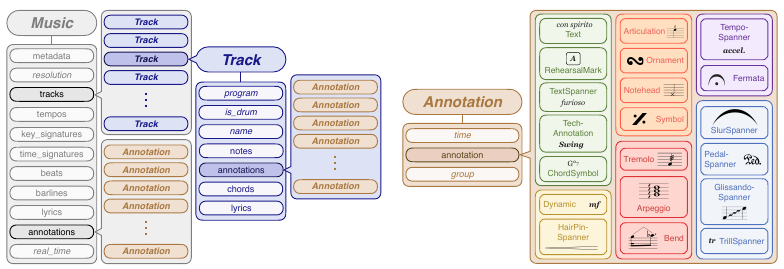
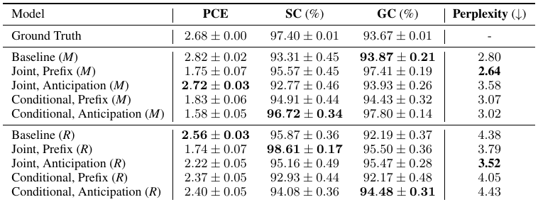

## Summary

MusPyExpress extends MusPy to preserve expression markings from score formats and expose them for modeling. It supports joint note/expression generation, expression-conditioned note generation, and expression tagging. The contribution is a richer representation and accessible library; improved perplexity does not consistently improve distributional musical descriptors. [PDF pp. 2–4, 7–10]

**Validity caveat:** the reported average annotation count has an unresolved denominator mismatch. Released rendering and timing APIs also require more care than a general claim of automatic expression realization suggests. Details below distinguish paper claims from static code findings.

## Key Contributions

Twenty-eight typed annotation classes cover text, structural controls, note-level markings, and general spanners. Score and track storage preserves scope; explicit duration preserves interval semantics. The paper analyzes PDMX and establishes small-model baselines for three tasks, making data-and-representation its primary category. [PDF pp. 2–4, 7]

## Methodology and Architecture

### Representation and I/O

MusPyExpress extends MusPy's score and track annotation lists with 28 Python classes. Each Annotation carries a time, typed annotation object, and group; spanners additionally encode duration. Examples include Dynamic, Text, ChordSymbol, RehearsalMark, HairPinSpanner, TempoSpanner, SlurSpanner, PedalSpanner, and articulations. Tempo text, special barlines, and grace-note attributes also extend base objects. MusicXML and MuseScore inputs can preserve these features; JSON is intended to preserve the richer object representation. [PDF pp. 2, 7–8]

A real_time flag distinguishes metrical steps from seconds. The paper describes expression-aware realization through manually chosen configurable rules: e.g., slowing tempo threefold for a fermata, multiplying accent velocity by 1.5, and lengthening slurred notes toward the next onset. These are explicit rendering conventions, not empirical estimates of a uniquely correct performance. Preservation, timing conversion, and expression realization need separate validation. [PDF p. 8; distinction is repository inference]

### Three modeling tasks

On individual tracks, jointly model notes and annotations p(n,e), generate notes conditioned on expressions p(n|e), or tag existing notes p(e|n). Modified MMT compound tokens add an expression event type, combine 128 note pitches and nearly 700 expression values in one value vocabulary, and add velocity. Metrical timing uses beat/position; real timing replaces them with seconds. The real-time scheme truncates pieces at 60 seconds. [PDF pp. 3–4, 9–10]

Prefix conditioning puts all controls before the generated sequence. Anticipation inserts a control near the first event at or after its onset minus δ, with δ=8 beats or eight seconds depending on timing. Expressions are controls for joint/conditional note generation; notes are controls for tagging. Conditional losses mask the control tokens. Joint generation predicts both event types. [PDF p. 10]

All systems are approximately 20M-parameter MMT-style decoders: six layers, eight heads, width 512, absolute position embeddings, maximum length 1,024. Training uses 80,000 steps, batch eight, Adam at 5e-4, on one RTX 3090. An 80/10/10 split is applied to 357,749 annotation-bearing PDMX tracks. The PDF does not establish that tracks from the same score or duplicate work are grouped. Generation metrics use 256 outputs per configuration; note perplexity uses held-out test data. Table 2 explicitly labels tagging evaluation as validation-set accuracy. [PDF pp. 4, 10]

Figure 1 (PDF p. 2) shows that storing an instruction and interpreting it as a performance action are different stages.

## Results

### Corpus evidence

The paper reports 212,406 of 222,820 MusicXML files (95.33%) containing expression text. Table 3 totals 3,513,641 markings: 1,082,640 tempo; 1,069,492 dynamic; 467,479 text; 336,029 barline; 176,579 rehearsal mark; 164,014 hairpin; 86,764 slur; 78,572 fermata; 48,421 pedal; and 3,651 text spanner. These ten tabulated groups are not the complete 28-class vocabulary. Special barlines exclude ordinary single barlines in the distribution analysis. [PDF pp. 2–3, 9]

**Arithmetic discrepancy:** the stated mean of 20.1 markings/song does not follow from either published denominator: 3,513,641 / 222,820 = 15.77, and / 212,406 = 16.54. An unstated subset or counting convention could explain it; the digest does not replace the paper's mean with a presumed corrected result. The table entries themselves sum to the stated total. [PDF pp. 2, 9; division and sum checked by repository]

“Density” here is inter-marking distance in beats, so larger values indicate sparser markings. Mean all-type spacing is 17.21 beats. The composer plots describe this corpus's annotation practice, not a controlled historical comparison; score length, instrumentation, edition, and dataset composition are potential confounds. [PDF p. 3]

### Generation

| Model | Pitch-class entropy | Scale consistency % | Groove consistency % | Note perplexity ↓ |
|---|---:|---:|---:|---:|
| Ground truth | 2.68 | 97.40 | 93.67 | — |
| Baseline, metrical | 2.82 | 93.31 | 93.87 | 2.80 |
| Joint prefix, metrical | 1.75 | 95.57 | 97.41 | 2.64 |
| Joint anticipation, metrical | 2.72 | 92.77 | 93.93 | 3.58 |
| Conditional prefix, metrical | 1.83 | 94.91 | 94.43 | 3.07 |
| Conditional anticipation, metrical | 1.58 | 96.72 | 97.80 | 3.02 |
| Baseline, real time | 2.56 | 95.87 | 92.19 | 4.38 |
| Joint prefix, real time | 1.74 | 98.61 | 95.50 | 3.79 |
| Joint anticipation, real time | 2.22 | 95.16 | 95.47 | 3.52 |
| Conditional prefix, real time | 2.37 | 92.93 | 92.17 | 4.05 |
| Conditional anticipation, real time | 2.40 | 94.08 | 94.48 | 4.43 |

These are Table 1 means; the original table also displays uncertainty on the three musical descriptors without a sufficiently clear uncertainty definition. Closeness to ground truth, not maximizing consistency, is the stated criterion. Best metrical perplexity improves from 2.80 to 2.64, but pitch-class entropy shifts from 2.82 to 1.75 against reference 2.68. No configuration dominates. Perplexities across different tokenizations are not a common-scale quality comparison. [PDF pp. 3–4]

### Expression tagging

| Scheme | Modal baseline total % | Prefix total % | Anticipation total % |
|---|---:|---:|---:|
| Metrical | .05 | 29.41 | 24.41 |
| Real time | 1.63 | 33.90 | 27.75 |

For real-time prefix tagging, time/value/duration accuracies are 46.05/57.39/66.54%. Metrical prefix beat/position/value/duration accuracies are 62.80/93.55/55.60/54.15%. “Total” is the table's label and should not be mistaken for an average of these fields. The PDF does not fully specify its aggregation in prose. Different truncation changes the field distributions, so the real-time advantage is not an isolated timing-format effect. [PDF p. 4, Table 2]

Table 1 (PDF p. 3) separates note perplexity from closeness to ground-truth musical descriptors.

### Limitations and artifact discrepancies

This is a representation/library contribution with small single-track proof-of-concept models. There is no listener study, expert annotation audit, calibrated tagging uncertainty, or demonstration that a suggested expression is stylistically justified. Score-wide generation and fine-grained text control are future work. Annotation prediction is not an explanation of why a model chose a note. Potential score/work overlap across track splits remains unresolved. [PDF pp. 4, 10]

The linked [expressive MusPy branch](https://github.com/salu133445/muspy/tree/dbeb120146280c7b2a145615598480326bc75baa) contains the advertised 28 annotation classes and MusicXML parsing routes. Static inspection also exposes material limits:

- [MIDI export defaults](https://github.com/salu133445/muspy/blob/dbeb120146280c7b2a145615598480326bc75baa/muspy/outputs/midi.py#L970) set realize_annotations=False; the paper's expression-aware rendering capability must be enabled explicitly.
- [Timing conversion](https://github.com/salu133445/muspy/blob/dbeb120146280c7b2a145615598480326bc75baa/muspy/music.py#L185) integrates the tempos list. convert_to_real_time calls that mapping but does not itself realize fermatas or tempo spanners. A caller must establish a suitable preprocessing path before assuming Appendix A.2's broader timing claim.
- [Hairpin/tempo-spanner rendering](https://github.com/salu133445/muspy/blob/dbeb120146280c7b2a145615598480326bc75baa/muspy/outputs/midi.py#L457) reads music.infer_velocity, while the inspected Music definition does not declare or initialize it. This is an unresolved potential runtime defect for those annotations unless callers attach the attribute.
- The convenience realization method defaults to pedal-duration multiplier 3, while MIDI output uses 2; equivalent output across these routes should not be assumed.

These are findings in the inspected release, not proof that the publication experiments used these exact paths. No parser corpus sweep, rendering run, or model training was performed; numerical impact on the reported real-time experiments is unknown.

## Related Papers

- [[concepts/music-domain-inductive-biases]] — existing reciprocal synthesis anchor; expands the representation layer.
- [[concepts/expression-aware-symbolic-representations]] — preserves instruction, scope, time, and realization provenance separately.
- [[generation-and-planning/guo-2025-moonbeam-a-midi-foundation-model]] — event timing and velocity do not exhaust score expression.
- [[generation-and-planning/wang-2025-notagen-advancing-musicality-in-symbolic]] — contrasting score-text representation.
