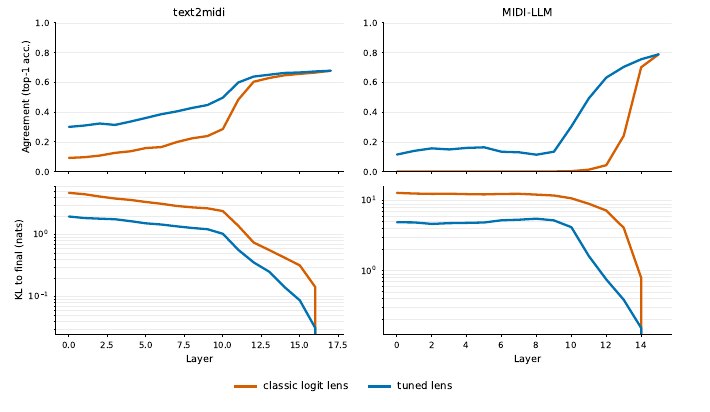
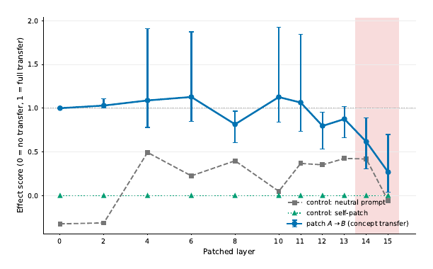
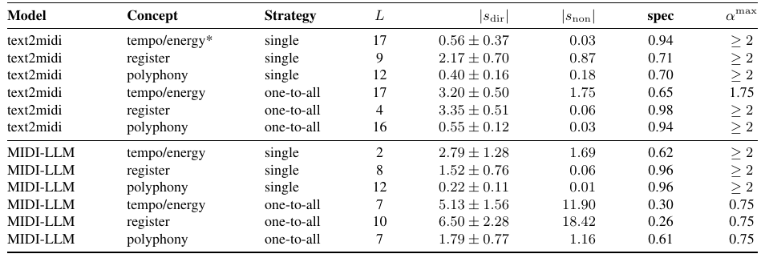

## Summary

MI-MIDI studies text2midi and MIDI-LLM using probes, classic/tuned lenses, prompt patching, and activation additions. It reports causal changes in instrumentation, register, and polyphony, extending the repository beyond recoverability-only probing. It does not establish faithful note-level explanations or musician-facing explanation utility. [PDF pp. 2–12]

## Key Contributions

The central contribution is an intervention-based analysis of text-conditioned symbolic generators, including a bidirectional protocol that catches same-direction drift. Apparent late prediction formation in MIDI-LLM partly reflects a mismatch between intermediate representations and the final output basis. [PDF pp. 7–11]

## Methodology and Architecture

### Models, labels, and probes

text2midi uses a frozen Flan-T5 encoder and an 18-layer, width-768 decoder with metrical REMI+ tokens. MIDI-LLM extends Llama 3.2 1B with AMT music tokens, using 16 layers, width 2,048, and absolute time on a 10ms grid. These systems differ in tokenizer, width, training, and conditioning as well as architecture. [PDF pp. 2–3]

The authors generate 1,000 sequences from randomized descriptions, temperature 1, and a 1,024-token budget. Labels come from decoded output, not requested prompt attributes. They probe instrument family, pitch class, octave, intervals, contour, chord root/quality, harmonic function, texture, rhythmic density, and estimated key. Key is a Krumhansl–Schmuckler estimate, not an expert annotation; simultaneity and rhythmic-density definitions are tokenizer-dependent. [PDF pp. 3–4]

L2 logistic regression uses C=1, L-BFGS, at most 200 iterations, train-fold-only scaling, and five grouped stratified folds keeping each sequence together. Token probes use 200 sequences; key variants use all usable sequences. Shuffled-label controls collapse toward the majority baseline. Reported best layers are selected post hoc across the same CV profiles, rather than validated by an independent layer-selection/test procedure. A second experiment uses 1,080 SynTheory MIDI examples after removing timbre variation, with sequence pooling and sample-grouped folds. [PDF pp. 3–6]

### Lenses and prompt patching

The logit lens applies the actual final normalization and output projection to each layer. MIDI-LLM is evaluated both through its music-restricted vocabulary and by the music share of full-vocabulary mass. Affine tuned lenses distill the final distribution using 60,000 positions for training, four epochs at 1e-3, and 50,000 evaluation positions from disjoint sequences. Agreement is with sampled tokens, so final-layer agreement need not equal one. Different vocabulary sizes make raw cross-model entropies incomparable. [PDF pp. 6–8]

Piano/violin prompt activations are patched at each MIDI-LLM layer input; normalized piano-note-fraction transfer is compared with self and neutral-prompt controls. Ten paired generation seeds and 2,000 bootstrap resamples of complete seed triplets yield 95% intervals. text2midi instead receives a one-layer replacement of cross-attention encoder memory. [PDF p. 9]

### Bidirectional steering

At each source layer, the normalized difference of means from 25 prompts per pole defines a direction. MIDI-LLM reads the last prompt position; text2midi averages a fixed teacher-forced prefix. The vector is injected at its source layer or reused at every layer (“one-to-all”). The sweep has three concepts × two strategies × two orientations × nine source layers × nine strengths from 0 to 2 × ten seeds = 9,720 sequences per model. [PDF pp. 9–10]

The stable fitting range stops at the first strength where either orientation's median note count falls below half the baseline. Seed-clustered regressions give two slopes, with directional component (sBA−sAB)/2 and symmetric component (sBA+sAB)/2. Specificity is the absolute directional component divided by the sum of their absolute values. This measures reversal symmetry of one metric, not preservation of every non-target attribute. Configurations are selected by specificity subject to an exploratory |directional slope| > 2SE rule; it is not a multiple-comparison-corrected discovery claim. [PDF pp. 10–11]

Figure 5 (PDF p. 8): blue tuned-lens agreement rises earlier than the orange classic-lens curve in MIDI-LLM. The lower row uses a logarithmic KL-divergence axis.

Figure 6 (PDF p. 9): transfer weakens late but remains nonzero; the neutral-prompt curve also moves. Read this together with its confidence intervals.

## Results

### Recoverability

Selected best-layer accuracies (five-fold mean ± SD) are:

| Readout | text2midi | MIDI-LLM |
|---|---:|---:|
| Generated instrument family | .680 ± .008 | .940 ± .009 |
| Generated pitch class | .505 ± .023 | .619 ± .019 |
| Generated chord quality | .469 ± .015 | .483 ± .008 |
| Generated harmonic function | .465 ± .015 | .465 ± .009 |
| Generated key, mean pooling | .533 ± .012 | .623 ± .021 |
| SynTheory interval | .604 ± .035 | .998 ± .005 |
| SynTheory scale mode | .012 ± .015 | .423 ± .051 |
| SynTheory chord quality | .375 ± .065 | .855 ± .067 |
| SynTheory progression | .728 ± .056 | 1.000 ± .000 |

Generated-key lift from pitch-class histograms is .486 for text2midi and .475 for MIDI-LLM, versus activation lifts .401 and .545. Much of key decoding can therefore be explained by the note distribution that also constructs the label. SynTheory progression tonic is already perfectly decodable at layer 0 in both models; this does not imply learned harmonic reasoning. The two probing settings have different readouts and distributions and cannot be ranked directly against each other or the original audio SynTheory study. [PDF pp. 4–6, Tables 3–4]

### Prediction formation and intervention

MIDI-LLM's classic-lens agreement rises from .238 at layer 13 to .712 at 14 and .801 at 15; music-vocabulary mass rises from .561 to .954 to >.999. Tuned lenses recover predictions two to three layers earlier, supporting both a change in representational basis and continuing prediction refinement. The early classic lens is not evidence of absent musical information. Prompt-patching transfer attenuates to .62 and .27 at layers 14 and 15, with nonzero neutral-control shifts and broad intervals: this is a transition region, not a precise causal boundary. [PDF pp. 7–9, Figures 4–6]

| Best single-layer intervention | text2midi baseline → lower / higher | MIDI-LLM baseline → lower / higher |
|---|---|---|
| Mean MIDI pitch | 64.49 → 59.34 / 66.34 | 61.14 → 58.34 / 64.33 |
| Same-onset polyphony | 3.21 → 2.39 / 4.48 | 2.84 → 2.00 / 3.46 |
| Note-density tempo/energy proxy | 5.92 → 4.59 / 6.73 | 17.58 → 17.04 / 29.97 |

These extrema occur at different strengths, not a common operating point. text2midi's single-layer tempo/energy response fails the exploratory 2SE rule. Its best one-to-all register/polyphony specificities are .98/.94; MIDI-LLM's best single-layer equivalents are .96/.96. MIDI-LLM's one-to-all configurations have a reported stability limit around α=.75 and much larger symmetric drift. A norm-relative sweep still reaches all-layer limits at 2% of local activation norm for tempo and 5% for register/polyphony, while single-layer interventions remain intact through 20%. [PDF pp. 10–11, Tables 6–8]

Table 7 (PDF p. 11) preserves directional strength, symmetric drift, specificity, and the stable range as separate quantities.

### Limitations and artifact discrepancy

Only two models are tested, one per architecture, so conditioning-route explanations remain hypotheses with confounded alternatives. Text contrasts also change instrumentation and other cues. “Tempo/energy” is note density (notes/beat versus notes/second), not BPM, and is not independent of polyphony. Heuristic labels can be noisy; note-count stability is not musical quality, safety, or semantic preservation. There is no listener study of explanation utility, no circuit-level account of a particular note decision, and no quantitative SAE results. [PDF pp. 11–12]

The PDF promises experimental code later. The inspected [demo](https://github.com/jpocwiar/MI-MIDI-Demo/tree/589e961040832686e6b24182c513ad6134a4f1b3) is a static showcase. Its [sample mappings](https://github.com/jpocwiar/MI-MIDI-Demo/blob/589e961040832686e6b24182c513ad6134a4f1b3/script.js#L1) use MIDI-LLM one-to-all directions from layer 14, with register/polyphony strengths up to 2. These are not the selected single-layer configurations in Tables 6–7. The mapping therefore cannot independently corroborate those tables or their stability guard; filename labels do not establish the settings actually used to create audio. No model experiment or audio listening was performed.

## Related Papers

- [[concepts/music-theory-probing]] — primary reciprocal anchor; adds causal intervention evidence without collapsing it into explanation utility.
- [[explainability-and-auditability/wei-2024-do-music-generation-models-encode]] — source of controlled concepts and audio-probing comparison.
- [[concepts/music-domain-inductive-biases]] — semantically named structure still requires intervention tests.
