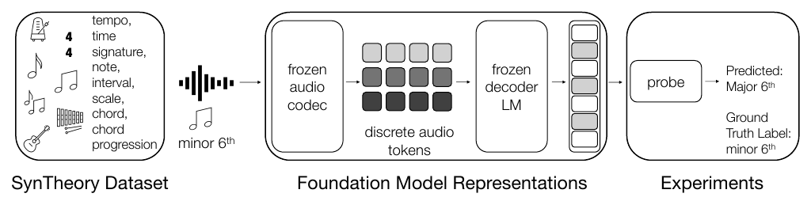
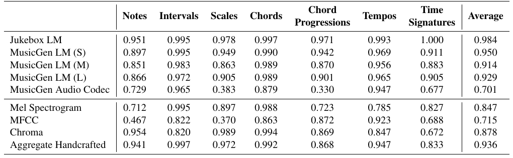
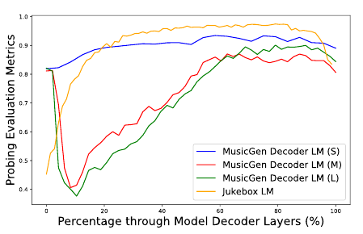

## Summary

Wei et al. introduce **SynTheory**, seven synthetic MIDI/audio datasets for testing whether elementary Western music-theory concepts can be decoded from frozen Jukebox and MusicGen representations. Their probes achieve high reported scores, with Jukebox leading the cross-task mean and MusicGen Small outperforming its larger counterparts. Handcrafted features are also strong, limiting what those scores imply about abstract musical knowledge. [PDF pp. 1–6]

**Result-validity caveat:** the released code fits normalization on validation features before training, partially overlaps training/held-out tempo values, and does not demonstrate independent test scoring in its runner. These findings may affect the validity of the reported comparisons; their numerical impact is unknown. The inspected revision is not established as the exact revision used for Table 2. Recoverable concepts are also not evidence that a generator causally uses those concepts or can explain its decisions.

## Key Contributions

- **Controlled concept benchmark:** tempos, meters, pitch classes, intervals, diatonic modes, triad qualities, and four-chord templates, with explicit construction and nuisance variation. [PDF pp. 2–4]
- **Representation diagnosis:** compare codec features, decoder layers, and handcrafted descriptors using separate supervised probes. This is the primary reason for the explainability-and-auditability category; it is not a constraint-based generator. [PDF pp. 4–5]
- **Layer/size comparison:** information accessibility varies with depth and model size; the reported ranking does not straightforwardly follow model scale. [PDF pp. 5–6]
- **Future benchmark direction:** harder entangled and compositional tasks may better distinguish learned representations from simple acoustic descriptors. [PDF p. 6]

## Methodology and Architecture

Tonal examples use 92 instrument programs from one soundfont, with labels crossed with roots, registers, inversions, or playback directions as appropriate. Rhythmic examples use five click settings, random offsets, and—for meter—three reverberation levels. Table 1 contains 104,585 configurations in total; notes have 9,936 configurations but only 9,848 non-silent samples. [PDF p. 3; total is repository arithmetic]

Targets are 12 pitch classes, 12 intervals, seven modes, four triad qualities, 19 progression templates, eight meters, and continuous tempo over 50–210 BPM. A chord-quality result does not measure chord-root identification, and a progression-template result does not establish open-ended harmonic-function understanding. [PDF pp. 3–4]

Four-second mono audio passes through frozen feature extractors. Jukebox yields 4,800-dimensional pooled features per decoder layer; MusicGen Small/Medium/Large yield 1,024/1,536/2,048, and its pre-quantization audio codec yields 128. Layer selection is concept-specific. Handcrafted descriptors concatenate temporal mean/std statistics of mel spectra, MFCCs, or chroma and their first/second differences. [PDF p. 5]

Figure 1 (PDF p. 2) shows supervised decoding from frozen representations. It contains no intervention on generation or human explanation task.

Classification uses a nominal 70/15/15 row split; tempo is intended to reserve extreme BPMs for generalization. Decoder probes use an MLP with one 512-unit ReLU hidden layer, normalization, batch size 64, learning rate 1e-3, dropout .5, and no weight decay. Codec/handcrafted probes search linear/MLP and several optimization settings. High decoder scores therefore do not establish linear separability. [PDF pp. 4–5]

## Results

### Paper-reported evidence

| Representation | Mean reported score | Important comparison |
|---|---:|---|
| Jukebox LM | .984 | Chords .997; progression .971; tempo R² .993; meter 1.000 |
| MusicGen Small | .950 | Highest mean among the three MusicGen decoders |
| MusicGen Medium | .914 | Below Small, Large, and aggregate handcrafted |
| MusicGen Large | .929 | Below Small and aggregate handcrafted |
| Aggregate handcrafted | .936 | Interval accuracy .997, exceeding Jukebox's .995 |
| MusicGen codec | .701 | Scale .383 and progression .330 |

The mean mixes six accuracies and one R²; it is **not** overall classification accuracy. Chroma separately reaches .954 on notes and .989 on modes, exceeding Jukebox on those tasks. Table 2 describes validation-based hyperparameter selection and layer selection. All scores are author-reported and remain unreproduced. [PDF p. 6]

Figure 2 (PDF p. 5) uses percentage through decoder depth. Medium/Large show early troughs and later recovery; Small is comparatively stable; later Jukebox layers remain strong before a final decline. These averaged curves do not identify a common causal concept layer. No confidence intervals or repeated-seed distributions accompany the headline scores.

### Implementation discrepancies and validity

The [official implementation](https://github.com/brown-palm/syntheory) was inspected at commit `4f222359e750ec55425c12809c1a0358b74fce49`:

1. **Validation-dependent preprocessing:** step-zero validation reaches an unfitted scaler, whose fallback calls `partial_fit` on validation features before training. This is feature-statistics leakage, not demonstrated label leakage. Confirmed by reading the call path and executing the actual evaluation helper with test doubles. Its numerical impact was not measured. [Pinned training/evaluation code](https://github.com/brown-palm/syntheory/blob/4f222359e750ec55425c12809c1a0358b74fce49/probe/probes.py#L340)
2. **Non-disjoint tempo boundaries:** row-based cuts share 74 and 186 BPM between training and combined validation/test. A direct reproduction of the split arithmetic confirmed this; most extreme BPMs remain unseen. Thus a strictly unseen-BPM interpretation is overstated for the release. [Pinned split code](https://github.com/brown-palm/syntheory/blob/4f222359e750ec55425c12809c1a0358b74fce49/probe/probes.py#L192)
3. **Missing independent test-scoring path:** the runner trains and returns; internal evaluation and saved metrics use validation. This does not establish that the authors never used a separate analysis, and Table 2 already references validation-based selection. [Runner](https://github.com/brown-palm/syntheory/blob/4f222359e750ec55425c12809c1a0358b74fce49/probe/main.py), [metric persistence](https://github.com/brown-palm/syntheory/blob/4f222359e750ec55425c12809c1a0358b74fce49/probe/probes.py#L578)
4. **Timing and selection metadata:** the progression generator uses two beats per chord versus the PDF's quarter-note description; sweep metadata minimizes accuracy/R², although grid search and training's maximizing early stopping prevent concluding that the published selection is reversed. [Progression generator](https://github.com/brown-palm/syntheory/blob/4f222359e750ec55425c12809c1a0358b74fce49/dataset/synthetic/chord_progressions.py#L75), [sweep configuration](https://github.com/brown-palm/syntheory/blob/4f222359e750ec55425c12809c1a0358b74fce49/probe/probe_config.py#L34)

The [full source digest](../../sources/wei-2024-do-music-generation-models-encode.md) preserves the complete task construction, table, and further implementation details. The [dataset](https://huggingface.co/datasets/meganwei/syntheory) and [project website](https://brown-palm.github.io/music-theory/) were inspected at page level; no dataset audio analysis or model rerun was performed.

### What can be concluded

The benchmark offers a concrete procedure for asking whether musical labels are recoverable from representations. The reported scores suggest such recoverability under controlled conditions, subject to the evaluation issues above. They do not establish causal music-theory use, controllable latent editing, generalization to full classical works, or human explanation utility. One soundfont, random classification splits, predefined templates, unequal feature dimensions, and nonlinear probes further constrain interpretation. Corrected train-only preprocessing, value-disjoint splits, and independent test evaluation are needed to assess whether the reported rankings survive.

## Related Papers

- [[concepts/music-theory-probing]] — recoverability, evaluation validity, and causal-evidence boundaries.
- [[concepts/music-domain-inductive-biases]] — separates named musical structure and learned encoding from constraints and explanations.
- [[generation-and-planning/guo-2025-moonbeam-a-midi-foundation-model]] — explicit MIDI attributes offer candidate targets for analogous probing; no such transfer is tested here.
- [[generation-and-planning/wang-2025-notagen-advancing-musicality-in-symbolic]] — score hierarchy and learned evaluation provide a contrasting route to musically structured generation.
