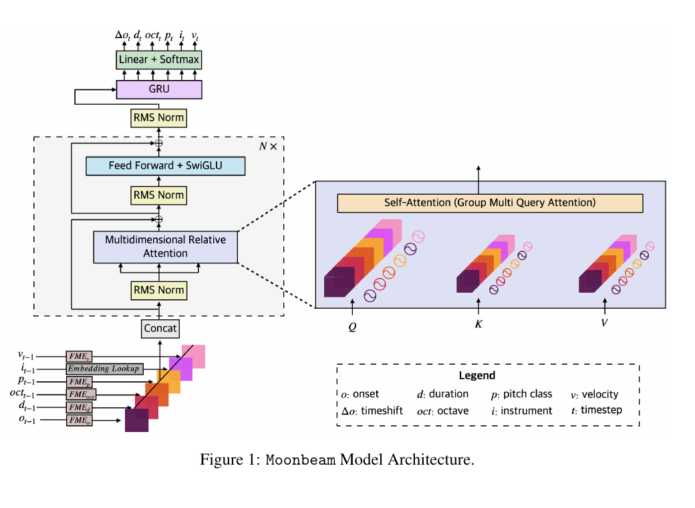

## Summary

Moonbeam is a LLaMA-style autoregressive foundation model for polyphonic, expressive, multi-instrument MIDI. It represents every input event as absolute onset, duration, octave, pitch class, instrument, and velocity; continuously embeds the five scalar music attributes; assigns attention-head groups to relative differences along those axes; and sequentially predicts the six next-event fields with a GRU. The 309M-parameter Small model uses LakhMIDI, while the 839M-parameter Medium model uses 19 listed datasets totaling 81.58K hours and 18.06B attribute tokens. [PDF pp. 1–7, 14–16]

Its strongest results are downstream. Medium leads accuracy and macro-F1 on three of four classification datasets, while M3 remains best on Emopia. In conditional generation, Moonbeam is worse than a REMI-like transformer on objective pitch, velocity, and timing control, but 20 music experts give it higher reported ratings for chord fit, metadata fit, coherence, and enjoyment. [PDF pp. 8–9]

For transparent music AI, Moonbeam is useful because the representation, head-group assignments, conditioning paths, and training sources are explicit. This is architectural auditability, not a faithful explanation: the paper never probes individual MRA dimensions causally, produces no note-level decision trace, and evaluates no harmony, counterpoint, voice-leading, or form rules. [PDF pp. 3–9, 14–17]

## Key Contributions

- A compound MIDI event representation that supports score/performance data, polyphony, and multiple instruments while using absolute onset on transformer inputs and delta onset on generated outputs. [PDF pp. 3–4]
- Fundamental Music Embedding for onset, duration, octave, pitch class, and velocity, with a learned lookup only for instrument and non-music tokens. [PDF p. 4]
- Multidimensional Relative Attention, which applies fixed RoPE-like rotations to semantically assigned head groups without a learned relative-position table. [PDF pp. 5, 16–17]
- A sequential GRU sub-decoder that models dependencies among the six fields of the next event. [PDF p. 6]
- LoRA-based classification and anticipatory conditional-generation architectures; timed controls share the same absolute-onset space as music events. [PDF pp. 6–7, 17–18]
- Dataset-level hours, token counts, and license labels, improving provenance visibility even though versions and deduplication are not reported. [PDF p. 14]

## Methodology and Architecture

*Figure 1, PDF p. 3. FME and the instrument lookup produce a factorized event embedding; MRA operates inside the transformer, and the GRU emits the six next-event attributes.*

For input event `x_t = (o, d, oct, p, i, v)`, onset `o` is absolute. The next-event target instead begins with time shift `Delta o`. Pretraining quantizes time to 10 ms and limits shifts/durations to 10.24 seconds for Small and 40.96 seconds for Medium. FME may accept unseen input scalars, but generative outputs remain categorical and bounded by the decoder dictionary used in pretraining. [PDF pp. 3–4, 15–16]

The rendered RoPE derivation gives relative phase `m - n`. MRA generalizes this by mapping six head groups to onset, duration, octave, pitch class, onset again for the instrument-associated group, and velocity. Appendix F preserves query-minus-key directions (`a_q - a_k`, `b_q - b_k`). Absolute content is supplied through the input embeddings; the rotations make attention logits depend on relative differences. [PDF pp. 5, 16–17]

Small has 309M parameters, 9 attention layers, and a 2-layer GRU; Medium has 839M, 15 attention layers, and a 4-layer GRU. Both use a 1,024-event training length, Adam at initial learning rate `3e-4`, mixed precision, and two A100 GPUs. Reported training time is 54 hours on 2×40 GB A100s for Small and about 15 days on 2×80 GB A100s for Medium. [PDF pp. 7, 15]

For classification, LoRA rank 8 adapts selected attention projections and a `<cls>` head. For CoMMU generation, chord events and 12 metadata controls are prepended; metadata also conditions the GRU. The chosen ablation layout sends metadata to transformer and GRU but chords only to the transformer. The experiment tests chord-conditioned generation, not a dedicated missing-span infilling task. [PDF pp. 6–9, 17–18]

## Results

Moonbeam Small reaches perplexity 2.423, versus 2.512 with standard attention, 2.512 with the all-attribute rotation variant, 3.245 with an MLP sub-decoder, and 4.216 in the nominal no-FME condition. The latter still retains onset FME, and no result includes repeated-run uncertainty. [PDF pp. 7–8]

For classification, Medium obtains accuracy/macro-F1 of 0.679/0.638 on PiJAMA30, 0.946/0.947 on Pianist8, 0.693/0.682 on Emopia, and 0.648/0.635 on GPM30. It leads both metrics except on Emopia, where M3 reaches 0.715/0.688. Medium's scale and corpus both differ from Small, so the comparison cannot isolate either factor. [PDF p. 9]

The selected generation architecture has perplexity 2.254, exact velocity/pitch accuracy 0.862/0.851, and timing error `0.233 / 3.397`. The REMI-like baseline has stronger objective control: 0.997/0.915 and `-0.887 / 1.530`. Moonbeam nevertheless receives higher expert ratings: chord fit 3.955 vs 3.210, metadata fit 3.950 vs 3.215, coherence 3.940 vs 3.105, and enjoyment 3.600 vs 2.885. The paper does not state the statistical unit used for its extremely small Wilcoxon p-values or define the `±` statistic. [PDF pp. 8–9]

The principal validity cautions are: PiJAMA is in pretraining and PiJAMA30 is downstream without a documented exclusion/deduplication boundary; classification results lack seeds and uncertainty; generation checkpoint scale and full schedule are unspecified; decoding differs between systems; the 20 listeners provide repeated ratings without a described participant-level analysis; and no explicit infilling or theory-rule benchmark is reported. [PDF pp. 6–9, 14, 18–20]

Figure 3 also contains an internal visual inconsistency: the prose says 90% training/10% test, but its legend labels the small blue bars Train and the large orange bars Test, apparently reversing the intended colors. [PDF p. 18]

## Related Papers

- [[generation-and-planning/wang-2025-notagen-advancing-musicality-in-symbolic]] — supplies the complementary ABC/classical case: NotaGen emphasizes hierarchical score generation and learned-evaluator post-training, whereas Moonbeam emphasizes expressive MIDI, factorized events, and attribute-relative attention.
- [[overviews/symbolic-music-foundation-models]] — compares the two ingested symbolic foundation/generative models across representation, data, adaptation, evaluation, provenance, and auditability.
- [[concepts/music-domain-inductive-biases]] — uses Moonbeam's FME/MRA design to distinguish semantically named architectural priors from causally verified musical mechanisms or faithful explanations.
