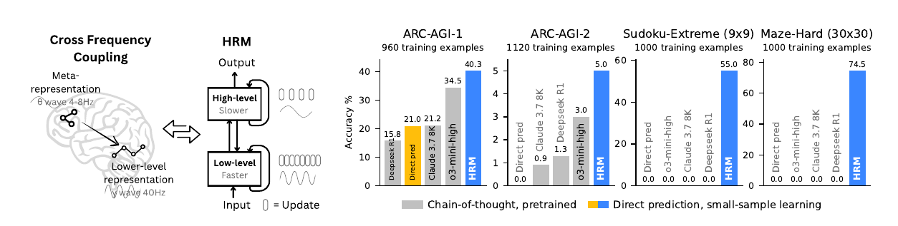
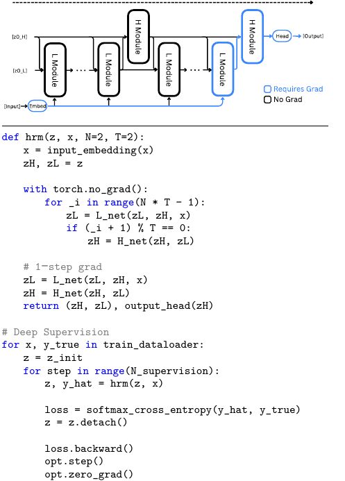
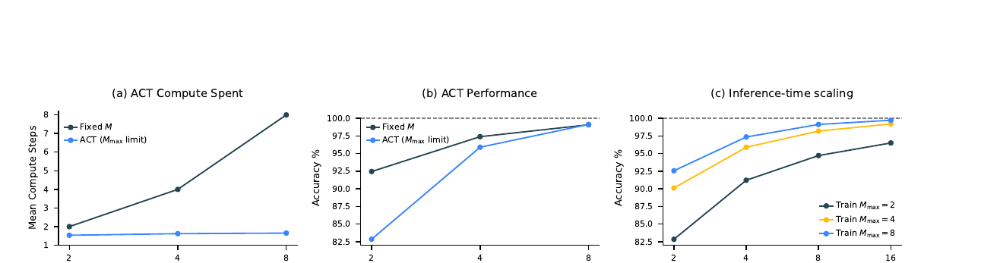
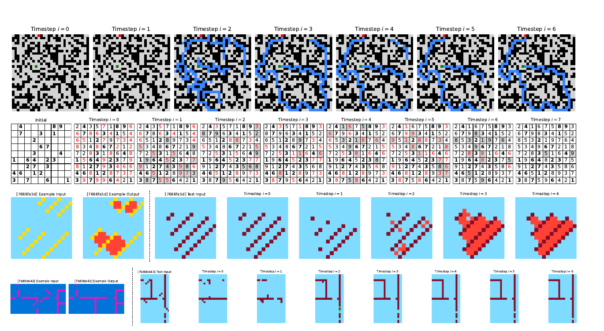
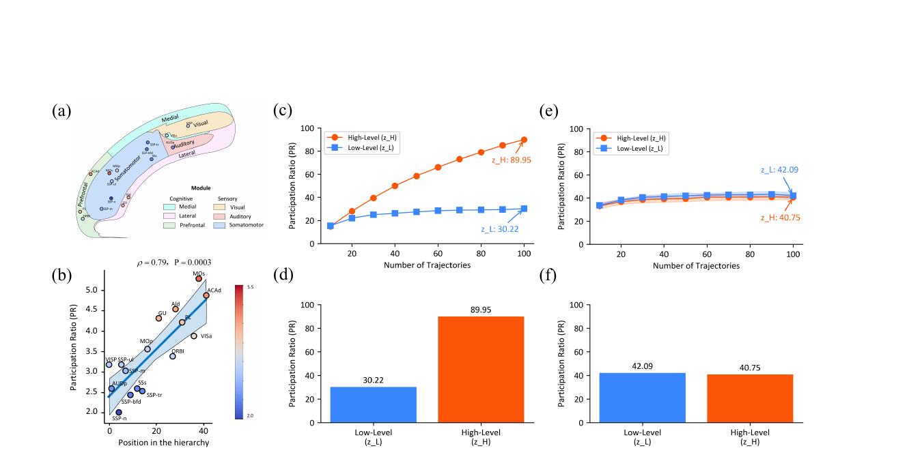
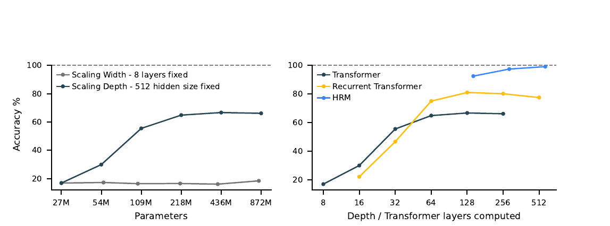

## Summary

The Hierarchical Reasoning Model (HRM) is a 27M-parameter, direct-prediction sequence model that replaces token-visible chain-of-thought with recurrent computation in two coupled hidden states. A slow high-level module supplies context to a fast low-level module; the low-level module runs several steps before the high-level state changes. Detached deep supervision trains repeated full passes without backpropagating through their history, and a Q-learning head decides whether to halt or continue. [PDF pp. 1, 3–9]

The paper reports strong results from random initialization on ARC-AGI, difficult Sudoku, and 30×30 optimal-path mazes. Its relevance to transparent generative music is prospective: slow form-level planning and fast note-level realization are an appealing division, but HRM contains no musical representation, explicit theory constraint, provenance mechanism, or explanation study. Selected intermediate grids are decodable, yet the paper does not show that they are faithful causal explanations. [PDF pp. 10–16]

## Key Contributions

1. **Two-timescale latent reasoning.** One forward pass has `N` high-level cycles of `T` low-level steps. The high-level state remains fixed through a low-level cycle, then redirects the next phase. Both modules use encoder-only Transformer blocks. [PDF pp. 3–5, 9–10]
2. **Hierarchical convergence.** The low-level state repeatedly approaches a local equilibrium and is “restarted” by each high-level update, maintaining activity across more recurrent depth than the plotted ordinary recurrent baseline. The residual itself and the plotting protocol are not formally specified. [PDF pp. 4–5]
3. **One-step gradient approximation.** All but the last local module updates run without gradients; only the final `L`, final `H`, and input-embedding path are differentiated. The authors motivate this as a first-term approximation to deep-equilibrium implicit differentiation and claim `O(1)` recurrent-history memory. No BPTT or exact-gradient ablation is reported. [PDF pp. 5–7]
4. **Detached deep supervision plus ACT.** Each complete recurrent segment predicts the final target and performs an optimizer step; its state is detached before the next segment. A correctness-trained Q-head chooses halt or continue and can exploit larger inference limits. [PDF pp. 7–9]
5. **Small-sample grid reasoning.** With 960–1,120 ARC examples and 1,000 Sudoku or Maze examples, Figure 1 reports `40.3%`, `5.0%`, `55.0%`, and `74.5%` respectively. [PDF pp. 1, 10–12]
6. **Preliminary internal-state evidence.** Decoded trajectories show solution-like revisions, and trained high- versus low-level states have different participation ratios. Both analyses are observational rather than causal. [PDF pp. 12–16]

## Methodology and Architecture

### Recurrence

Input tokens are embedded into a working representation. `L` updates every timestep from its previous state, the current `H` state, and the input. `H` updates every `T` timesteps and supplies the final state to the output head after `N` cycles. ACT may run several such `NT`-step segments. [PDF p. 4]

The printed recurrence gives `z_L^{i-1}` to `H`, while the prose and Figure 4 pseudocode say/use the just-computed cycle-final `z_L`. This is one of several specification discrepancies that code or author clarification would need to resolve. [PDF pp. 4, 6]

### Modules and optimization

`H` and `L` have identical encoder-only Transformer structure. Inputs are merged by element-wise addition. Blocks use RoPE, gated linear units, RMSNorm, Post-Norm, bias-free linear layers, and truncated LeCun-normal initialization. Small-sample experiments replace softmax with stablemax. Initial hidden states are fixed samples from a truncated normal distribution. [PDF pp. 9–10]

The PDF does not tabulate benchmark-specific `N`, `T`, layer count, hidden size, heads, batch size, learning rate, training duration, ACT exploration probability, or maximum segments. Figure 4's `N=2, T=2` is pseudocode, not identified as the experimental configuration. [PDF pp. 4, 6, 9–12]

The printed token-loss equation lacks a leading minus sign even though the authors minimize it and call cross-entropy in pseudocode. The ACT stability argument names AdamW, while the next paragraph says all parameters use Adam-atan2. These are visible paper-internal issues, not extraction repair choices. [PDF pp. 6, 9–10]

### Approximate gradient and deep supervision

The fixed-point gradient contains `(I − J_F)^{-1}`. HRM approximates its Neumann expansion by the identity term, retaining gradients only through the most recent high- and low-level updates. This removes the stored recurrent trajectory but introduces an unquantified gradient approximation. [PDF pp. 5–7]

Each segment receives the previous detached hidden state, predicts the final target, and triggers an optimizer update. It is “deep supervision” in computational depth, not supervision from human-authored intermediate reasoning steps. [PDF p. 7]

### Adaptive compute

The Q-head predicts `halt` and `continue` values from the final high-level state. Correct output gives the halt action reward 1; continuing bootstraps from the next segment. Random minimum-length exploration sometimes forces longer reasoning. The target equation tests an undefined `N_max` even though the mechanism is defined with `M_max`. [PDF pp. 7–8]

On Sudoku-Extreme-Full, ACT keeps average segments near 1.5–1.7 as the maximum rises from 2 to 8. Accuracy is substantially lower than fixed compute at maximum 2, closer at 4, and nearly equal at 8. Models improve when allowed larger inference limits than their training limit. The paper gives no latency or FLOP measurements. [PDF pp. 8–9]

### Data and protocols

- **ARC-AGI:** evaluation-task demonstrations are included, examples receive a learnable task token, and training uses translation, rotation, flip, and color augmentations. At test time the model solves 1,000 augmented variants, reverses them, and submits the two modal answers. CoT comparison values come from the official leaderboard rather than a matched rerun. [PDF pp. 10, 12]
- **Sudoku-Extreme:** 1,149,158 easier and 3,104,157 challenging puzzles are split with transformation-equivalence controls. The headline subset has 1,000 training examples; the scaling analyses use Sudoku-Extreme-Full with 3,831,994. Exact-match requires all 81 cells. [PDF p. 11]
- **Maze-Hard:** 1,000 training and 1,000 test 30×30 mazes have shortest-path difficulty above 110. A prediction must be valid and optimal; no augmentation is used. [PDF pp. 11–12]

### Interpretation probe

At each timestep the analysis performs an extra provisional `H` update from the current `H/L` pair and decodes that result. The selected Maze trace branches and prunes paths, Sudoku revises constraint violations, and ARC examples change shapes incrementally. The authors cautiously describe these as resembling depth-first search/backtracking and hill climbing. [PDF pp. 12–13]

This establishes decodability, not faithfulness. There is no intervention, completeness metric, representative-sample analysis, or test that editing the apparent trace changes the final answer as predicted.

### Dimensionality analysis

Participation ratio is `(sum eigenvalues)^2 / sum squared eigenvalues` for the covariance of hidden trajectories. Over 100 trained-network Sudoku trajectories, `PR_H=89.95` and `PR_L=30.22`; an untrained control gives `40.75` and `42.09`. [PDF pp. 14–15]

The paper compares HRM's high/low ratio (`~2.98`) to a mouse-cortex ratio (`~2.25`) but acknowledges that causality is untested. The body also reverses Figure 8 panel labels `(c)` and `(d)` relative to the figure caption. [PDF pp. 14–16]

## Results

### Headline accuracy

| Model | ARC-AGI-1 | ARC-AGI-2 | Sudoku-Extreme | Maze-Hard |
|---|---:|---:|---:|---:|
| DeepSeek R1 | 15.8 | 1.3 | 0.0 | 0.0 |
| Direct prediction | 21.0 | 0.0 | 0.0 | 0.0 |
| Claude 3.7 8K | 21.2 | 0.9 | 0.0 | 0.0 |
| o3-mini-high | 34.5 | 3.0 | 0.0 | 0.0 |
| HRM | **40.3** | **5.0** | **55.0** | **74.5** |

Values are visually verified from Figure 1. HRM and Direct prediction are trained from scratch; the other systems are pretrained API/leaderboard models under non-matched protocols. [PDF pp. 1, 12]

### Depth scaling

On Sudoku-Extreme-Full, widening an 8-layer Transformer from 27M to 872M parameters leaves the plotted accuracy near the high teens. Increasing depth at fixed width raises it to the mid-60s. At 128–512 computed layers, HRM rises from roughly 92% to almost 100%, above the saturated Transformer and recurrent-Transformer curves. The plot has no seed variability or compute-matched table. [PDF pp. 2–3, 11]

The abstract's “only 1,000 examples” and “nearly perfect” wording should not be fused into one Sudoku result: the 1,000-example score is 55.0%, while near-perfect curves use 3,831,994 training examples. [PDF pp. 1, 3, 11]

### Evidence limits

- No full-BPTT, exact implicit-gradient, or longer Neumann approximation is compared.
- No ablation isolates the two modules, state reset, element-wise merge, deep supervision, or ACT outside full-data Sudoku.
- Model/API prompts and decoding for Sudoku and Maze baselines are missing.
- ARC spends 1,000 augmented solves per input before two-answer voting.
- Hardware, wall-clock, memory, FLOPs, seeds, intervals, and most hyperparameters are absent.
- Intermediate decoding and participation-ratio separation are correlational.
- “Turing complete” is an asymptotic claim under sufficient time and memory, not an empirical property established by these finite experiments. [PDF pp. 11–18]

### Implication for generative music

The paper strengthens the architectural case for separating slow global planning from fast local realization and for allocating extra latent compute only when needed. It does **not** strengthen a claim of explainability. A symbolic-music adaptation would need explicit form/harmony/voice-leading representations, named constraints with legitimate exceptions, causal tests of state traces, and human evaluation of prediction, diagnosis, repair, trust calibration, or creative control. Its exact-grid, one-correct-output evaluations do not model the many valid continuations of composition.

## Related Papers

- [[concepts/hierarchical-latent-reasoning]] — records HRM's slow/fast recurrence, one-step gradient approximation, adaptive compute, and the boundary between decodable intermediate states and faithful explanations.
- [[generation-and-planning/wang-2025-notagen-advancing-musicality-in-symbolic]] — contrasts recurrent latent hierarchy with a symbolic-music representation hierarchy; the link is a transfer hypothesis, not evidence that HRM works for music.
- [[overviews/symbolic-music-foundation-models]] — defines the actual music-model evidence against which any HRM-inspired planning proposal must be tested.
