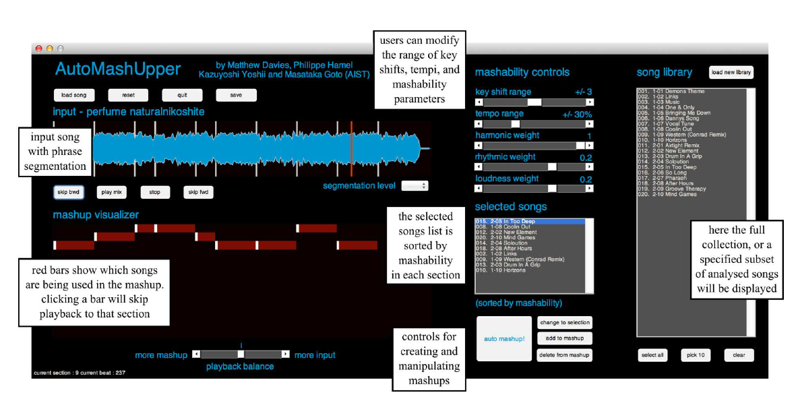
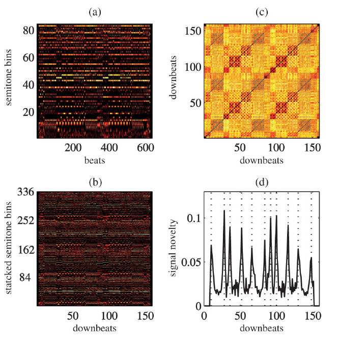
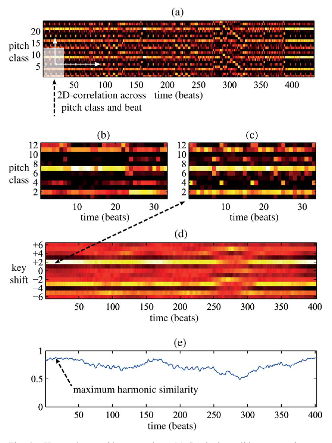
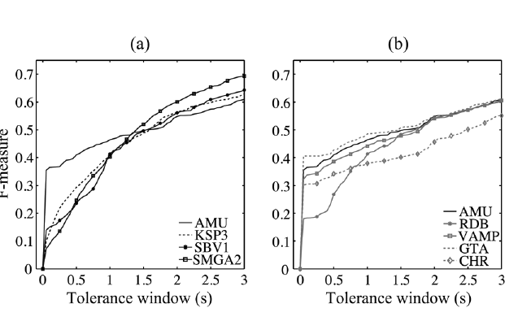
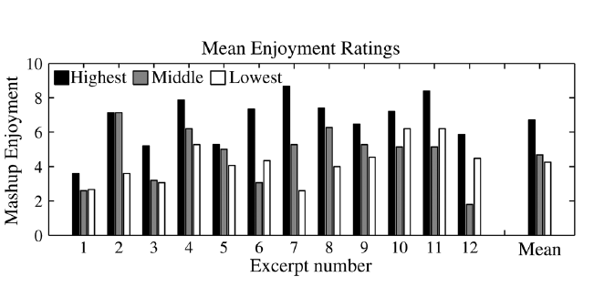
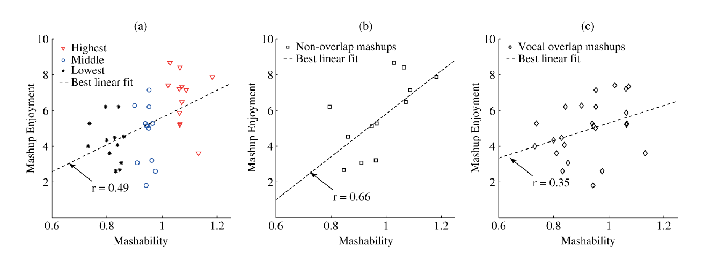

## Summary

AutoMashUpper is an explicit retrieval-and-editing pipeline for multi-song audio mashups. It segments an input recording into phrase-like regions, searches a song library for one candidate passage per region, and estimates whether each candidate **can be made compatible** through key transposition, tempo modification, and gain adjustment. Compatibility—or Mashability—is a manually weighted combination of harmonic similarity, kick/snare rhythmic similarity, complementary three-band spectral balance, and a tempo-range bonus. [PDF pp. 1–7 / article pp. 1726–1732]

The system is important less as a modern generative model than as an early formula-auditable creative assistant. Its algorithm computes a chosen song and source beat, component scores, key shift, timing map, and loudness change, making the decision reconstructable in principle. The interface visibly provides source-section assignments, adjustable ranges and weights, ranked song names, and local editing controls; the paper does not show the complete internal trace surfaced or persistently logged. This is not a validated semantic explanation: the features do not express chord function, cadence, voice leading, phrase role, vocal conflict, or long-range form. [PDF pp. 6–7, 10–11 / article pp. 1731–1732, 1735–1736]

## Key Contributions

1. **Transform-aware retrieval.** Candidate sections are compared across beat positions and hypothetical chromatic shifts, with tempo-octave normalization before matching. The output includes the transformation needed to realize the match. [PDF pp. 3–6 / article pp. 1728–1731]
2. **Phrase-local multi-source construction.** Different input phrases can retrieve regions from different songs, avoiding one global companion track and locating the best passage inside each candidate. [PDF pp. 1–3 / article pp. 1726–1728]
3. **Decomposed Mashability.** Harmony, rhythm, and spectral balance remain separate, visible signals with user-adjustable weights. Defaults are `1`, `0.2`, and `0.2`; the harmony term therefore dominates the plotted total. A tempo match within the default ±30% range adds `0.2`. [PDF pp. 6–7 / article pp. 1731–1732]
4. **Efficient harmonic search.** Two-dimensional convolution replaces nested loops over time and pitch-class rotations, reducing the authors’ tested searches from seconds to milliseconds. Exact hardware is not reported. [PDF p. 4 / article p. 1729]
5. **Mixed-initiative editing.** The system presents ranked alternatives and section provenance while keeping parameter choice and local replacement under human control. The authors frame it as assistive rather than as a substitute for aesthetic judgment. [PDF pp. 7, 10–11 / article pp. 1732, 1735–1736]
6. **Intermediate-boundary evaluation.** A 100-song segmentation benchmark and 15-participant listener study test two components, but not complete multi-song outputs or interaction quality. [PDF pp. 8–10 / article pp. 1733–1735]

## Methodology and Architecture

### Analysis and segmentation

NNLS Chroma supplies global tuning, an 84-bin seven-octave semitone spectrogram, and 12-bin chroma. Kick/snare onset functions support beat and downbeat detection. The method assumes constant tempo, fixed 4/4 meter, downbeat-aligned phrases, and common bar-length regularities. [PDF pp. 2–3 / article pp. 1727–1728]

Four beat frames are stacked into a 336-dimensional downbeat frame. Cosine distances form a self-similarity matrix; a 16-downbeat checkerboard kernel creates a novelty trace. Initial peaks are iteratively moved by ±1 downbeat to reward 2-, 4-, 8-, and 16-downbeat section lengths. [PDF p. 3 / article p. 1728]

### Transform-aware harmonic and rhythmic search

The candidate chromagram is stacked over two octaves, and the input phrase becomes a two-dimensional filter. Convolution searches candidate beat offsets and chromatic rotations together; the system retains the largest cosine match and the inverse pitch shift needed for rendering. [PDF pp. 4–5 / article pp. 1729–1730]

Rhythm is represented by sampling kick and snare onset strength at 12 positions per beat, giving 24 dimensions. Candidate rhythm windows are scored by cosine similarity. Spectral balance adds input and candidate perceptual loudness in low (`≤220 Hz`), mid (`220–1760 Hz`), and high (`>1760 Hz`) bands and rewards a flat normalized profile. [PDF p. 5 / article p. 1730]

### Selection and rendering

The default local score is:

\[
M=1.0M_H+0.2M_R+0.2M_L,
\]

plus a `0.2` bonus when the candidate lies within the selected tempo range. Each candidate is reduced to its best beat position, and candidates are ranked independently for each phrase. Rubber Band maps candidate beats to the input grid and applies the stored key/tuning correction; Replay Gain matches loudness. [PDF pp. 6–7 / article pp. 1731–1732]

The MATLAB prototype reportedly handles a four-minute input and 10–15 candidates in under 30 seconds. The UI supports library selection, key/tempo/weight controls, ranked alternatives, add/change/delete actions, section playback, and input-versus-mashup balance. [PDF p. 7 / article p. 1732]

### Auditability boundary

The architecture specifies enough internal state to reconstruct a useful decision path in principle: source identity, offset, harmonic/rhythmic/spectral components, tempo eligibility, transposition, beat mapping, and gain. The interface exposes only part of that path, and the paper does not document persistent logging. The defaults were selected informally and are not calibrated probabilities. The explicit low-level formula explains how the system ranked a candidate, not why the combination is musically meaningful or preferred by a listener.

## Results

### Boundary localization

On all 100 RWC Popular Music Database songs, the method obtains `F = 0.35` at ±0.05 seconds and clearly leads the compared 2012 MIREX systems at that narrow tolerance. Estimated downbeats outperform random downbeats, and seven-octave semitone features outperform folded chroma. Above about one second, however, competing systems overtake AutoMashUpper; SMGA2 is best at three seconds. AutoMashUpper also returns shorter median segments: 10.3 seconds versus 15.6 for SMGA2 and 14.3 in the annotations. [PDF pp. 8–9 / article pp. 1733–1734]

The result supports precise localization of short boundaries on regular pop, not universal superiority in structural segmentation. Structural annotations are only a proxy for phrases, and RWC Pop closely matches the system’s fixed-meter and constant-tempo assumptions.

### Listener ranking

Twelve 32-beat input excerpts from a 90-song collection generate a highest-, mean-, and lowest-scoring mashup each. Fifteen listeners rate the 36 stimuli on 0–10 enjoyment relative to the original excerpt. [PDF p. 9 / article p. 1734]

- Highest: **6.7** mean.
- Middle: **4.7** mean.
- Lowest: **4.3** mean.
- Highest versus middle: **`p < .005`**.
- Middle versus lowest: **`p = .65`**, not significant.
- Highest leads both alternatives for 11 of 12 excerpts. [PDF pp. 9–10 / article pp. 1734–1735]

This supports a “find a promising extreme” interpretation more strongly than a fully ordered preference scale.

### Correlation and vocal-overlap failure

Across the 36 stimulus means, Mashability and enjoyment correlate at `r = .49` (`p < .005`). The manually separated no-vocal-overlap subset reaches `r = .66`, while vocal-overlap cases reach `r = .35`; subset sizes and p-values are not stated. Some overlapping-vocal examples remain highly rated, so a hard exclusion rule would also remove valid creative exceptions. [PDF p. 10 / article p. 1735]

The paper explicitly concludes that high Mashability indicates an acceptable result, not necessarily the listener’s favorite. Qualitative failures include overlapping vocals, bass incompatibility, chord changes away from downbeats, audible pitch transformation, and dislike of altering a familiar song. [PDF pp. 9–11 / article pp. 1734–1736]

### Evidence limits

- Only 15 participants; no participant/item mixed model, demographics, effect sizes, intervals, or power analysis.
- The 90-song listening corpus is not documented for replication.
- No listening ablation isolates harmony, rhythm, spectrum, or tempo terms.
- Full multi-song outputs and the interactive interface are not evaluated.
- Independent phrase selection omits transitions, source reuse, and whole-song form.
- Chroma, kick/snare patterns, and three spectral bands omit musically central conflicts.
- No official source-code release or reproducibility package is reported.

## Related Papers

- [[retrieval-and-recombination/wu-2026-an-automated-pop-song-mashup]] — treats the AutoMashUpper/Mashability lineage as a handcrafted baseline and extends mashup retrieval toward listener-trained ranking, vocal-conditioned rearrangement, and learned mix restoration.
- [[overviews/automated-music-mashup-systems]] — places Davies’s explicit transform-aware score before later learned compatibility and editing stages.
- [[concepts/auditable-creative-editing-pipelines]] — uses AutoMashUpper to distinguish reconstructable feature/edit traces from faithful semantic explanations.
- [[questions/when-do-interpretable-music-editing-traces-become-faithful-explanations]] — asks what causal, musical, calibration, and human-utility evidence an exposed score requires before it should be trusted as an explanation.
