## Summary

Wu presents a source-preserving automated mashup pipeline with three separable stages: downbeat-level alignment, vocal-conditioned accompaniment selection and rearrangement, and reference-steered mix restoration. Its main relevance to transparent music AI is architectural: the pipeline exposes provenance and inspectable intermediates—warp maps, compatibility curves, assignment matrices, rankings, and tonal-balance targets—so a user or agent can diagnose and revise a stage without regenerating the whole result. [PDF pp. 22–25, 95–97 / thesis pp. 6–9, 79–81]

This is not an end-to-end music generator. It recombines and edits stems from real recordings in order to preserve recognizable performances and production identity. Its primary contribution therefore belongs to retrieval and recombination, with secondary relevance to evaluation, explicit constraints, and auditability. [PDF pp. 17–24 / thesis pp. 1–8]

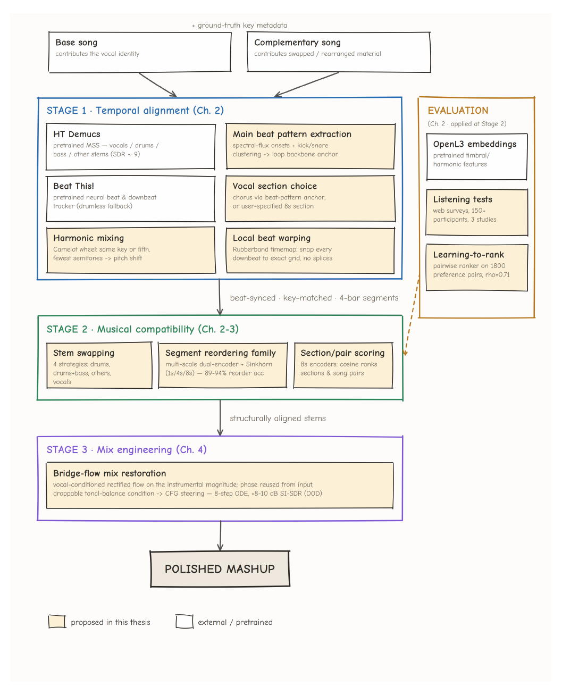

## Key Contributions

1. **Explicit stage and provenance boundaries.** HT Demucs, Beat This!, and OpenL3 are labeled as adopted; kick/snare extraction, key matching, and local warping are proposed DSP; the reordering family and mix restoration are proposed learned components; ranking and listening tests are evaluation. [PDF pp. 22–25 / thesis pp. 6–9]
2. **Local temporal correction.** A representative kick/snare pattern anchors phrases, while Rubber Band timemaps move detected downbeats to an exact grid instead of relying only on one global tempo estimate. [PDF pp. 27–34 / thesis pp. 11–18]
3. **Graded preference evaluation.** Four stem-swapping strategies yield 360 rated mashups. A vocal-conditioned Bradley–Terry utility model ranks candidates from within-context listener preferences. [PDF pp. 36–42 / thesis pp. 20–26]
4. **Hierarchical structural matching.** Asymmetric vocal/instrumental encoders and Sinkhorn assignments learn same-song segment correspondence without manual compatibility labels. Coarse encoders select a section; fine assignments reorder it. [PDF pp. 44–63 / thesis pp. 28–47]
5. **Semantic mix control.** A deterministic rectified-flow restoration model preserves vocal and phase while steering instrumental magnitude toward a complete 31-band vocal-relative tone-and-level reference. [PDF pp. 77–89 / thesis pp. 61–73]
6. **Editing-first research agenda.** Chapter 5 proposes confidence-triggered content editing, spatial mixing, full-length agent orchestration, and mixed-initiative control, but these elements are not implemented or evaluated. [PDF pp. 91–97 / thesis pp. 75–81]

## Methodology and Architecture

### Stage 1: alignment

The drum stem is low-passed near 2 kHz, onset-detected through spectral flux, and represented by 0.1-second mel patches. K-means with `K = 2` separates lower-centroid “kick” from higher-centroid “snare” onsets. The modal kick-to-snare delay and maximum cross-correlation between adjacent onset sequences identify a main beat pattern. [PDF pp. 27–30 / thesis pp. 11–14]

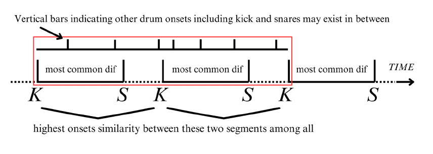

The complementary song is shifted to the base key or perfect fifth using the smaller semitone move, based on ground-truth keys. Beat anchors come from the drum analysis or Beat This!. Intervals more than 10% from the median are filtered, and a continuous Rubber Band timemap snaps downbeats to the exact grid. [PDF pp. 30–34 / thesis pp. 14–18]

The thesis does not report an alignment benchmark, a global-only ablation, or a warp-artifact listening test. Alignment precision is therefore an unverified design claim in this document.

### Preference ranking

Ten songs generate 360 candidates across drums, drums-plus-bass, “other,” and vocal/accompaniment swapping. OpenL3 embeddings are placed in session-specific blocks; candidate and candidate-by-vocal interaction features define a scalar utility. Within-context rating differences supervise an intercept-free Bradley–Terry logistic model. Evaluation holds out each of 40 strategy/base contexts, but not unseen songs. [PDF pp. 34–42 / thesis pp. 18–26]

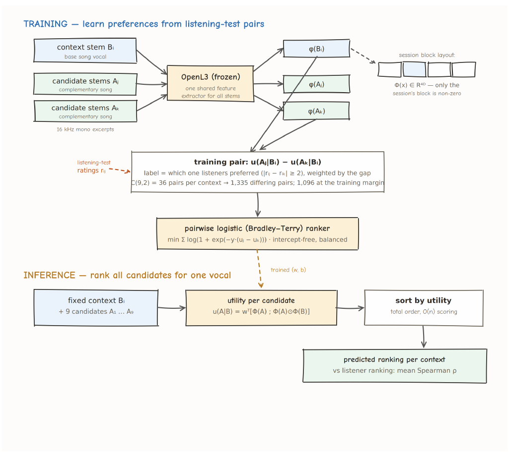

### Stage 2: selection and rearrangement

An eight-second passage at 120 BPM is divided into eight one-second tokens. Independent vocal and instrumental Transformer encoders project coarse mel features to 256 dimensions; only the vocal encoder receives position embeddings. Cosine similarities pass through a learned temperature and 20 Sinkhorn iterations to form a soft, nearly one-to-one assignment. [PDF pp. 44–51 / thesis pp. 28–35]

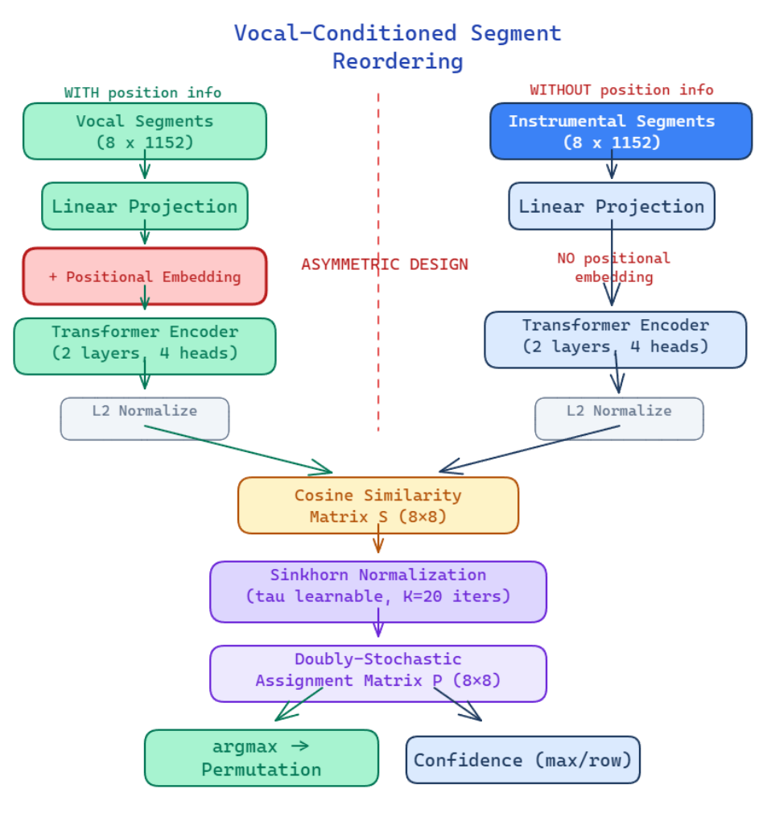

Training randomly permutes aligned same-song accompaniment and minimizes feature-reconstruction error against the original order. At application time, frozen 8-second encoders scan another song at one-second hops, then the 1-second model rearranges the selected window. The scan curve and assignment matrix are audit traces, but neither supplies a chord-, phrase-, or voice-leading explanation. [PDF pp. 51–63 / thesis pp. 35–47]

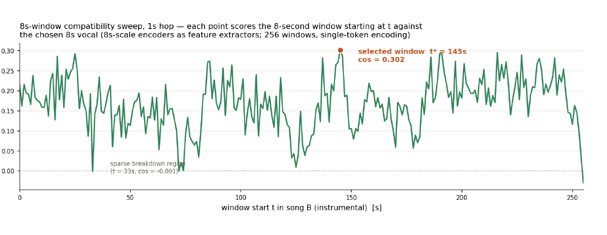

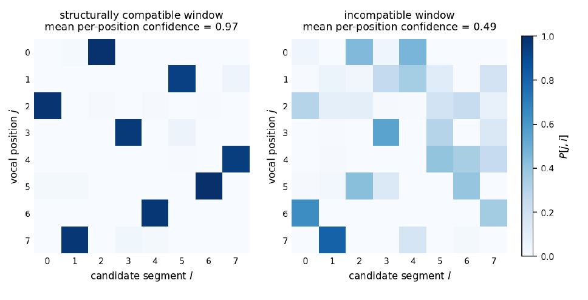

### Stage 3: mix restoration

The final model trains on eight-second vocal/instrumental pairs from an internal corpus of approximately 100,000 songs. Online corruption applies 2–4 EQ bells with ±10 dB gains plus a ±6 dB level offset. Because this positive gain preserves phase, the model predicts only clean instrumental magnitude and reuses input phase. [PDF pp. 77–80 / thesis pp. 61–64]

The four U-Net planes are current bridge state, clean vocal magnitude, a complete 31-band vocal-relative target, and a condition-present indicator. Training learns the constant velocity from broken to clean magnitude along a straight, noise-free path; eight-step guided Euler inference begins from the broken magnitude. [PDF pp. 80–85 / thesis pp. 64–69]

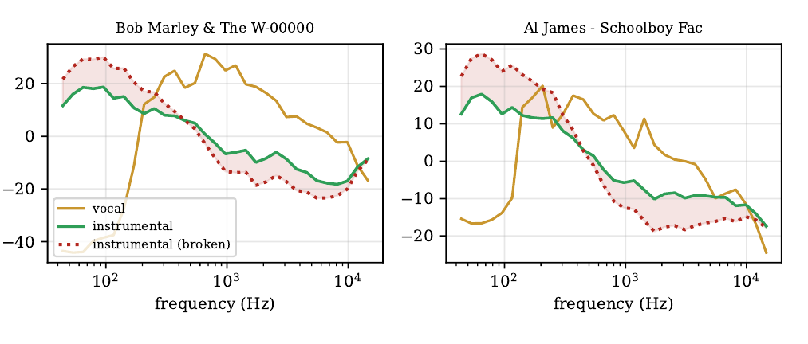

The curve is a meaningful production control. The ablation shows it causally affects output in the expected literal direction, but that does not make the U-Net itself mechanistically interpretable.

## Results

### Preference ranking

- Full utility model: pairwise accuracy **0.807**, mean per-context Spearman `ρ = 0.738` over 40 folds. [PDF p. 40 / thesis p. 24]
- Mashability heuristic versus ranker: mean `ρ = −0.047` versus **0.738**; the ranker wins for all four strategies. [PDF p. 41 / thesis p. 25]
- Figure 2.6: AUC **0.89** overall, **0.93** on gap-filtered pairs, and **0.64** on excluded adjacent pairs; all context correlations are positive, minimum 0.27 and mean 0.74. [PDF p. 42 / thesis p. 26]

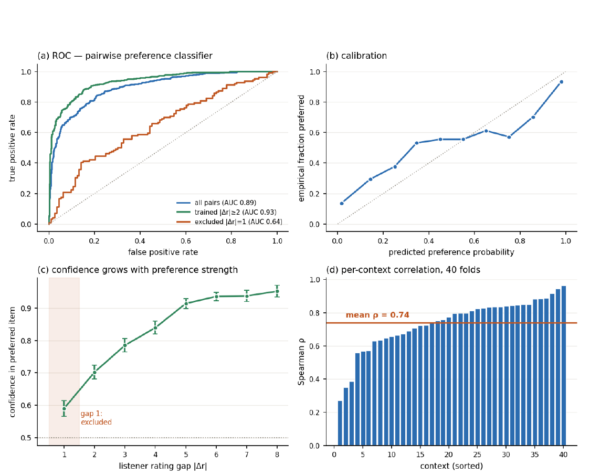

The evidence is in-domain: the same ten songs recur across contexts. Visual calibration is not accompanied by a calibration error or uncertainty analysis.

### Rearrangement

Same-song unshuffling accuracy is **89.24%** at 1 s, **93.94%** at 4 s, and **91.91%** at 8 s, against a 12.5% random baseline. These results demonstrate correspondence learning, not cross-song mashup quality. [PDF pp. 54–55 / thesis pp. 38–39]

In the 30-participant cross-song listening test, the proposed method scores 3.51 rhythm, 3.31 harmony, 3.24 creativity, and 3.38 overall, versus 2.67, 2.74, 2.73, and 2.63 for Mashability. Originals score 4.06, 3.89, 3.62, and 3.93. [PDF pp. 64–65 / thesis pp. 48–49]

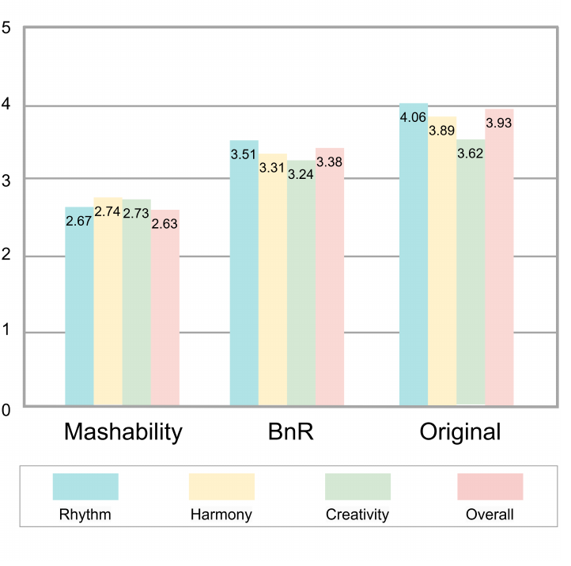

The chapter calls the advantage significant but reports no test, confidence interval, p-value, effect size, or error bars. It also lacks a same-section-without-reordering control.

### Mix restoration

Across EQ ±4/8/12 dB and volume-only corruptions, the full `w=2` model improves broken-input SI-SDR by **7.94–9.64 dB**. Clean-input SI-SDR is **28.63 dB** with 0.19 dB tonal-balance and 0.13 LUFS error. On volume-only corruption, LUFS error falls from 2.90 to 0.23 dB. [PDF pp. 86–87 / thesis pp. 70–71]

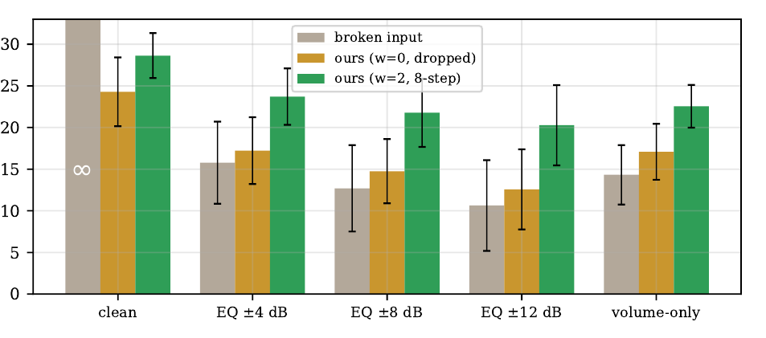

Pooled full conditioning gives **22.08 dB SI-SDR**, versus 15.41 dB when dropped. Tone-only and level-only maps constructed at inference collapse to 8.41 and 2.90 dB, respectively, because the model obeys their malformed semantics. This supports a load-bearing condition while showing that separate controls must be trained explicitly. [PDF pp. 88–89 / thesis pp. 72–73]

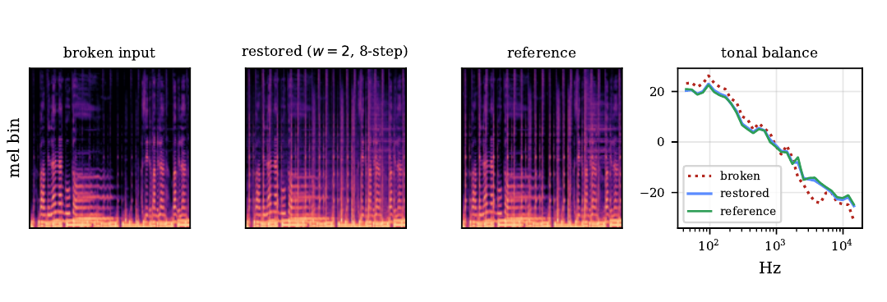

The evaluation is out-of-domain in song content but uses the same synthetic, invertible corruption family. No natural cross-production mismatch or Chapter 4 listening study is included.

### Evidence cautions

- Reported ranking counts and correlations conflict: 1,800/0.71 in Figure 1.1 versus 1,335 non-tied pairs, 1,096 filtered pairs, and 0.738/0.74 later. [PDF pp. 23, 38–43 / thesis pp. 7, 22–27]
- The drum-swap excerpt is eight bars in prose but four bars in Figure 2.3. [PDF pp. 34–35 / thesis pp. 18–19]
- Keeping every second 0.5-second beat cannot yield 2.0-second downbeats. [PDF p. 33 / thesis p. 17]
- Table 3.3’s train/validation gaps do not match the stated 4–6 points. [PDF pp. 54–55 / thesis pp. 38–39]
- “All” 150 MUSDB18-HQ songs are claimed, while Table 4.2 evaluates 149 without explanation. [PDF pp. 77, 86, 90 / thesis pp. 61, 70, 74]
- Figure 4.8 summarizes condition value as about 5 dB; the pooled ablation gives 6.67 dB and per-condition gaps range 5.46–7.70 dB. [PDF pp. 87–89 / thesis pp. 71–73]

## Related Papers

- [[overviews/automated-music-mashup-systems]] — places the three-stage design, evidence, and remaining gaps in a system-level map.
- [[concepts/auditable-creative-editing-pipelines]] — uses this thesis to distinguish workflow auditability from faithful semantic explanation.
- [[questions/when-do-interpretable-music-editing-traces-become-faithful-explanations]] — frames the validation needed before an assignment, score, or condition can count as an explanation.
